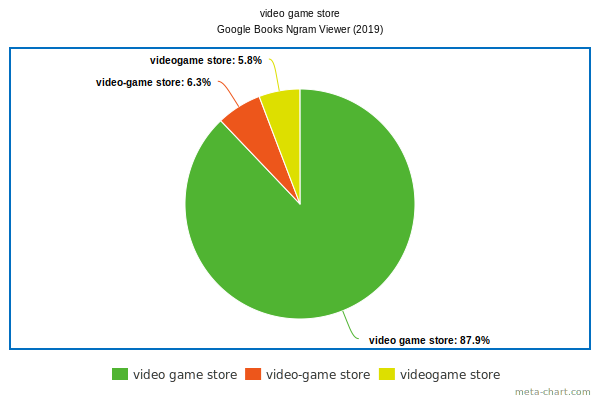

# Formatting
- [Punctuation](#punctuation)
  - [Italicizing comma after an italic word](#italicizing-comma-after-an-italic-word)
  - [Punctuation mark and a word before](#punctuation-mark-and-a-word-before)
  - [Colon at the end of a heading](#colon-at-the-end-of-a-heading)
- [Dash types](#dash-types)
  - [hyphen](#hyphen)
  - [minus](#minus)
  - [em dash](#em-dash)
  - [en dash](#en-dash)
  - [two-em dash](#two-em-dash)
  - [three-em dash](#three-em-dash)
- [Hyphen rules in compound words](#hyphen-rules-in-compound-words)

***

## Punctuation

### Italicizing Comma After an Italic Word

If the commas are not logically part of the italicized material, they should not be italicized.

> We rented the movie *Planes, Trains and Automobiles*. \[The comma is part of the title\]

### Punctuation Mark and a Word Before

The formatting of the punctuation mark should match the formatting of the word before, but there can be exceptions:

> The difference is statistically significant (*p* < .05).

### Colon at the End of a Heading

Do not underline the colon at the end of a heading.

[*Source*](https://iconlogic.blogs.com/weblog/2011/04/writing-grammar-do-i-italicize-the-comma-after-an-italic-word.html)

***

## Dash Types

### Hyphen

***Дефис*** (hyphen, -) употребляют в середине слова:
- в составных словах:
  > *three-em dash*
  > *off-white shirt*
- для обозначения переносов
- для отделения корней от префиксов и суффиксов:
  > *co-worker*
- в названиях:
  > *Tay-Sachs disease*

### Minus

***Минус*** (minus, −) может быть немного длиннее дефиса. Употребляется для обозначения отрицательного числа или операции вычитания. В зависимости от шрифта можно заменить дефисом или коротким тире.

### En dash

***Короткое тире*** (En dash, &ndash;) равно по ширине букве *n* в прописном или строчном варианте, в зависимости от шрифта. В некоторых шрифтах может быть длиннее или короче.
- обозначение диапазонов:
  > *June 18&ndash;20*
- акцент на контрасте или взаимоотношении между двумя объектами:
  > *New York&ndash;London flight*
  > *Radical&ndash;Unionist coalition*
  > *mother&ndash;daughter relationship*
- некоторые предпочитают заменять этим знаком длинное тире.

### Em dash

***Длинное тире*** (Em dash, &mdash;) равно по ширине букве *m* в прописном или строчном варианте, а в некоторых шрифтах и длиннее. Если поставить рядом несколько длинных тире, они образуют сплошную линию.
- вместо запятой, двоеточия или скобок. Разница в том, что длинное тире обозначает более длинную и выразительную интонационную паузу.
- отделение источника в цитатах:
  > *In matters of grave importance, style, not sincerity, is the vital thing.* &mdash; Oscar Wilde
- в американском английском длинное тире не принято отделять пробелами от предшествующего слова:
  > *A flock of sparrows&mdash;some of them juveniles&mdash;alighted and sang.*
- иногда вместо длинного тире используют короткое тире с пробелом:
  > *A flock of sparrows &ndash; some of them juveniles &ndash; alighted and sang.*

### Two-em dash

**Двойное длинное тире** (two-em dash, &mdash;&mdash;) &mdash; два длинных тире, поставленных рядом без пробела. Указывает, что часть слова опущена. Обычно так обозначают имена либо ругательства:
> *Mr. L&mdash;&mdash; told Ms. T&mdash;&mdash; that he would be d&mdash;&mdash;d if he invited her out again.*

### Three-em dash

**Тройное длинное тире** (three-em dash, &mdash;&mdash;&mdash;) &mdash; три длинных тире, поставленных рядом без пробела. Указывает, что опущено (повторяющееся) слово. Особенно актуален этот знак для библиографий, где тройное тире вместо имени автора означает, что автор тот же, что и для предыдущего пункта в списке.

Правила не универсальны. Иногда в сложносоставных прилагательных употребляют короткое тире вместо дефиса или не отделяют длинное тире от текста пробелами даже в британском варианте английского.

[*Источник*](https://ru.just-translate-it.com/eshhe-nemnogo-o-tire)

***

## Hyphen Rules in Compound Words

Historically, a lot of compounds follow the pattern of entering English as open compounds, then gradually take on hyphenation and eventually a closed form as they become more familiar. There was a time when *baseball* was spelled as *base ball*. As the sport took hold in the American consciousness, it gradually began to be spelled with a hyphen *(base-ball)*, but now any form other than the solid compound
*baseball* looks like an affectation.

1. When a compound that is usually left open is used to modify another noun, that compound will usually take a hyphen:

> *a video-game collector*

> *a food-truck business*

> *a pet-store employee*

> *made-for-TV movie*

> *over-the-counter medication*

Even in these instances, the hyphen is sometimes dropped: *real estate agent* or *health care legislation*.

2. Hyphens also work well with compound adjectives that end in a participle:

> *a funny-looking badger*

> *a sun-bleached roof*

> *fire-roasted tomatoes*

> *a money-grubbing thief*

3. Hyphens are not used with -ly adverbs:

> *lightly salted peanuts*

> *distantly related cousins*

> *a poorly written sentence*

4. Hyphens are generally not used with suffixes:

> *threefold*

> *knockout*

> *pushover*

But you need them occasionally for clarity. Hyphens are often used with suffixes, such as *–able*, *-elect*, *-like* and *-wise*:

> *president-elect*

> *money-wise*

5. Hyphenate fractions and numbers when they are written in full:

> *three-tenths*

> *twenty-five people*

*Sources: [1](https://www.merriam-webster.com/grammar/hyphen-rules-open-closed-compound-words),
[2](https://www.onlinegrammar.com.au/hyphens-and-their-usage),
[3](https://books.google.com/ngrams/graph?content=base+ball+bat%2Cbase-ball+bat%2Cbaseball+bat&year_start=1800&year_end=2019&corpus=en-2019&smoothing=3),
[4](https://books.google.com/ngrams/graph?content=video-game+player%2Cvideo+game+player%2Cvideogame+player&year_start=1800&year_end=2019&corpus=en-2019&smoothing=3),
[5](https://books.google.com/ngrams/graph?content=video-game+store%2Cvideo+game+store%2Cvideogame+store&year_start=1800&year_end=2019&corpus=en-2019&smoothing=3),
[6](https://books.google.com/ngrams/graph?content=video-game+consoles%2Cvideo+game+consoles%2Cvideogame+consoles&year_start=1800&year_end=2019&corpus=en-2019&smoothing=3),
[7](https://books.google.com/ngrams/graph?content=video-game+market%2Cvideo+game+market%2Cvideogame+market&year_start=1800&year_end=2019&corpus=en-2019&smoothing=3),
[8](https://books.google.com/ngrams/graph?content=real+estate+agent%2Creal-estate+agent%2Crealestate+agent&year_start=1800&year_end=2019&corpus=en-2019&smoothing=3),
[9](https://books.google.com/ngrams/graph?content=health+care+legislation%2Chealth-care+legislation%2Chealthcare+legislation&year_start=1800&year_end=2019&corpus=en-2019&smoothing=3)*

***
