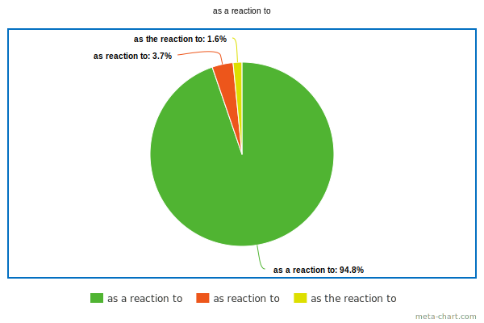
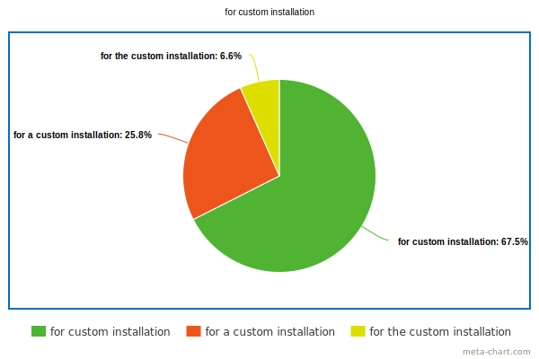
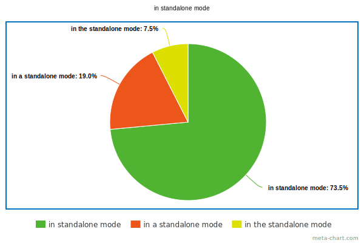

# Index \[Articles\]
- [Words and phrases](#words-and-phrases)
  - [as a reaction to](#as-a-reaction-to)
  - [for compliance with](#for-compliance-with)
  - [installation](#installation)
  - [mode](#mode)
  - [pose a threat](#pose-a-threat)
- [Abbreviations](#abbreviations)
  - [Acronyms](#acronyms)
  - [Initialisms](#initialisms)
  - [Pronunciation](#pronunciation)

## Words and Phrases

### For compliance with

[*Source*](https://books.google.com/ngrams/graph?content=for+the+compliance+with%2Cfor+compliance+with&year_start=1800&year_end=2019&corpus=en-2019&smoothing=3)

***

### As a reaction to

[*Source*](https://books.google.com/ngrams/graph?content=as+a+reaction+to%2Cas+reaction+to%2Cas+the+reaction+to&year_start=1800&year_end=2019&corpus=en-2019&smoothing=3)

***

### Pose a threat

[*Source*](https://books.google.com/ngrams/graph?content=pose+a+threat%2Cpose+the+threat%2Cpose+threat&year_start=1800&year_end=2019&corpus=en-2019&smoothing=3)

***

### Installation

- *(countable \& uncountable)* Installation is the act of installing.
- *(countable)* An installation is something that is installed.

*Sources: [1](https://simple.wiktionary.org/wiki/installation),
[2](https://books.google.com/ngrams/graph?content=for+a+custom+installation%2Cfor+custom+installation%2Cfor+the+custom+installation&year_start=1800&year_end=2019&corpus=en-2019&smoothing=3)*

***

### Mode

We don’t need the definite article before one item/user/table/mode that can be uniquely identified from others in a certain set of items/users/tables/modes:

> *My cell-phone is <ins>on silent</ins> **mode**.*

*Sources: [1](https://ell.stackexchange.com/questions/61397/a-definite-article-before-silent-mode),
[2](https://books.google.com/ngrams/graph?content=in+the+standalone+mode%2Cin+a+standalone+mode%2Cin+standalone+mode&year_start=1800&year_end=2019&corpus=en-2019&smoothing=3)*

***

## Abbreviations

### Acronyms

***Acronyms*** (which are read as words) tend not to require preceding articles at all except when they are used adjectivally[^adjectivally]:

> *The patient was diagnosed with AIDS.*

> *UNESCO designates World Heritage Sites.*

> *Finland is not a member of NATO.*

> ***The** AIDS <ins>patient</ins>*

> *The Giza pyramids are **a** UNESCO <ins>World Heritage Site</ins>.*

> ***The** UNICEF <ins>campaign</ins> raised awareness.*

### Initialisms

***Initialisms*** (which are pronounced as individual letters) tend to use a preceding article (whether definite or indefinite):

> ***a** CD*

> ***an** NGO*

> ***the** EU*

> *He has a new job at **the** BBC.*

> ***The** UN was voting later that day.*

> ***An** FBI agent has infiltrated the group.*

> ***The** DVD player is broken.*

However, when you use an initialism as a noun that names a condition or illness, a substance, or a method of doing something, you do not usually need an article:

> *DDT[^ddt] has been banned for many years.*

> *Too much typing has given me RSI[^rsi].*

> *The course teaches you how to use CPR[^cpr].*

### Pronunciation

| Sound type | Article | Example |
|------------|--------------|---------|
| Consonant  | **A**  | ***a** PhD* |
|            |          | ***a** NASA launch* |
|            |          | ***a** UNICEF greeting card* |
| Vowel or consonant pronounced with an initial vowel sound | **An** | ***an** APA style of referencing* |
|                                                           |        | ***an** IQ test* |
|                                                           |        | ***an** MP’s riding* |

[^adjectivally]: Adjectivally \= как часть прилагательного.

[^ddt]: DDT \= ДДТ (insecticide).

[^rsi]: RSI (Repetitive Strain Injury) \= заболевание, связанное с неправильной ежедневной многочасовой работой за клавиатурой компьютера (боль или покалывание в пальцах и кистях рук).

[^cpr]: CPR (cardiopulmonary resuscitation) \= искусственное дыхание.

*See also [abbreviation \| acronym \| backronym \| initialism](../Vocabulary.md#abbreviation--acronym--backronym--initialism)*

*Sources: [1](https://www.proof-reading-service.com/en/blog/appropriate-use-articles-abbreviations),
[2](https://wwwnc.cdc.gov/eid/page/abbreviations-acronyms-initialisms),
[3](https://proofed.com/writing-tips/using-articles-a-an-the-before-acronyms-and-initialisms)*

***