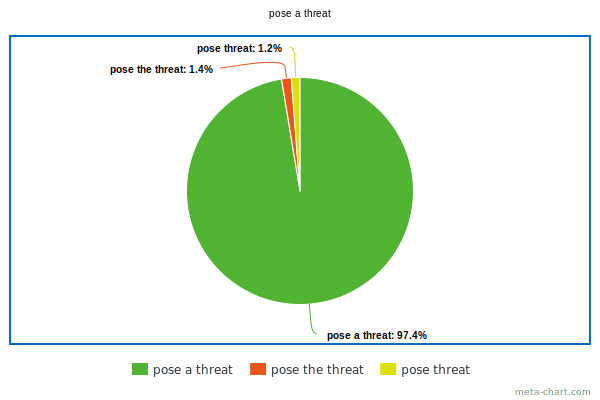

# Index \[Articles\]

- [Words and phrases](#words-and-phrases)
  - [as a reaction to](#as-a-reaction-to)
  - [ask for approval \| ask for an approval](#ask-for-approval--ask-for-an-approval)
  - [attention \| the attention](#attention--the-attention)
  - [evaluation \| an evaluation](#evaluation--an-evaluation)
  - [experience \| an experience \| experiences](#experience--an-experience--experiences)
  - [for compliance with](#for-compliance-with)
  - [installation](#installation)
  - [literature \| the literature](#literature--the-literature)
  - [load \| the load](#load--the-load)
  - [mode](#mode)
  - [operation \| an operation \| operations](#operation--an-operation--operations)
  - [part \| a part](#part--a-part)
  - [part of \| a part of](#part-of--a-part-of)
  - [pose a threat](#pose-a-threat)
  - [progress \| ~~a progress~~ \| the progress](#progress--a-progress--the-progress)
  - [such \| such a](#such--such-a)
- [Abbreviations](#abbreviations)
  - [Acronyms](#acronyms)
  - [Initialisms](#initialisms)
  - [Pronunciation](#pronunciation)

***

## Words and Phrases

### such \| such a

| Form | Type of nouns | Example |
|------|---------------|---------|
| such a(n) | countable, singular | ***such an** apple* |
| such | countable, plural | ***such** apples* |
| such | uncountable | ***Such** bravery is to be commended.* |

Same nouns can be countable or uncountable, singular or plural in different contexts:

> ***Such** honor is to be revered.*

> ***Such an** honor is to be bestowed.*

> ***Such** honors are to be bestowed.*

***Such a*** is required before singular countable nouns even if no emphasis is intended:

> *Throughout this article, we refer to **such a** block or range of nodes with the term “context node”.*

*Sources: [1](https://ell.stackexchange.com/questions/64937/such-vs-such-a),
[2](https://ell.stackexchange.com/questions/114262/when-to-use-such-before-a-noun-and-when-to-use-such-a-an)*

***

### progress \| ~~a progress~~ \| the progress

When we refer to the ways in which society in general goes forward and improves itself, we use progress without ***the***:

> ***Progress** will only happen when people begin to understand that every individual has a responsibility to play their part.*

> *~~The progress will only~~ ...*

***Progress*** is a mass noun and cannot be regarded as a count noun, except in an archaic form:

> Religious processions and royal **progresses** have been an important practice in the Indian subcontinent.

*Sources:
[1](https://dictionary.cambridge.org/grammar/british-grammar/progress),
[2](https://forum.wordreference.com/threads/made-a-substantial-progress-article.2675136)*

***

### part of \| a part of

Generally, you can use either.

If you say *Money is **part** of the American Dream*, you mean that both ideas are strongly linked together.

If you said *Money is **a part** of the American Dream*, it would mean that money is only a part of the American Dream. You would focus on just one part as opposed to the rest. The second solution is grammatically correct but seems awkward as it would be difficult to find a context in which it fits.

*See also* [part \| a part](#part--a-part)

[*Source*](https://english.stackexchange.com/questions/158232/difference-between-part-and-a-part)

***

### part \| a part

Both ***part*** and ***a part*** can be used to refer to a discrete countable thing:

> *We teach several skills. Dancing is **part** of what we teach.*

> *We teach several skills. Dancing is **a part** of what we teach.*

Both ***part*** and ***a part*** can be used to refer to a more general portion of a thing that is not countable:

> ***Part** of the food* \[or money, or care\] *will be devoted to the poor.*

> ***A part** of the food* \[or money, or care\] *will be devoted to the poor.*

The portion to be devoted is not defined in these sentences as comprising a specific discrete section or item, but either construction is clear and appropriate. The addition of the article a may give a slight connotation that the portion may already be determined, but not necessarily.

*See also* [part of \| a part of](#part-of--a-part-of)

[*Source*](https://english.stackexchange.com/questions/117833/a-part-vs-part?noredirect=1)

***

### operation \| an operation \| operations

- *\[countable\]* The process of cutting open a part of a person’s body in order to remove or repair a damaged part:

  > *Will I need to have **an operation**?*

  > *He underwent **a** three-hour heart **operation**.*

- *\[countable, uncountable\]* An act performed by a machine, especially a computer:

  > *The whole **operation** is performed in less than three seconds.*

- *\[uncountable\]* The way that parts of a machine or a system work; the process of making something work:

  > *Regular servicing guarantees **the** smooth **operation** of the engine.*

  > ***Operation** of the device is extremely simple.*

- *\[countable\]* An organized activity that involves several people doing different things:

  > ***A** security **operation**.*

  > *The police have launched **a** major **operation** against drug dealers.*

- *\[countable\]* A business or company involving many parts:

  > ***A** huge multinational **operation**.*

- *\[countable\]* The activity or work done in an area of business or industry:

  > ***The** firm’s banking **operations** overseas computer.*

- *\[countable, usually plural\]* Military activity:

  > *He was the officer in charge of **operations**.*

- *\[countable\]* A process in which a number or quantity is changed by adding, multiplying, etc.

- Idioms:

  > *Come into **operation**.*

[*Source*](https://www.oxfordlearnersdictionaries.com/definition/american_english/operation)

***

### load \| the load

***Load*** can be countable or uncountable. If you are talking about a specific load, than it is countable:

> ***The load** on this circuit is 200 watts.*

If you are talking about the idea of (for example), electrical power requirements, then it is uncountable:

> *Our teacher explained the concept of **load** and how it affects electrical circuits.*

[*Source*](https://ell.stackexchange.com/questions/257672/is-load-countable-or-non-countable)

***

### literature \| the literature

An article is not needed for a general use. When ***literature*** refers to a specific collection of books, papers, etc., is related to a given subject, we use ***the***.

[*Source*](https://jakubmarian.com/in-literature-vs-in-the-literature-in-english)

***

### experience \| an experience \| experiences

*Countable*: an event or incident. It is an event that you were a part of and the event made an impression on you (it’s something you will remember). These type of experiences are countable, just like events.

> *Climbing Mount Everest was an **experience** that I’ll never forget.*

> *I have had some bad **experiences** with taxi drivers.*

*Uncountable*: familiarity. You have used computers for many years, so you are familiar with them, you have knowledge of them, and you have skill using them:

> *I have 8 years of teaching **experience**.*

[*Source*](https://www.englishcurrent.com/grammar/experiences-experience/)

***

### evaluation \| an evaluation

| Example | Interpretation |
| --- | --- |
| *This talk focuses on **evaluation** of...* | The talk is about the process of evaluating. |
| *This talk focuses on **an evaluation** of...* | The talk is about a particular evaluation that has been made. |
| *The focus of this talk is **an evaluation** of...* | The talk itself is making an evaluation of something. |

[*Source*](https://english.stackexchange.com/questions/483505/omitting-article-before-evaluation)

***

### attention \| the attention

> *His success draws **the attention** of everyone.*

> *She drew **attention** to the need for proper punctuation.*

[*Source*](https://forum.wordreference.com/threads/draw-attention-of.2551894/)

***

### ask for approval \| ask for an approval

It is like *ask for permission*, with no article. You could also say *ask for
your approval*. It would be possible to say ***ask for an approval*** if by
*approval* you mean, for example, a specific form to be filled out.

[*Source*](https://forum.wordreference.com/threads/ask-for-an-approval-with-or-without-the-article.2871918/)

***

### For compliance with

[*Source*](https://books.google.com/ngrams/graph?content=for+the+compliance+with%2Cfor+compliance+with&year_start=1800&year_end=2019&corpus=en-2019&smoothing=3)

***

### As a reaction to

[*Source*](https://books.google.com/ngrams/graph?content=as+a+reaction+to%2Cas+reaction+to%2Cas+the+reaction+to&year_start=1800&year_end=2019&corpus=en-2019&smoothing=3)

***

### Pose a threat

[*Source*](https://books.google.com/ngrams/graph?content=pose+a+threat%2Cpose+the+threat%2Cpose+threat&year_start=1800&year_end=2019&corpus=en-2019&smoothing=3)

***

### Installation

- *(countable \& uncountable)* Installation is the act of installing.
- *(countable)* An installation is something that is installed.

*Sources: [1](https://simple.wiktionary.org/wiki/installation),
[2](https://books.google.com/ngrams/graph?content=for+a+custom+installation%2Cfor+custom+installation%2Cfor+the+custom+installation&year_start=1800&year_end=2019&corpus=en-2019&smoothing=3)*

***

### Mode

We don’t need the definite article before one item/user/table/mode that can be uniquely identified from others in a certain set of items/users/tables/modes:

> *My cell-phone is <ins>on silent</ins> **mode**.*

*Sources: [1](https://ell.stackexchange.com/questions/61397/a-definite-article-before-silent-mode),
[2](https://books.google.com/ngrams/graph?content=in+the+standalone+mode%2Cin+a+standalone+mode%2Cin+standalone+mode&year_start=1800&year_end=2019&corpus=en-2019&smoothing=3)*

***

## Abbreviations

### Acronyms

***Acronyms*** (which are read as words) tend not to require preceding articles at all except when they are used adjectivally[^adjectivally]:

> *The patient was diagnosed with AIDS.*

> *UNESCO designates World Heritage Sites.*

> *Finland is not a member of NATO.*

> ***The** AIDS <ins>patient</ins>*

> *The Giza pyramids are **a** UNESCO <ins>World Heritage Site</ins>.*

> ***The** UNICEF <ins>campaign</ins> raised awareness.*

### Initialisms

***Initialisms*** (which are pronounced as individual letters) tend to use a preceding article (whether definite or indefinite):

> ***a** CD*

> ***an** NGO*

> ***the** EU*

> *He has a new job at **the** BBC.*

> ***The** UN was voting later that day.*

> ***An** FBI agent has infiltrated the group.*

> ***The** DVD player is broken.*

However, when you use an initialism as a noun that names a condition or illness, a substance, or a method of doing something, you do not usually need an article:

> *DDT[^ddt] has been banned for many years.*

> *Too much typing has given me RSI[^rsi].*

> *The course teaches you how to use CPR[^cpr].*

### Pronunciation

| Sound type | Article | Example |
|------------|--------------|---------|
| Consonant  | **A**  | ***a** PhD* |
|            |          | ***a** NASA launch* |
|            |          | ***a** UNICEF greeting card* |
| Vowel or consonant pronounced with an initial vowel sound | **An** | ***an** APA style of referencing* |
|                                                           |        | ***an** IQ test* |
|                                                           |        | ***an** MP’s riding* |

[^adjectivally]: Adjectivally \= как часть прилагательного.

[^ddt]: DDT \= ДДТ (insecticide).

[^rsi]: RSI (Repetitive Strain Injury) \= заболевание, связанное с неправильной ежедневной многочасовой работой за клавиатурой компьютера (боль или покалывание в пальцах и кистях рук).

[^cpr]: CPR (cardiopulmonary resuscitation) \= искусственное дыхание.

*See also [abbreviation \| acronym \| backronym \| initialism](../Vocabulary.md#abbreviation--acronym--backronym--initialism)*

*Sources: [1](https://www.proof-reading-service.com/en/blog/appropriate-use-articles-abbreviations),
[2](https://wwwnc.cdc.gov/eid/page/abbreviations-acronyms-initialisms),
[3](https://proofed.com/writing-tips/using-articles-a-an-the-before-acronyms-and-initialisms)*

***
