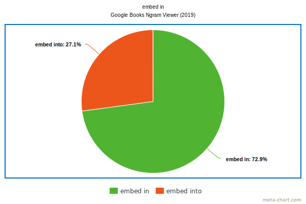
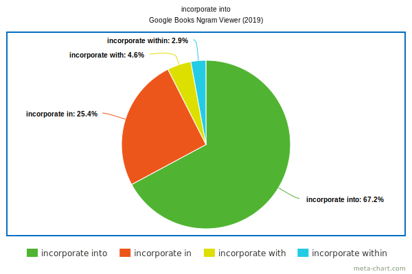

# Prepositions

[according to \| ~~according with~~ \| in accord with \| ~~in accordance to~~ \| in accordance with \| ~~in according with~~](#according-to--according-with--in-accord-with--in-accordance-to--in-accordance-with--in-according-with)

[add in \| add into \| add to](#add-in--add-into--add-to)

[allow for \| allow of \| allow that \| allow to](#allow-for--allow-of--allow-that--allow-to)

[at a path \| on a path](#at-a-path--on-a-path)

[at each step \| in each step \| on each step](#at-each-step--in-each-step--on-each-step)

[at startup \| on startup](#at-startup--on-startup)

[at the beginning \| in the beginning](#at-the-beginning--in-the-beginning)

[at the end \| in the end](#at-the-end--in-the-end)

[bound to \| bound with](#bound-to--bound-with)

[by email \| ~~through email~~ \| via email](#by-email--through-email--via-email)

[by means of planting \| by planting \| through planting \| using planting \| via planting](#by-means-of-planting--by-planting--through-planting--using-planting--via-planting)

[by software \| by using software \| using software \| ~~via software~~ \| with software](#by-software--by-using-software--using-software--via-software--with-software)

[change in \| change of \| change to](#change-in--change-of--change-to)

[check if \| check whether](#check-if--check-whether)

[communicate to \| communicate with](#communicate-to--communicate-with)

[compare to \| compare with](#compare-to-compare-with)

[condition for \| condition of](#condition-for--condition-of)

[connect to \| connect with](#connect-to--connect-with)

[considered \| considered as](#considered--considered-as)

[consist in \| consist of](#consist-in--consist-of)

[cover by \| cover in \| cover with](#cover-by--cover-in--cover-with)

[designed for \| designed to](#designed-for--designed-to)

[die by \| die from \| die of](#die-by--die-from--die-of)

[effort at \| effort in \| effort of \| effort to](#effort-at--effort-in--effort-of--effort-to)

[embed in \| into \| ~~to~~](#embed-in--into--to)

[equivalent of \| equivalent to](#equivalent-of--equivalent-to)

[incorporate ∅ \| in \| into \| with \| within](#incorporate---in--into--with--within)

***

## equivalent of \| equivalent to

> *To be **equivalent to** something*

> *To be <ins>the</ins> **equivalent of** something*

[*Source*](https://forum.wordreference.com/threads/equivalent-to-vs-equivalent-of.2673133/)

***

## effort at \| effort in \| effort of \| effort to

effort\[s\] ***to*** {infinitive} is a more common form.

***effort at*** focuses on energy/resources that are required for the effort.

***effort in*** emphasizes that something requires certain energy/resources for the success.

One can say *trapping effort*, or *effort ***of*** trapping*, but the meaning is different than with the preposition *in* or *at*. In a noun-noun construct the first noun (the noun adjunct) serves the role of an adjective.

[*Source*](https://ell.stackexchange.com/questions/65234/effort-at-of-in-shooting)

***

## die by \| die from \| die of

| Form | Interpretation | Example |
| --- | --- | --- |
| **die of** | Someone dies of a direct cause | *He **died of** cancer.* |
| **die from** | Someone dies from an indirect cause | *He **died from** smoking.* |
| **die by** | Someone dies by the means of something | *He **died by** a bullet.* |

If you fell twenty stories, we might say that you ***died from*** falling, but you ***died of*** massive trauma and bloodloss (caused by the fall).

Both *died of cancer* or *died from cancer* would probably be acceptable to an English speaker.

When someone ***dies by** the sword*, for example, we don’t literally mean that they died from a sword to the heart. Rather we mean that they were prone to violence, and themselves died violently.

You would more commonly see *death by X* as opposed to *died by X*:

> ***Death by** firing squad*

[*Source*](https://english.stackexchange.com/questions/397488/which-one-is-correct-died-of-or-died-from)

***

## designed for \| designed to

***design to***&mdash;this is used for what an object has been made to do itself:

> *Buildings can be **designed to** absorb and retain heat.*

> *The book is **designed for** learning English* (not ~~designed to learn~~, the book cannot learn English for itself)

*Sources: [1](https://english.stackexchange.com/questions/229507/design-to-vs-design-for),
[2](https://www.powerthesaurus.org/designed_to/sentences)*

***

## cover by \| cover in \| cover with

The meanings are very similar, and these three prepositions can be used almost interchangeably:

> *The mountain is **covered with/in/by** snow.*

When referring to a substance that sticks to another, use ***in*** or ***with***, but not ***by***:

> *The actress was **covered in** blood.*

> *The actress was **covered with** blood.*

> ~~*The actress was **covered by** blood.*~~

> *The ribs were **covered with** sauce.*

> *The ribs were **covered in** sauce.*

> ~~*The ribs were **covered by** sauce.*~~

When referring something that physically protects something else, use ***with*** or ***by***, but not ***in***:

> *The field was **covered with** a tarp.*

> *The field was **covered by** a tarp.*

> ~~*The field was **covered in** a tarp.*~~

Use ***covered with*** to indicate an unusual amount of something on top of something else; use ***covered by*** to connote a covering so dense that the object being covered is completely obscured from view:

> *The mountain was **covered with** fog.*

> *The mountain was **covered by** fog.*

> *Our grass was **covered with** butterflies.*

> *Our grass was **covered by** butterflies.*

When talking about metaphorical coverage, use ***covered by***:

> *The roof damage was **covered by** insurance.*

> ~~*The roof damage was **covered with** insurance.*~~

> ~~*The roof damage was **covered in** insurance.*~~

> *The city council meeting was **covered by** the news station.*

> ~~*The city council meeting was **covered with** the news station.*~~

> ~~*The city council meeting was **covered in** the news station.*~~

[*Source*](https://english.stackexchange.com/questions/60805/covered-with-vs-covered-in-vs-covered-by)

***

## consist in \| consist of

**Consist of**&mdash;to be made up of, comprise:

> *This novel **consists of** three parts.*

> *Genes **consist of** a specific sequence of DNA.*

**consist in**&mdash;to be essential, be inherent or lie in:

> *His social success **consists in** making people believe he is interested in what they say.*

The secret to a successful relationship consists in knowing that a crisis doesn’t mean everything is over.

Some people say a key point to know which one to use is that ***consist of*** is normally used with more tangible objects whereas ***consist in*** refers to an abstract quality.

Others also say that ***consist of*** is always followed by a noun phrase, whereas ***consist in*** is followed by a verb.

[*Source*](http://ourenglishblog.com/grammar/consist-of-or-consist-in/)

***

## considered \| considered as

***Considered as*** construction is almost always redundant. If you use ***considered*** to describe what people think of someone or something, you simply don’t need *as*.

> *LeBron James is **considered** one of the best basketball players of all time.*

> *Bad grammar should be **considered** a crime.*

[*Source*](https://bringmethenews.com/life/instagrammar-please-please-stop-saying-considered-as)

***

## connect to \| connect with

**Connected to** usually means a physical connection:

> *Your computer is **connected to** a printer.*

**Connected with** someone or something means a relationship:

> *He is still **connected with** his school colleagues.*

> *Symptoms **connected with** kidney stones*

[*Source*](https://www.linkschool.co.uk/learn-english-connect-to-or-with/)

***

## condition for \| condition of

The **conditions for** some state of affairs are the conditions that must exist in order for that state of affairs to exist:

> *The **conditions for** a hail storm.*

The **condition of** *something* is the state that it is in. This is a different definition of condition.

> *the **condition of** a car engine*

[*Source*](https://www.englishforums.com/English/SufficientConditionForOf/zmwbk/post.htm)

***

## compare to \| compare with

**to**: акцент делается на схожести сравниваемых вещей

**with**: акцент делается на разности вещей больше, чем на их схожести

[*Source*](https://www.dailywritingtips.com/compared-to-or-compared-with/)

***

## communicate to \| communicate with

If you **communicate with** someone, you share or exchange information with them, for example by speaking, writing, or using equipment:

> *My natural mother has never **communicated with** me.*

You can also say that two people communicate:

> *They **communicated** in sign language.*

***Communicate to***: if you communicate information, a feeling, or an idea to someone, you let them know about it:

> *They successfully **communicate** their knowledge **to** others.*

[*Source*](https://www.collinsdictionary.com/dictionary/english/communicate)

***

## check if \| check whether

***If*** and ***whether*** are often interchangeable, but sometimes using one or the other will change the meaning of your sentence.

> *We want to know **if** you can come.*

> *We want to know **whether** you can come.*

> *Check his work and see **if** it is correct or not.*

> *Check his work and see **whether** it is correct or not.*

Use ***if*** when you have a conditional sentence and ***whether*** when showing that two alternatives are possible.

> *Squiggly didn’t know whether Aardvark would arrive Friday or Saturday.* \[There are two possibilities: Aardvark will arrive Friday, or Aardvark will arrive Saturday.\]

> *Squiggly didn’t know if Aardvark would arrive Friday or Saturday.* \[Aardvark may not arrive at all.\]

*See also* [check \| check for \| check that \| validate \| verify](#check--check-for--check-that--validate--verify), [whether \| whether or not](#whether--whether-or-not)

*Sources:
[1](https://www.usingenglish.com/forum/threads/is-there-a-difference-between-check-if-and-check-whether.28260/),
[2](https://www.quickanddirtytips.com/education/grammar/if-versus-whether)*

***

## change in \| change of \| change to

| Form               | Meaning                                   | Example                                    |
|--------------------|-------------------------------------------|--------------------------------------------|
| change in          | a state, condition, character, or quality | ***change in** attitudes*                  |
| change of          | some sort of replacement                  | ***change of** government*                 |
| change from ... to | transition / transformation               | *color **change from** green **to** brown* |

[*Source*](https://english.stackexchange.com/questions/405625/changes-in-changes-of-or-changes-to/405636#405636)

***

## by software \| by using software \| using software \| ~~via software~~ \| with software

| Example | Comment |
|---------|---------|
| ***by** software* | The software did all the work, without any human intervention. The work is actually done *by* a human with the help of the software. |
| ***by using** software* | Sounds correct and complete because you need both a preposition (*by*) and a verb (*use*). |
| ***with** software* | OK, but *using* is better&mdash;*with* doesn’t tell you what the person would be doing with the software (*using* it). |
| ***using*** | *Use* is a verb and thus indicates an action. |
| ~~***via** software*~~ | Sounds awkward in this context. *Via* is mostly used as a synonym of *by way of*, as in *I’m flying to Hawaii via California*. It can also be used to mean something is like a stepping-stone in a less literal sense, as in *She arrived at the answer via brainstorming.* *Via* would be used when you are talking about a path (literal or figurative) to somewhere with any number of “stops” on the way. In this context, the software is not like a stop on the way, but is the thing the person is using. |

*See also [by email \| ~~through email~~ \| via email](#by-email--through-email--via-email), [by means of planting \| by planting \| through planting \| using planting \| via planting](#by-means-of-planting--by-planting--through-planting--using-planting--via-planting)*

*Sources: [1](https://ell.stackexchange.com/questions/194845/by-with-using-or-via-here),
[2](https://forum.wordreference.com/threads/via-through-by-using-the-web-interface.2742782)*

***

## by email \| ~~through email~~ \| via email

***By*** is the most popular, ***via*** is used sometimes, ***through*** is not used in this construction.

*See also [by means of planting \| by planting \| through planting \| using planting \| via planting](#by-means-of-planting--by-planting--through-planting--using-planting--via-planting), [by software \| by using software \| using software \| ~~via software~~ \| with software](#by-software--by-using-software--using-software--via-software--with-software)*

[*Source*](https://forum.wordreference.com/threads/through-email-by-email-via-email.3086548/)

***

## by means of planting \| by planting \| through planting \| using planting \| via planting

| Example | Emphasizes |
|---------|------------|
| ***by** planting* | the direct action of planting itself in achieving a desired outcome |
| ***by means of** planting* | a specific technique or process that involves planting |
| ***through** planting* | the role of planting as a conduit for achieving a larger goal or objective |
| ***using** planting* | the practical application or utilization of planting as a resource |
| ***via*** | a means of transportation or a route taken to reach a destination |

*See also [by email \| ~~through email~~ \| via email](#by-email--through-email--via-email), [by software \| by using software \| using software \| ~~via software~~ \| with software](#by-software--by-using-software--using-software--via-software--with-software)*

[*Source*](https://thecontentauthority.com/blog/how-to-use-via-planting-in-a-sentence)

***

## bound to \| bound with

***Bind to*** is used to describe the action of tying or attaching an object to another object:

> *Take the knife, and **bind** it **to** your leg.*

***Bind with*** is used to describe the thing which is used to tie or attach the object:

> *I will **bind** the knife with a rope.*

One is used with the object the action is performed upon, and the other is used with the object performing the action.

There is a range of idiomatic uses and similar phrasal verbs.

The outcome was inevitable. **To** might be seen as part of the infinitive to fail, certainly it needs to be followed by a verb in infinitive form:

> *He was **bound to** fail.*

A complex or ongoing relationship between the outcome (failure), and some other factor (his preconceptions):

> *His failure was **bound** up **with** his preconceptions.*

[*Source*](https://forum.wordreference.com/threads/be-bound-to-vs-be-bound-with-noun.2963161/)

***

## at the end \| in the end

**At the end**:

- the end of a physical location:

  > ***At the end** of our hallway.*

- the closing or near completion of something:

  > ***At the end** of the story.*

  > ***At the end** of the film.*

- the end point of a period in time:

  > *The score was nil nil **at the end** of the game.*

  > *I am going to go away **at the end** of the month.*

**In the end** means *finally*:

> *We all wanted to go to different places, **in the end**, we agreed to go to the beach.*

> *We waited for the bus for 2 hours, **in the end**, we caught a taxi.*

[*Source*](https://english.stackexchange.com/questions/217987/what-differences-are-there-between-at-the-end-and-in-the-end)

***

## at the beginning \| in the beginning

***In the beginning*** is usually preferred alone and followed by a comma.

***At the beginning*** is used together with a noun such as year, book,
century, show, etc.

> *In the beginning, God created* (etc\...)

> *At the beginning OF TIME, God created*

[*Source*](https://english.stackexchange.com/questions/20389/at-the-beginning-or-in-the-beginning/20406)

***

## at startup \| on startup

***On startup*** refers to the startup event of the application.

***At startup*** refers to the moment in time the operating system starts up.

Google Books Ngram Viewer statistics (by 2019):

*At startup* is [2.56 times](https://books.google.com/ngrams/graph?content=on+startup%2Cat+startup&year_start=1800&year_end=2019&corpus=en-2019&smoothing=3) more popular than *on startup*;

*at system startup* is [4.3 times](https://books.google.com/ngrams/graph?content=on+system+startup%2Cat+system+startup&year_start=1800&year_end=2019&corpus=en-2019&smoothing=3) more popular than *on system startup*;

*at Windows startup* is [27 times](https://books.google.com/ngrams/graph?content=on+Windows+startup%2Cat+Windows+startup&year_start=1800&year_end=2019&corpus=en-2019&smoothing=3) more popular than *on Windows startup* (2017), the latter is not registered in 2019;

*at application startup* is [1.43 times](https://books.google.com/ngrams/graph?content=on+application+startup%2Cat+application+startup&year_start=1800&year_end=2019&corpus=en-2019&smoothing=3) more popular than *on application startup*.

[*Source*](https://english.stackexchange.com/questions/154467/at-startup-vs-on-startup)

***

## at each step \| in each step \| on each step

***In each step***&mdash;something is done or happens as part of the process:

> *Assembling the furniture consists of seven steps. **In each step** a new piece is added to the assembly.*

***At each step***&mdash;something is done additionally to the process:

> *Creating a report takes three steps. **At each step** the author is required to check with a reviewer that it has been done correctly.*

***On*** turns the emphasis away from the person taking action, to emphasis the step as more crucial. *Step* could be a physical step (on a staircase or ladder) or a specific procedure one must do or follow:

> *While climbing the ladder to pick cherries, "Warning: Serious Injury May Occur if extended beyond 5 Meters" was written **on every step**.*

> *In building any model airplane with high voltage, safety equipment must be worn on every step, when performing steps 8 thru 14 below* [Whenever steps 8 thru 14 are performed, no matter which step it is between 8 and 14, safety equipment is necessary to prevent serious injury.)

See also [at a path \| on a path](#at-a-path--on-a-path)

*Sources: [1](https://english.stackexchange.com/questions/108584/at-step-or-in-step),
[2](https://english.stackexchange.com/questions/486165/difference-between-at-every-step-and-on-every-step)*

***

## at a path \| on a path

When you are ***at a path***, you are facing it, having not yet taken it.

When you are ***on a path***, you have begun to take it and are in the act of following it.

*See also* [at each step \| in each step \| on each step](#at-each-step--in-each-step--on-each-step)

[*Source*](https://english.stackexchange.com/questions/486165/difference-between-at-every-step-and-on-every-step/486191#486191)

***

## allow for \| allow of \| allow that \| allow to

**Allow** means:

- *permit* or *give permission*:

  > *I can’t **allow** you to go outside without a jacket.*

- fail to stop something from happening:
  
  > *The hermit **allowed** the grass to grow wild around the house and the
    yard.*

- admit (***allow that***[^allow_that]):
  
  > *The intern **allowed that** she was not the most experienced person to
    give the flu shots.*

**Allow for** means *make allowances for*[^make_allowances_for] or *consider
the possibility of something*.

[^allow_that]: allow that = допускать возможность того, что

[^make_allowances_for]: make allowances for = делать поправку на

> *The instructor **allowed for** the possibility that the students really did
  forget to bring their homework assignments to class.* = Although the
  instructor really believes that the students haven’t done the assignment, he
  is open to the possibility that they really did the work and just forgot to
  bring their assignments to class.

> *When we decided to go on a picnic, we didn’t **allow for** the chance that
  the rain would be as hard and continuous as it was.* = The friends didn’t
  consider the possibility that it would keep raining when they first made up
  their minds to go on a picnic.

**Allow of**[^allow_of] (permit) has never been common, and it has practically
disappeared today:

> *The evidence **allows of** the possibility of an inside job.*

[^allow_of]: Allow of = permit = делать возможным, допускать

We would not say that *the evidence ~~allows for~~ a possibility*, because
*evidence* is not a viable subject for that action; it is rather your
interpretation which must allow for possibilities.

*Sources:
[1](https://languagetips.wordpress.com/category/allowallow-for/),
[2](https://ell.stackexchange.com/questions/34025/allow-allow-of-allow-for)*

***

## add in \| add into \| add to

> *I **add in** tomatoes.*

> *I **add to** the salad.*

> *I **add to** the salad, tomatoes.*

> *I **add** tomatoes **into** the salad.*

> *To the salad, I **add in** tomatoes.*

[*Source*](https://hinative.com/ru/questions/326474)

***

## according to \| ~~according with~~ \| in accord with \| ~~in accordance to~~ \| in accordance with \| ~~in according with~~

**According to**:

1) as stated or attested by:

   > ***According to** John, the bank closes at 3 p.m.* \[ ~~*in accordance with*~~ is unusual\]

1) in conformity with:

   > *He acted **according to** his promise.*

1) depending on:

   > *You will be paid **according to** the amount of work you have done.*

   > *Books arranged **according to** their subjects.*

**Accordance with**&mdash;in compliance or in agreement:

> ***In accordance with** the Geneva Convention...*

**Accord** is a synonym of *agreement* or *harmony*:

> *This view is not **in accord with** reality.*

| category | in accord    | in accordance |
|----------|--------------|---------------|
| meaning  | in agreement | in compliance |
| field    | physics      | legal         |

> *In this system, ~~in accordance to~~ **in accord with** Kohn’s theorem, strong reduction of the energy level separation caused by the electron‐electron interaction compensates the depolarization shift.*

> *We have observed fine structures near sample edges that shift inward with an increase in magnetic field ~~in accordance with~~ **in accord with** the shift of the positions of the quantum‐Hall edge states.*

> *The simulated x‐ray diffraction pattern, density, and bulk modulus of Cco‐C₈ are ~~in good accordance with~~ **in good accord with** the experimental data on structurally undetermined superhard carbon recovered from cold compression of carbon nanotube bundles.*

*Sources: [1](https://english.stackexchange.com/questions/400974/are-in-accordance-with-and-according-to-interchangeable),
[2](https://ru.hinative.com/questions/19561453),
[3](https://forum.wordreference.com/threads/as-per-according-in-accordance-with.548106/#post-3081201),
[4](https://www.englishforums.com/English/InAccordanceAccordanceWith/jvbl/post.htm),
[5](https://forum.wordreference.com/threads/according-to-according-with.931916/#post-4921192),
[6](https://prostoenglishblog.ru/englishvocabulary/tpost/upztkzse51-according-to-ili-in-accordance-with),
[7](https://grammarist.com/usage/accord-accordance),
[8](http://people.physics.illinois.edu/Celia/MsP/Accord-Accordance.pdf)*

***

## embed in \| into \| ~~to~~

**Embed**:

| Pattern | Explanation | Example |
| --- | --- | --- |
| *be **embedded in\/into** sth* | to put a computer or piece of electronic equipment inside a product in order to control the way it operates | *Microprocessors are **embedded into** products such as cars, fridges, traffic lights, and industrial equipment.* |
| ***embed** sth **in** sth* | to include text, sound, images, video, etc. in a computer file, email message, or on a website | *When you upload a video, you get a code to **embed** it **in** your site.* |
| | | *The video was **embedded** on the homepage of the website.* |
| | | *The tweet was **embedded in** the blog post.* |
| | | *She **embedded** a link to the article **in** her email.* |
| ***embed*** (US also *imbed*) | to fix something firmly into a substance | *They are attached to the vein walls and **embedded in** carbonates just like the carbonaceous filaments.* |
| | | *So the pattern for the “hero” was something thoroughly **embedded in** his social world.* |
| | | *The development of scientific management was **embedded in** political and moral controversy from the beginning.* |
| | | *Technological knowledge can flow within the economic system **embedded in** new companies.* |
| | | *We will show that our language is at least as expressive by showing how to **embed** several value-oriented secure languages **in** our account.* |

An **embed code**[^embed_code] is essentially a piece of HTML code created by third-party websites for users to copy and paste into their own websites. The code would then show the media or feed on the user’s website as it shows on the original site.

[^embed_code]: Embed code \= код для вставки; встроенный код.

*Sources: [1](https://dictionary.cambridge.org/dictionary/english/embed),
[2](https://thecontentauthority.com/blog/imbed-vs-embed),
[3](https://thecontentauthority.com/blog/embed-vs-integrate),
[4](https://books.google.com/ngrams/graph?content=embed+in%2Cembed+into&year_start=1800&year_end=2019&corpus=en-2019&smoothing=3)*

***

## incorporate ∅ \| in \| into \| with \| within

| Pattern | Example |
| --- | --- |
| ***incorporate** a component\/an element\/a feature* | *Mobile phones **incorporate** features of desktop computers, personal digital assistants, and landlines.* |
| ***incorporate** a concept\/an idea\/a theme* | *Working with colleagues from other countries gives us the opportunity to **incorporate** new ideas and methods.* |
| ***incorporate** sth **in\/into** sth* | *Suggestions from the survey have been **incorporated into\/in** the final design.* |
| ***incorporate** sth **with** sth* | *Thirty years ago, the idea that a phone could be **incorporated with** a computer and be held in one hand was the stuff of comic books.* |

*In* is often used as an abbreviated form of *into*. In strict terms, ***in*** indicates a place; ***into*** indicates a motion:

> *He poured the milk **in** (place) the bottle **into** (motion) the jug.*

The distinction between motion and place is swiftly disappearing under the influence of AmE.

*Sources: [1](https://forum.wordreference.com/threads/incorporate-in-into.3044642),
[2](https://dictionary.cambridge.org/dictionary/english/incorporate),
[3](https://books.google.com/ngrams/graph?content=incorporate+into%2Cincorporate+in%2Cincorporate+with%2Cincorporate+within&year_start=1800&year_end=2019&corpus=en-2019&smoothing=3)*

***
