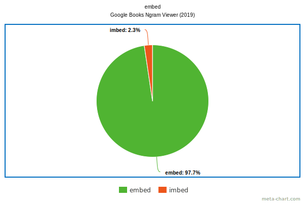
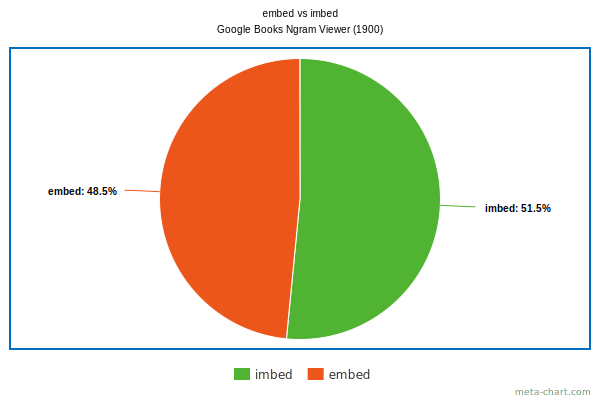
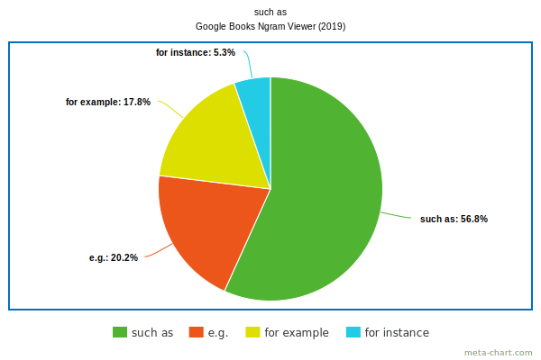
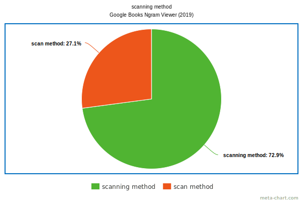
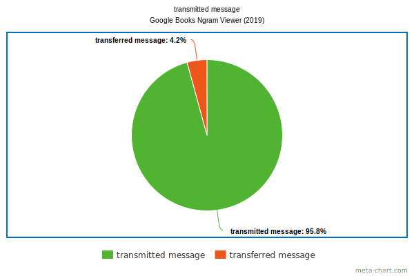
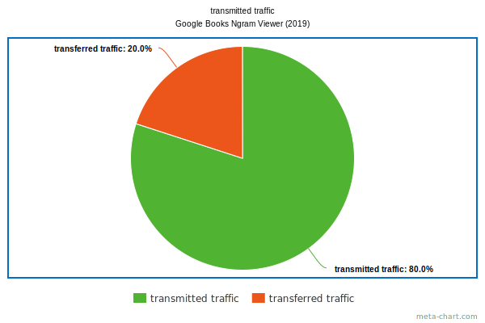
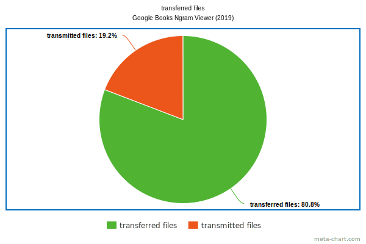

# Index

[abbreviation \| acronym \| backronym \| initialism](#abbreviation--acronym--backronym--initialism)

[able to \| capable of](#able-to--capable-of)

[accidentally \| coincidentally \| coincidently \| incidentally](#accidentally--coincidentally--coincidently--incidentally)

[accurate \| precise](#accurate--precise)

[activity \| activities \| assignment \| drill \| exercise \| problem \| task](#activity--activities--assignment--drill--exercise--problem--task)

[additional \| extra](#additional--extra)

[affirm \| confirm](#affirm--confirm)

[After that,](#after-that)

[ahead of \| before](#ahead-of--before)

[also \| besides \| furthermore \| moreover](#also--besides--furthermore--moreover)

[amend \| emend \| mend](#amend--emend--mend)

[among \| amongst](#among--amongst)

[among \| between](#among--between)

[answer \| reply \| response](#answer--reply--response)

[anybody \| anyone](#anybody--anyone)

[apparatus \| device](#apparatus--device)

[artefact \| artifact](#artefact--artifact)

[aspects \| peculiarities](#aspects--peculiarities)

[await \| wait](#await--wait)

[backward \= backwards](backward--backwards)

[be different \= differ](#be-different--differ)

[before \| till \| until](#before--till--until)

[being used \| in use](#being-used--in-use)

[beside \| besides](#beside--besides)

[beverage \| drink](#beverage--drink)

[big \| large](#big--large)

[blue dog \| red dog](#blue-dog--red-dog)

[boobs \| tits](#boobs--tits)

[borehole \| well](#borehole--well)

[boring \| drilling](#boring--drilling)

[building \| compiling](#building--compiling)

[bunny \| rabbit](#bunny--rabbit)

[canceled \| cancelled](#canceled--cancelled)

[cannot \| failed \| unable](#cannot--failed--unable)

[cause \| reason](#cause--reason)

[change \| modify](#change--modify)

[character \| glyph \| symbol](#character--glyph--symbol)

[check \| check for \| check that \| validate \| verify](#check--check-for--check-that--validate--verify)

[cite \| quote](#cite--quote)

[class \| lesson](#class--lesson)

[click \| press \| tap](#click--press--tap)

[close \| exit \| quit](#close--exit--quit)

[common \| general](#common--general)

[common knowledge \| common sense](#common-knowledge--common-sense)

[common knowledge \| general knowledge](#common-knowledge--general-knowledge)

[common language \| general language](#common-language--general-language)

[company name](#company-name)

[competition \| contest](#competition--contest)

[complement \| supplement](#complement--supplement)

[compose \| comprise \| contain](#compose--comprise--contain)

[configuration \| options \| preferences \| properties \| setting](#configuration--options--preferences--properties--setting)

[conjurer \| illusionist \| magician](#conjurer--illusionist--magician)

[contain \| include](#contain--include)

[containing \| that contains](#containing--that-contains)

[content \| contents](#content--contents)

[correct errors \| eliminate errors \| fix errors \| rectify errors \| remove errors \| repair errors \| resolve errors](#correct-errors--eliminate-errors--fix-errors--rectify-errors--remove-errors--repair-errors--resolve-errors)

[cost \| price](#cost--price)

[crash \| crush](#crash--crush)

[create \| generate \| make \| produce](#create--generate--make--produce)

[critical \| crucial](#critical--crucial)

[custom \| customized](#custom--customized)

[data \| information](#data--information)

[decrease \| reduce](#decrease--reduce)

[dedicated \| devoted](#dedicated--devoted)

[define \| determine \| determine on \| establish](#define--determine--determine-on--establish)

[delete \| remove](#delete--remove)

[demand \| need \| requirement](#demand--need--requirement)

[dependant \| dependent](#dependant--dependent)

[dependence \| dependency](#dependence--dependency)

[directive \| instruction](#directive--instruction)

[disguise \| guise](#disguise--guise)

[disperse \| dissolve](#disperse--dissolve)

[divide \| separate](#divide--separate)

[dosage \| dose](#dosage--dose)

[dot \| full stop \| period \| point](#dot--full-stop--period--point)

[downward \= downwards](downward--downwards)

[drag \| lift \| thrust](#drag--lift--thrust)

[due to \| owing to](#due-to--owing-to)

[dummy \| fake \| mock \| stub](#dummy--fake--mock--stub)

[during \| while](#during--while)

[during \| within](#during--within)

[duty \| responsibility](#duty--responsibility)

[each \| each and every \| every](#each--each-and-every--every)

[effective \| efficient](#effective--efficient)

[effectiveness \| ~~effectivity~~ \| efficacy \| efficiency](#effectiveness--effectivity--efficacy--efficiency)

[e.g. \| for example \| for instance \| such as](#eg--for-example--for-instance--such-as)

[embed \= imbed](#embed--imbed)

[embed \| incorporate \| integrate](#embed--incorporate--integrate)

[emulator \| simulator](#emulator--simulator)

[enable \| ensure](#enable--ensure)

[enchantress \| mage \| magician \| necromancer \| shaman \| sorcerer \| warlock \| witch \| witch doctor \| wizard](#enchantress--mage--magician--necromancer--shaman--sorcerer--warlock--witch--witch-doctor--wizard)

[enhance \| improve](#enhance--improve)

[entire \| whole](#entire--whole)

[error \| failure \| fault](#error--failure--fault)

[error \| mistake](#error--mistake)

[essential \| necessary](#essential--necessary)

[essentially \| substantially](#essentially--substantially)

[everybody \| everyone](#everybody--everyone)

[expand \| extend](#expand--extend)

[expert \| specialist](#expert--specialist)

[explanation](#explanation)

[explode \| implode](#explode--implode)

[fast \| quick](#fast--quick)

[field \| text box](#field--text-box)

[gain \| profit](#gain--profit)

[generally \| in general](#generally--in-general)

[given that \| provided that](#given-that--provided-that)

[goal \| objective](#goal--objective)

[hamper \| hinder \| impair \| undermine](#hamper--hinder--impair--undermine)

[handle \| process](#handle--process)

[here \| in here](#here--in-here)

[host \| node](#host--node)

[I have got \| I have gotten](#i-have-got--i-have-gotten)

[~~in free time~~ \| in my free time](#in-free-time--in-my-free-time)

[In that case \| In this case](#in-that-case--in-this-case)

[in the list \| on the list](#in-the-list--on-the-list)

[individual \| person](#individual--person)

[individual \| personal](#individual--personal)

[individually \| separately \| severally](#individually--separately--severally)

[initial \| original](#initial--original)

[inside knowledge \| insider knowledge \| insider’s knowledge](#inside-knowledge--insider-knowledge--insiders-knowledge)

[installation \| setup](#installation--setup)

[instant \| moment](#instant--moment)

[integrate \| merge](#integrate--merge)

[issue \| problem](#issue--problem)

[it is \| this is](#it-is--this-is)

[job \| work](#job--work)

[killing \| murder](#killing--murder)

[lack \| miss](#lack--miss)

[learn how to \| learn to](#learn-how-to--learn-to)

[license \| permit](#license--permit)

[located \| placed \| positioned \| situated](#located--placed--positioned--situated)

[material \| materiel](#material--materiel)

[maximal \| maximum, minimal \| minimum](#maximal--maximum-minimal--minimum)

[menace \| threat](#menace--threat)

[minimal \| minimum](#minimal--minimum)

[means](#means)

[named \| ~~named as~~](#named--named-as)

[new \| novel](#new--novel)

[package \| packet \| parcel](#package--packet--parcel)

[particular \| specific](#particular--specific)

[people’s lives \| peoples’ lives \| people’s life \| in the lives of people](#peoples-lives--peoples-lives--peoples-life--in-the-lives-of-people)

[people \| peoples \| Peoples \| persons](#people--peoples--peoples--persons)

[permission \| privilege](#permission--privilege)

[possible \| potential](#possible--potential)

[practice \| practise](#practice--practise)

[privilege \| right](#privilege--right)

[quotation \| quote](#quotation--quote)

[ratio between ... and \| ratio of ... to](#ratio-between--and--ratio-of--to)

[reboot \| restart](#reboot--restart)

[recommend that you \| recommend you \| ~~recommend to~~ \| ~~recommend you to~~](#recommend-that-you--recommend-you--recommend-to--recommend-you-to)

[regime \| regimen \| regiment](#regime--regimen--regiment)

[register \| registry](#register--registry)

[request \| require](#request--require)

[related to \| relates to \| relating to](#related-to--relates-to--relating-to)

[residual \| residue \| residues](#residual--residue--residues)

[router (pronunciation)](#router-pronunciation)

[said](#said)

[salary \| wages](#salary--wages)

[scan method \= scanning method](#scan-method--scanning-method)

[schema \| schemata \| scheme](#schema--schemata--scheme)

[shameful \| shameless](#shameful--shameless)

[signalling \| signaling](#signalling--signaling)

[skyward \= skywards](skyward--skywards)

[sniffing \| snooping \| spoofing](#sniffing--snooping--spoofing)

[somebody \| someone](#somebody--someone)

[special \| specific](#special--specific)

[state \| status](#state--status)

[subject \| topic](#subject--topic)

[toward \= towards](toward--towards)

[that \| which](#that--which)

[that \| who](#that--who)

[transfer \| transit](#transfer--transit)

[transfer \| transmit](#transfer--transmit)

[troop \| troupe](#troop--troupe)

[trooper \| trouper](#trooper--trouper)

[update \| upgrade](#update--upgrade)

[usage \| use](#usage--use)

[validation \| verification](#validation--verification)

[variant \| variation](#variant--variation)

[what \| which](#what--which)

[whether \| whether or not](#whether--whether-or-not)

***

## initial \| original

Use ***initial*** when referring to the first version or draft of something.

Use ***original*** when referring to something that is not a copy or imitation, but rather the first or earliest of its kind.

Use *authentic* or *genuine* when referring to something that is not a fake or imitation, but rather the real thing.

### Exceptions

#### IT

In software development, ***original*** could refer to the first version of a program, while ***initial*** could refer to the first step in a process.

#### Law

***Original*** could refer to a signed and dated contract, while ***initial*** could refer to the act of initialing[^initialing] each page of a document to indicate agreement.

[^initialing]: Initialing, paraphing \= *Парафирование* &mdash; предварительное подписание договора (или его отдельных статей, подписание на каждой странице) в том случае, если международный договор полностью согласован между сторонами, но требует ещё одобрения правительств, заключающих договор, или когда подписание окончательно оформленного текста по каким-либо причинам откладывается. Парафирование состоит в том, что уполномоченные ставят под текстом договора не свои подписи и печати, а лишь *параф* &mdash; росчерк, часть фамилии или инициалы каждого из них. Иногда инициалы ставятся не только в конце текста, но и на каждой странице. Парафирование не является обязательным этапом заключения договора и не заменяет подписания договора.

*Sources: [1](https://thecontentauthority.com/blog/original-vs-initial),
[2](https://ru.wikipedia.org/wiki/%D0%9C%D0%B5%D0%B6%D0%B4%D1%83%D0%BD%D0%B0%D1%80%D0%BE%D0%B4%D0%BD%D1%8B%D0%B9_%D0%B4%D0%BE%D0%B3%D0%BE%D0%B2%D0%BE%D1%80#%D0%9F%D0%B0%D1%80%D0%B0%D1%84%D0%B8%D1%80%D0%BE%D0%B2%D0%B0%D0%BD%D0%B8%D0%B5)*

***

## related to \| relates to \| relating to

***Related to***&mdash;connected with.

***Relating to***&mdash;about or concerning.

1. Activity focus:
   > *My question **relates to** your earlier work.*
1. Status focus:
   > *My question **is related to** you earlier work.*

*Sources:
[1](https://english.stackexchange.com/questions/67703/relating-to-or-related-to),
[2](https://english.stackexchange.com/questions/260331/relates-to-vs-is-related-to)*

***

## configuration \| options \| preferences \| properties \| setting

**Setting** usually refers to a single variable that can be changed.

**Configuration** refers to a group of settings.

For example, changing the brightness of a phone screen is a ***setting***. But all of the settings you have chosen on your phone make up its ***configuration***.

***Properties*** represent the characteristics of a single component or object in the application.

***Options*** alter global ways that the application works (for example, options of a user interface) and can be disabled.

***Settings*** and ***Preferences*** change qualities of how the application works. The implication here is to change, not disable.

*Sources: [1](https://hinative.com/questions/1653320#answer-4076441),
[2](https://stackoverflow.com/questions/2074384/options-settings-properties-configuration-preferences-when-and-why)*

***

## toward \= towards
## backward \= backwards
## downward \= downwards
## skyward \= skywards

| Usage | Form |
| --- | --- |
| AmE | *upward, downward, skyward, toward* |
| BrE | *upwards, downwards, skywards, towards* |

> *She wrote her name **backward\/backwards** in her notebook.*

Only ***backward*** is considered standard as an adjective; ***backwards*** is often used in <ins>casual</ins> speech and writing:

> *The kid wearing the **backwards** hat is the one that broke the mailbox.* \[casual\]

*Sources: [1](https://writingexplained.org/backward-or-backwards-difference),
[2](https://www.thesaurus.com/e/grammar/backward-or-backwards)*

***

## click \| press \| tap

**Click**&mdash;to activate a link or button on a computer screen with a mouse.

**Press**&mdash;to press keys on a keyboard.

**Tap**&mdash;to directly touch a touch sensitive screen.

*Sources: [1](https://rephrasely.com/usage/click-vs-press),
[2](https://english.stackexchange.com/questions/192523/click-tap-or-click-or-tap)*

***

## embed \= imbed

*See also [embed in \| into \| ~~to~~](./Grammar/Prepositions.md#embed-in--into--to)*

*Sources: [1](https://thecontentauthority.com/blog/imbed-vs-embed),
[2](https://www.dictionary.com/e/imbed-vs-embed),
[3](https://books.google.com/ngrams/graph?content=embed%2Cimbed&year_start=1800&year_end=2019&corpus=en-2019&smoothing=3)*

***

## embed \| incorporate \| integrate

***Embed*** refers to the process of inserting a third-party element into a website or application, such as a video, image, or social media post. The embedded element retains its original source and functionality, but is displayed within the host website or application. This is commonly done through the use of HTML code or an [embed code](./Grammar/Prepositions.md#embed-in--into--to) provided by the third-party source.

***Incorporate*** refers to the act of bringing together or combining different elements into a single entity.

***Integrate*** also refers to the act of combining different elements, but with a focus on creating a seamless whole. It implies a deeper level of integration than *incorporate*, where the different parts are not just brought together, but are also made to work together in a cohesive way.

> *We need to **incorporate** ~~integrate~~ this new employee into our team*.

> *We need to **integrate** ~~incorporate~~ this new software into our system.*

> *The company plans to **incorporate** sustainable practices into their business model.*

> *It’s important to **incorporate** feedback from customers into product development.*

In general, ***embedding*** means to place something within another thing, while ***integrating*** means to combine multiple things into a single system.

For example, when you ***embed*** a YouTube video on your website, you’re essentially placing the video player within your page. On the other hand, if you ***integrate*** your website with a payment processing system, you’re combining two separate systems into one cohesive whole.

| Embed | Integrate |
| --- | --- |
| Inserting a third-party element | Combining two or more elements |
| Retains original source and functionality | Creates a cohesive and unified whole |
| Displayed within the host website or application | Allows different systems to communicate with each other |

Rather than embedding a large PDF file on your website, it may be better to provide a link to the file instead.

### Website Design

***Embedding content*** within a webpage can provide a seamless experience for the user, as the content appears to be part of the page itself. However, this can also slow down the loading time of the page. On the other hand, ***integrating content*** can provide faster loading times, but may not appear as seamless to the user. It’s important to consider the overall design and functionality of the website when making this decision.

If you are embedding a map or a chart on your website, it may be more beneficial for users to see the content in a larger format rather than integrated into the page. This allows users to interact with the content more easily and see more details.

### Software Integration

***Embedding software*** within another system can provide a more customized experience for the user, but can also require more development time and resources. ***Integrating software*** can be a quicker and easier solution, but may not provide the same level of customization. It’s important to consider the specific needs and goals of the integration when making this decision.

*See also [embed in \| into \| ~~to~~](./Grammar/Prepositions.md#embed-in--into--to),
[incorporate ∅ \| in \| into \| with \| within](./Grammar/Prepositions.md#incorporate---in--into--with--within)*

*Sources: [1](https://thecontentauthority.com/blog/embed-vs-integrate),
[2](https://thecontentauthority.com/blog/incorporate-vs-integrate)*

***

## that \| which

In formal AmE, ***that*** is used in restrictive clauses, and ***which*** is used in nonrestrictive clauses:

> *Do you remember the name of the book **that** Carla recommended to us?*

> *The book, **which** I found at a dusty used bookstore, was a real page-turner.*

> *These pairs of pants, **which** no longer fit me, should be given away.*

If the relative clause contains information that is not essential to the meaning of the sentence, and is also preceded by a comma, a dash, or parenthesis, it’s probably nonrestrictive, so use ***which***. If not, odds are it’s restrictive, so use ***that***.

However, the above distinction is a rule of formal AmE, and is not as strictly observed in BrE or in informal English of any type.

Note that in restrictive clauses, sometimes *that* can be omitted, especially in informal settings:

> *Any book you like must be good.*

*See also [that \| who](#that--who)*

[*Source*](https://www.dictionary.com/e/that-vs-which)

***

## e.g. \| for example \| for instance \| such as

Can be used interchangeably to illustrate a point. Using them alternately is a great way to avoid repetition:

> *I love watching sitcoms, **for example** Friends, The Office, and Big Bang Theory.*

> *I’m keen on fantasy literature, **for instance** Harry Potter, The Lord of the Rings, and The Chronicles of Narnia.*

> *I can’t stand green vegetables, **such as** broccoli, spinach, or brussels sprouts.*
 
> *Set an immediate timeline, **e.g.**, three weeks, to learn all this.*

> *WIPA will launch a 12-week choral program for up to 60 older adults that explores musical themes (**e.g.**, Jazz, Rock, Great American Songbook, Classical) chosen by the participants.*

Microsoft Style Guide suggests replacing ***e.g.*** with *for example*, *such as*, or *like*.

*Sources: [1](https://www.myenglishteacher.eu/blog/difference-between-for-example-for-instance-and-such-as),
[2](https://books.google.com/ngrams/graph?content=e.g.%2C+for+example%2C+for+instance%2C+such+as&year_start=1800&year_end=2019&corpus=en-2019&smoothing=3),
[3](https://learn.microsoft.com/en-us/style-guide/a-z-word-list-term-collections/e/eg),
[4](https://www.merriam-webster.com/grammar/ie-vs-eg-abbreviation-meaning-usage-difference)*

***

## In that case \| In this case

| Phrase | Pattern | Explanation | Example |
|--------|---------|-------------|---------|
| **In this case** | “in this example” | Develops a point or idea from the previous situation | *Sometimes our printer runs out of ink. **In this case**, we must write out all of our forms manually.* |
| | | | *Sometimes my manager makes me work late. **In this case**, I got away with it, but I might not be so lucky again.* |
| **In that case** | “if that’s the situation, I’ll do this instead” | Presents a counterpoint after receiving news that changes your mind | *\- We’re closing soon.* |
| | | | *\- **In that case**, I’ll hurry up.* |

***In this case,*** is much more likely to be seen in writing because it’s used to elaborate points or to expand on a situation.

You should place a comma after both phrases. They work as their own separate clause to introduce a new idea, meaning they need a comma to help break up the flow of the sentence.

[*Source*](https://grammarhow.com/in-that-case-vs-in-this-case)

***

## scan method \= scanning method

*Sources: [1](https://english.stackexchange.com/questions/103082/scan-method-vs-scanning-method/104238#104238),
[2](https://books.google.com/ngrams/graph?content=scan+method%2Cscanning+method&year_start=1800&year_end=2019&corpus=en-2019&smoothing=3)*

***

## also \| besides \| furthermore \| moreover

| Word | Role | Example |
|------|------|---------|
| **Also** | Simple addition. | *I like green. I **also** like blue.* |
| **Furthermore** | Addition and advancing an argument. You have a line of reasoning, and you are furthering that same particular line with additional evidence. It conveys a sense of building. | *You are a bad person. You cheat and you lie. **Furthermore**, you steal.* |
| **Moreover** | Addition, advancing an argument, and indicating that the added reason is of a <ins>different</ins> kind than previously furnished reasons. Even if you weren’t convinced by this particular line of reasoning, there’s this other line of reasoning that is fundamentally different but still points to the same conclusion. | *I don’t like Rufus the dog. He’s disobedient and mean. **Moreover**, Julie doesn’t like Rufus the dog, either.* |
| | | *Our XRD and FTIR results support conclusion X. **Moreover**, conclusion X is consistent with similar literature reports for comparable systems.* |
| | | *Our XRD and FTIR results support conclusion X. Conclusion X is **moreover** consistent with similar literature reports for comparable systems.* |
| **Besides** | The next level up from *moreover*. *Besides* signals that the game is over. You are adding a cherry on top, and\/or you are negating the importance of the entire argument. Even if the entire previous argument were completely wrong, you should accept the conclusion for this other reason. | *This restaurant is gross and disgusting. **Furthermore**, I get sick every time I eat there. **Moreover**, we’re in a hurry. **Besides**, I’m not even hungry.* |

[*Source*](https://wp.nyu.edu/sciwriabudhabi/2018/07/31/also-furthermore-moreover-besides)

***

## abbreviation \| acronym \| backronym \| initialism

| Term | Definition | Example | Complete form |
|------|------------|---------|---------------|
| ***Abbreviation*** | The shortened form of a word or phrase intended to speed up communication and\/or use fewer symbols. | *vs.* | versus |
| | | *dept.* | department |
| ***Acronym*** | An abbreviation made up of parts of the phrase it stands for and pronounced as a word. | *NATO* | The North Atlantic Treaty Organization |
| | | *AIDS* | acquired immunodeficiency syndrome |
| | | *laser* | light amplification by the stimulated emission of radiation |
| | | *GABA* | Gamma-Aminobutyric Acid |
| ***Initialism*** | An acronym that is pronounced as individual letters. | *DNA* | Deoxyribonucleic Acid |
| | | *RT-PCR* | Reverse transcription polymerase chain reaction |
| ***Backronym*** | An acronym which meaning was created after the abbreviation. | *SOS* | Save Our Ship |

*Sources: [1](https://wwwnc.cdc.gov/eid/page/abbreviations-acronyms-initialisms),
[2](https://www.writersdigest.com/write-better-fiction/abbreviation-vs-acronym-vs-initialism-grammar-rules),
[3](https://simple.wikipedia.org/wiki/Backronym)*

***

## each \| each and every \| every

If you want to emphasize a person or a thing, use ***each***:

> ***Each** season of the show has ten episodes.*

> *They **each** have their own car.*

> *My brothers lost the bet and paid $25 **each**.*

If you want to emphasize the group, use ***every***:

> *We enjoyed **every** second of the movie.*

> ***Every** doctor in that hospital is kind, compassionate, and caring.* \[\=All doctors...\]

***Every*** is also used to indicate how often something occurs:

> *The train stops **every** 30 minutes to let passengers off.*

When placed before a singular noun, ***each*** and ***every*** are both correct. In this case, the verb that follows would also be singular:

> ***Each** day is special.* \[\= ***Every** day is special.*\]

Only ***each*** can be used after a plural subject and would be followed by a plural verb form:

> *<ins>They</ins> **each** <ins>have</ins> their own office.*

The only time ***every*** can be used with a plural noun is if you use *every one of*:

> ***Every** <ins>one of</ins> the gift bags had cash.*

***Each and every*** is sometimes used to add emphasis:

> *I love **each and every** one of my students.*

Although it’s common in speech, it should be avoided in writing as it is considered redundant.

[*Source*](https://languagetool.org/insights/post/word-choice-each-and-every)

***

## recommend that you \| recommend you \| ~~recommend to~~ \| ~~recommend you to~~

> &check; *I **recommend that you define** those parameters beforehand.*

> &check; *I **recommend you define** those parameters beforehand.*

> &cross; *I **recommend <ins>you</ins> to define** those parameters beforehand.* \[My recommendation (to some other currently unspecified person) is that you are the person best-suited to the task.\]

> &check; *I **recommend that you hide** your friend list from others.* \[Best option.\]

> &check; *I **recommend hiding** your friend list from others.* \[Also possible.\]

> &cross; *I ~~**recommend to hide**~~ your friend list from others.* \[*Recommend* can’t take an infinitive unless it has a direct object.\]

*Sources: [1](https://english.stackexchange.com/questions/35953/recommend-you-to-vs-recommend-that-you),
[2](https://forum.wordreference.com/threads/recommend-that-recommend-to-recommend-ing.3582437)*

***

## named \| ~~named as~~

Using ***named as*** isn’t strictly ungrammatical, but it’s not standard usage.

> *This method, **named** ABC, is used to calculate the temperature of these categories of objects.*

Non-restrictive phrases are set off in commas.

[*Source*](https://ell.stackexchange.com/questions/11313/named-or-named-as)

***

## hamper \| hinder \| impair \| undermine

**Hinder**&mdash;to stop or slow down:

> *The avalanche **hindered** the car from going forward.*

**Impair**&mdash;to reduce:

> *The darness **impaired** his vision.*
 
**Undermine**&mdash;to make (someone or something) weaker or less effective usually in a secret or gradual way:

> *She tried to **undermine** my authority by complaining about me to my boss.*

> *The events of the past year have **undermined** people’s confidence in the government.*

If something ***hinders*** you, it keeps you from moving forward. It’s usually an outside obstruction.

If something ***hampers*** you, then it prevents you from doing something freely. The problem is inherent, or at least immediate (e.g. *wet clothes which hamper a swimmer*).

*Sources: [1](https://www.italki.com/en/post/question-206106),
[2](https://www.italki.com/en/post/PjcKB8PbA2O1eK0pUhceg0),
[3](https://www.britannica.com/dictionary/undermine)*

***

## custom \| customized

**Customized**: modified from something that already exists, such as a Web site template or a general-purpose application program:

> ***Customized** design* \[a slightly modified version of a design that we’ve already created\]

**Custom**: developed from the beginning for one specific client. In BrE one can also use *bespoke*, a term that was originally used for men’s clothing.

> ***Custom** design* \[a completely fresh design, made just for you\]

*Sources: [1](https://forum.wordreference.com/threads/custom-customized.2938512/#post-14872193),
[2](https://casakids.com/blogs/news/differences-between-ready-made-standard-custom-and-customized-design-furniture)*

***

## register \| registry

A **register** is a list or record of people or things, typically used for administrative purposes.

A **registry** is a centralized database or system used for regulatory or informational purposes that contains information about a specific type of entity, such as a product, service, or organization.

A **register** is a list or record of names or items, while a **registry** is a place where information is stored or recorded.

| Field | Register | Registry |
|-------|----------|----------|
| IT | A small amount of memory that is used to store data that is frequently accessed by the CPU. | A hierarchical database that contains configuration settings for Windows and installed applications. |
| Law   | A document that contains a list of legal transactions. | A public record or database that contains information about legal matters. |
| *Examples* | *land **register*** | ***registry** of wills* |
|          | ***register** of deeds* | ***registry** of trademarks* |

### Regional differences

| Definition | Term \/ Field | Alternative \/ Field |
|------------|---------------|----------------------|
| A government office where births, deaths, and marriages are recorded. | ***register** office* (BrE) | *vital records office* (AmE) |
| A government office that handles vehicle registrations. | ***registry** office* (some regions) | *Department of Motor Vehicles (DMV)* (other regions) |

[*Source*](https://thecontentauthority.com/blog/register-vs-registry)

***

## emulator \| simulator

A ***simulator*** focuses on a system model, aiming to mimic some conditions and operations that lead to a final result.

An ***emulator*** provides a recreated environment to observe these conditions and execute these operations as in the original system. So, we can explore systems’ processing routines and operational behaviors besides only their results.

|            | Simulation | Emulation |
|------------|------------|-----------|
| **Works with**  | Software (algorithmic description of processes) | Software and hardware (recreation of the entire system) |
| **Executes as** | A faster version of the original process (typically) | An equivalent version of the original system |
| **Aims to**     | Analyze the final state of the model and its results | Analyze the entire processing of a task, its results, and collateral effects in the system |
| **Examples**    | Flight simulators, weather forecasting | Android emulator, virtual machines |

[*Source*](https://www.baeldung.com/cs/simulation-vs-emulation)

***

## create \| generate \| make \| produce

***Produce*** is used to emphasise the process of forming the end product. The method and rate of production is being highlighted. You produce something by consuming raw materials or some other input and then transforming it to make the end product. Something that is produced is provided to a user, customer, market or similar:

> *This school **produces** really talented students.*

> *The farm **produces** more wheat than it did five years ago.*

> *The factory **produces** high quality auto parts.*

***Create*** is used to describe making a single object or result. It emphasises the end result rather than the process of making it. *Create* is normally used in situations where creativity or artistry is required to make the result:

> *We have **created** the greatest bridge in all the world.*

> *Can you please **create** something really special for my mother’s birthday?*

> *I think he wanted to **create** chaos to break the company.*

A chef might ***create*** a new dish, but after it’s been created, he might find himself ***making*** it every night.

***Generate*** is used when the thing being made is measured in a continuous quantity, not a single object or a countable number of objects. For example you can generate power (not countable, not a single object) but you can’t generate a set of knives (countable objects). Note, you can’t generate love or peace - you have to make peace.

> *The power station **generates** lots of electricity.*

> *Our department **generates** the most profit for the company.*

> *I’ve **generated** more success for this business than any of you.*

> *The fire **generates** a lot of heat.*

### IT

**Generate**&mdash;produce something through a series of step prescribed by an algorithm. It’s a pretty safe word for anything built by software (~~*generate a cake*~~).

A button that said *Generate Video* might be emphasizing that the software will now make the video as was set up by the user, while a button that said *Create Video* might emphasize that the user is about to put the finishing touches on her creation. Yet *Make Video* is a viable option, too. One might argue that *make* is the simplest word of the three, and it might therefore be apt for software that might be used by children.

*Sources: [1](https://ell.stackexchange.com/questions/76985/create-vs-generate-vs-make),
[2](https://www.ukentry.com/produce-create-generate-difference.html)*

***

## generally \| in general

***Generally*** (adverb) = ***in general*** (idiom)

***In general*** almost always comes at the start of a sentence, adding emphasis, or rather acting like an introduction. It should not come before a verb, though it can come after a verb, in commas:

> ***In general**, the lesson was difficult.*

> *The lesson was, **in general**, difficult.* \[Less common, adds emphasis to *in general*\]

Placing ***in general*** or ***generally*** at the end of a sentence makes the idea sound uncertain or more hesitant:

> *I like this band, **generally**.*

[*Source*](https://englishlessonsbrighton.co.uk/general-vs-generally/)

***

## issue \| problem

An ***issue*** is a situation that needs a discussion or a debate, whereas a ***problem*** requires an urgent solution.

An ***issue*** has little or no impact, whereas a ***problem*** can significantly affect people.

**Problem**:
1. A difficulty that has to be resolved or dealt with. 
   > *She’s leaving because she faced numerous **problems** to do with racism.*
1. A question to be answered, schoolwork exercise.
   > *Study hard, but don’t overdo it. The **problems** in the exam won’t be difficult to solve.*
1. A puzzling circumstance.
1. Objection.
   > *You got a **problem** with that?*
1. Difficulty in accepting or understanding or refusal to accept or understand.
   > *You made your best honest effort; if they judge you harshly, that’s their **problem**, not yours.*
1. (climbing) A set of moves required to complete a climb.

*Sources: [1](https://askanydifference.com/difference-between-issue-and-problem),
[2](https://en.wiktionary.org/wiki/problem#English),
[3](https://en.wiktionary.org/wiki/issue#English)*

***

## among \| amongst

***Among*** = ***amongst***.

***Among*** is more common in AmE, while ***amongst*** is used almost exclusively in BrE. ***Amongst*** is often considered old-fashioned or pretentious in AmE. Some British publications, including major newspapers, issue style guides that insist on using ***among***.

[*Source*](https://www.dictionary.com/e/among-vs-amongst/)

***

## field \| text box

**Text boxes** are ***fields*** that let you enter text.

[*Source*](https://www.indeed.com/career-advice/career-development/gui-meaning)

***

## correct errors \| eliminate errors \| fix errors \| rectify errors \| remove errors \| repair errors \| resolve errors

There is no unanimous opinion on what to use.

*Sources: [1](https://books.google.com/ngrams/graph?content=fix+errors%2Celiminate+errors%2Cresolve+errors%2Cremove+errors%2Crepair+errors%2Ccorrect+errors%2Crectify+errors&year_start=1900&year_end=2008&corpus=en-2012&smoothing=3),
[2](https://ell.stackexchange.com/questions/78777/which-verb-should-go-before-error-eliminate-resolve-remove-or)*

***

## possible \| potential

**Possible**&mdash;capable of happening, existing, or being true without contradicting proven facts, laws, or circumstances:

> *Is it **possible** to move faster than the speed of light?*

**Potential**&mdash;capable of being but not yet in existence; latent or undeveloped:

> *A **potential** problem.*

> *A substance with many **potential** uses.*

[*Source*](https://www.askdifference.com/potential-vs-possible/)

***

## goal \| objective

**Goal**&mdash;an achievable outcome that is typically broad and long-term. A company might use goals to inform yearly strategies that each department will execute.

An ***objective*** defines the specific, measurable actions each team employee must take to achieve the overall goal.

***Goals*** provide direction whereas ***objectives*** measure how you should follow that direction.

| Goal | Objective |
|------|-----------|
| Open a new company HQ in Phoenix, AZ by Q4. | Obtain all licensing and permit documents by Q2. |
| Increase company market share by 10%. | Grow customer base by 22% month-over-month for the next 12 months. |
| Reduce donut cost by 18% in the next five years. | Switch to a lower-cost sugar provider in the next six months. |

[*Source*](https://blog.hubspot.com/marketing/goals-vs-objectives)

***

## essential \| necessary

***Essential*** means something is indispensable or vital to the *existence*, *function*, or *success* of something else, and cannot be omitted or replaced:

> *Water is **essential** for life.*

> *Good communication skills are **essential** for success in business.*

***Necessary*** refers to something that is required or needed in order to achieve a particular goal or outcome. It suggests that something is required for a specific purpose or situation, but may not be indispensable or vital in all circumstances:

> *It is **necessary** to have a driver’s license to operate a vehicle.*

> *It is **necessary** to study for the exam in order to pass.*

*See also* [essentially \| substantially](#essentially--substantially)

[*Source*](https://langeek.co/en/grammar/course/1199/essential-vs-necessary)

***

## demand \| need \| requirement

***Demands*** has an element of *want*, while ***requirements*** has a sense of *need*:

> *I may **demand** to see the manager on duty if I am upset over poor customer service.*

> *I may **require** to use the rest room!*

**Need**&mdash;a basic necessity or desire that an individual requires to survive or thrive:

> *Children have a fundamental **need** for love and affection from their parents.*

**Requirement**&mdash;a specific condition or demand that must be met to achieve a particular objective or goal:

> *Passing the exam is a **requirement** for obtaining a driver’s license.*

Compare:

> *I **need** a degree to get this job* \[a degree is a personal desire or preference, rather than a necessary qualification\].

> *A degree is a **requirement** for this job* \[a degree is a non-negotiable qualification\].

> *It is a **requirement** that all employees attend the meeting* \[there will be consequences for those who do not attend\].

> *It is necessary for all employees to attend the meeting* \[simply emphasizes the importance of attending without implying consequences\].

### Business

***Needs*** are goals and objectives a business must achieve, whereas ***requirements*** are the things we need to do in order to achieve a need. Converting business needs into specific, measurable, relevant requirements is very important for the success of a business.

*Sources: [1](https://www.englishforums.com/English/DemandRequirements/cxlvb/post.htm),
[2](https://thecontentauthority.com/blog/need-vs-requirement),
[3](https://pediaa.com/what-is-the-difference-between-need-and-requirement/)*

***

## aspects \| peculiarities

**Peculiar**&mdash;unusual and strange, sometimes in an unpleasant way:

> *She has the most **peculiar** ideas.*

> *What a **peculiar** smell!*

> *It’s **peculiar** that they didn't tell us they were going away.*

> *The video on road accidents made me feel rather **peculiar*** (= ill, BrE).

**Peculiarity**&mdash;the quality of being strange or unusual, or an unusual characteristic or habit:

> *You couldn’t help but be aware of the **peculiarity** of the situation.*

> *Well, we all have our little **peculiarities**, don’t we?*

**Aspect**&mdash;one part of a situation, problem, subject, etc.:

> *Which **aspects** of the job do you most enjoy?*

> *That’s the most worrying **aspect** of the situation.*

> *Lighting is a vitally important **aspect** of filmmaking.*

*Sources: [1](https://dictionary.cambridge.org/dictionary/english/peculiar),
[2](https://dictionary.cambridge.org/dictionary/english/peculiarity),
[3](https://dictionary.cambridge.org/dictionary/english/aspect)*

***

## state \| status

**State**&mdash;the condition or mode of something at a particular time (temporary).

**Status**&mdash;the position or standing of something in relation to others; it describes in what step of a certain process an object is (permanent or long-lasting).

if you are checking the ***state*** of your computer, you are checking its current condition. On the other hand, if you are checking the ***status*** of your computer, you are checking its position in relation to others (e.g. whether it is online or offline).

***Status*** is one-dimensional, i.e., it is determined by a single value (e.g., the social rank of a person, the amount of progress made by a project, the goodness of an outcome, etc.) usually ranging from good to bad, desirable to undesirable, or the like.

***State*** is “all the rest”: it is either n-dimensional, or it does not refer to something that can be ordered by quality.

> The package’s ***state*** can be *mint*, *broken*, *partly broken*, while its ***status*** can be *ready*, *in delivery*, *delayed*, *delivered*, *lost*.

> A soldier’s ***state*** is *wounded* and his ***status*** is *awaiting surgery*.

> A lab specimen’s ***state*** is *frozen* and its **status** is *to be discarded in 2029*.

| Field | State | Status | Example |
|-------|-------|--------|---------|
| IT | the current condition of a system or application | the information about the system or application that is displayed to the user | An application might display the ***status*** of a file transfer process, while the ***state*** of the application might be *running* or *idle*. **Status** (jargon) might refer to a specific message or code that indicates whether a task has been completed successfully or not. |
| Psychology | current mental and emotional condition | position or role in a social hierarchy | A person’s ***state*** might be *happy* or *anxious*, while their status might be *leader* or *follower*. |
| Law | jurisdiction or government under which the individual or entity falls | legal position or standing within that jurisdiction | An individual might have the legal ***status*** of *citizen* within a particular ***state***. |
| Medicine | current physical condition | overall prognosis | A patient’s ***state*** might be *stable* or *critical*, while their ***status*** might be *improving* or *worsening*. |

*Sources: [1](https://thecontentauthority.com/blog/state-vs-status),
[2](https://english.stackexchange.com/questions/12958/status-vs-state)*

***

## located \| placed \| positioned \| situated

### Located vs positioned

***Location*** refers to a specific place or area, while ***position*** refers to the arrangement or placement of something within that location relative to a reference point or system. For example, if you’re talking about a building, its location would be its physical address or coordinates, while its position could refer to its orientation on a plot of land or its location in a city’s skyline.

| Context   | Location | Position |
|-----------|----------|----------|
| Geography | The location of a city on a map | The position of a landmark within that city |
| Business  | The location of a company’s headquarters | The position of an employee within that company |
| Design    | The location of a design element on a webpage | The position of that element in relation to other elements |

### Located vs situated

***Situated***: emphasis on context, surroundings, not just the coordinates, less used in casual conversation:

> *This sylvan abode is beautifully **situated** in the Green Mountains of Vermont.*

> *The car is <u>precariously</u> **situated** on the cliff.* [The car’s orientation is precarious in addition to its location]

Carries an echo of situation:

> *How did you get me into this **situation** (~~*location*~~)?*

### Located vs placed

***Located*** means you found something:

> *I **located** the car.*

***Placed*** means you set, or left something somewhere:

> *I **placed** the keys on the table.*

> *Did you **locate** the hidden camera that I **placed** in your...*

### Aspects

1. In biology, it’s common to use the term ***position*** (but not ~~*location*~~) when referring to the specific location of a gene on a chromosome.

1. In engineering, ***situated*** means *within a situation*, rather than *located in a specific place*.

1. ***Situated*** is used in the real-estate-ad kind of prose, in collocations with *beautifully, delightfully, ideally, picturesquely, pleasantly, well, conveniently, inconveniently, centrally, remotely, and quietly*.

*Sources: [1](https://thecontentauthority.com/blog/location-vs-position),
[2](https://sesquiotic.com/2013/04/08/situated-located/),
[3](https://english.stackexchange.com/questions/7567/situated-vs-located),
[4](https://ru.hinative.com/questions/2566036)*

***

## transfer \| transit

**Transit**&mdash;pass through a place or area:

> *You **transit** through an airport on your way to your final destination*

**Transfer**&mdash;move something from one place to another:

> ***Transfer** from one flight to another at the airport*

*See also* [transfer \| transmit](#transfer--transmit)

[*Source*](https://thecontentauthority.com/blog/transfer-vs-transmit)

***

## transfer \| transmit

### General

| Case | Transfer | Transmit |
|------|----------|----------|
| Definition | Move something from one place to another | Send or communicate something from one person or place to another, typically through a medium such as air, water, or wire |
| Nature | Typically implies a physical movement | Movement of information or energy |
| Ownership | Changes location and/or ownership: | Doesn’t change ownership&mdash;it’s shared information: *Radio and TV waves* |
|           | - ***transfer** ownership of a car to someone else* | - ***transmit** a message to someone* |
|           | - ***transfer** money from one account to another*  | - ***transmit** data from one device to another* |
| Sending and receiving | Both sending and receiving | Sending something away without necessarily knowing where it will end up: *Television transmission* |

> *The radio station **transmits** its signal across the city.*

> *The doctor believes the virus was **transmitted** through the air.*

> *The computer program can **transmit** data over a network.*

### IT

| Case | Transmit | Transfer |
|------|----------|----------|
| Definition | Send data or information over a network or through a device | Move physical objects or materials from one place to another |
| Example | - *You **transmit** a file from one computer to another over a local network.* | - *You **transfer** files from a USB drive to your computer.* |
|         | - *The virus can **transmit** from one computer to another through a shared network.* | - *Please **transfer** the documents to my email address.* |

*See also* [transfer \| transit](#transfer--transit)

*Sources: [1](https://www.usingenglish.com/forum/threads/transfer-vs-transmission.35828/),
[2](https://english.stackexchange.com/questions/273292/transfer-vs-transmit),
[3](https://thecontentauthority.com/blog/transfer-vs-transmit),
[4](https://books.google.com/ngrams/graph?content=transferred+message%2Ctransmitted+message&year_start=1800&year_end=2019&corpus=en-2019&smoothing=3),
[5](https://books.google.com/ngrams/graph?content=transferred+files%2Ctransmitted+files&year_start=1800&year_end=2019&corpus=en-2019&smoothing=3),
[6](https://books.google.com/ngrams/graph?content=transferred+traffic%2Ctransmitted+traffic&year_start=1800&year_end=2019&corpus=en-2019&smoothing=3)*

***

## everybody \| everyone

## somebody \| someone

***Someone*** is more formal than ***somebody*** (just as ***anyone*** is more formal than ***anybody***, and ***everyone*** is more formal than ***everybody***).

***Someone*** is used more frequently than ***somebody***. ***Everybody*** is used more often than ***everyone*** in spoken language.

*See also* [anybody \| anyone](#anybody--anyone)

*Sources: [1](https://www.britannica.com/dictionary/eb/qa/difference-between-someone-and-somebody),
[2](https://dictionary.cambridge.org/grammar/british-grammar/anyone-anybody-or-anything)
[3](https://www.britannica.com/dictionary/eb/qa/everybody-or-everyone)*

***

## canceled \| cancelled

***canceled*** = AmE

***cancelled*** = BrE

American English typically doubles the consonant only when the stress is on the syllable attached to the suffix, as in *remit* and *remitting*.

[*Source*](https://www.merriam-webster.com/grammar/canceled-or-cancelled)

***

## containing \| that contains

> *I have a jug **that contains** 2 litres of water* \[=to contain; the jug is capable of containing 2 litres\]

> *I have a jug **containing** 2 litres of water* \[the jug already has 2 litres of water in it\]

[*Source*](https://ell.stackexchange.com/questions/238779/that-contains-vs-containing/238780#238780)

***

## character \| glyph \| symbol

### General

A **character** is the symbol representing a letter.

A **glyph** is the specific shape, design, or representation of a character.

### IT

**Symbols** are names with identity (language identifiers). *Symbol* has no single universal definition and is of a semantically higher level than a *character*. In a programming language characters are meaningless until they form a statement, a keyword, an operator, an identifier, a constant or a value. What a symbol is exactly varies over languages and/or compiler implementations. In the Microsoft world they relate to debugging, they map points in a compiled program to source code locations.

*Sources: [1](https://www.creativelive.com/blog/6-typography-terms-that-get-confused),
[2](https://softwareengineering.stackexchange.com/questions/432762/is-there-the-difference-between-symbols-and-characters-in-programming),
[3](https://stackoverflow.com/questions/57349076/what-is-the-difference-between-a-symbol-and-its-name)*

***

## close \| exit \| quit

### General

**Quit**&mdash;to give up, stop doing something:

> ***Quit** your job*

**Exit**&mdash;to leave:

> ***Exit** the building*

### IT

Microsoft guidelines suggest ***exit***, Apple guidelines suggest ***quit***.

**Close** on Windows usually means closing the current window or tab only.

| Conventional terms  |          |            |
|---------------------|----------|------------|
| Windows (old)       | Open/Run | Close/Exit |
| Windows 8           | Open     | Close      |
| Mac OS X            | Open     | Quit       |
| Unix (command line) | Run      | Exit       |

*Sources: [1](https://hinative.com/questions/2525867#answer-6430280),
[2](https://ux.stackexchange.com/questions/50893/do-we-exit-quit-or-close-an-application)*

***

## change \| modify

***Change*** refers to a complete transformation, while **modify** means to make minor adjustments or alterations.

|        | Change | Modify |
|--------|--------|--------|
| Definition | Making something different or altering its original state. | Making partial or minor alterations to something without fundamentally changing its essence or nature. |
| Scope | Can be major or minor, intentional or unintentional. | Generally minor, intentional. |
| Result | Fundamental transformation of the object, concept, or situation. | Improved functionality, performance, or effectiveness of the object, concept, or situation. |
| Examples | - *change in weather patterns* | - *modifying a recipe* |
|          | - *change in leadership, change in technology* | - *modifying a car* |
|          | - *change in personal habits* | - *modifying a software program* |

[*Source*](https://thecontentauthority.com/blog/change-vs-modify)

***

## integrate \| merge

**Itegrate**&mdash;to combine two or more things into a whole in a way that allows each part to maintain its unique identity and function. For example, a company might integrate a new software system into its existing infrastructure, allowing the two to work together smoothly while still serving their individual purposes.

**Merge**&mdash;to combine two or more things into a single entity that no longer has distinct parts or identities. For example, two companies might merge to become a single, unified organization with a new name and structure.

In software development, ***integrating*** two different programs means making them work together seamlessly without any conflicts or issues, while ***merging*** them could mean combining their codebases into a single program.

*See also* [integrate \| integrate in \| integrate into \| ~~integrate to~~ \| integrate with](#integrate--integrate-in--integrate-into--integrate-to--integrate-with)

[*Source*](https://thecontentauthority.com/blog/integrate-vs-merge)

***

## building \| compiling

***Compiling*** is done at any time the compiler is involved in translating programming language code to machine code.

***Building*** is done when preparing an application for release, which includes ***compiling***, packaging, testing, etc.

[*Source*](https://softwareengineering.stackexchange.com/questions/140321/what-is-the-difference-between-building-and-compiling)

***

## able to \| capable of

If someone is **able to** do something, they can do it and it is not unusual or
surprising if they do it:

> *The doctor said that after a few years I’d be **able to** get out of bed.*

> *Will you be **able to** play on Saturday?*

If someone is **capable of** (doing) something, they do not usually do it, but
it is possible for them to do it if they want to:

> *I’m sure he’s quite **capable of** getting here on time, but he can’t be
  bothered.*

> *The power station is **capable of** generating enough electricity for the
  whole region.*

**capable of** is also used when talking about machines and technical
equipment:

> *\...water turbines, which are **capable of** producing more economical
  electricity.*

[*Source*](https://forum.wordreference.com/threads/capable-of-and-able-to.249028/)

***

## during \| within

**during** indicates a time frame

**within** implies a limit or deadline

This came up recently in the following sentence:

> *\... the new office will support the beneficiary \... **within** one year of
  petitioner approval.*

The business had interpreted that as *during the year of*, and it got them into a bit of trouble. They supported the beneficiary for a year but were not able to continue to support him after. The intent was for the position to continue, not end.

[*Source*](https://forum.wordreference.com/threads/during-vs-within.1647596/)

***

## new \| novel

**novel** = innovative

***

## content \| contents

- **content:** the entirety of information contained in something. The story of   a novel or the subject of an illustration can be called their "content". Just like "information", content is always uncountable when used in this sense. The word is most commonly used in reference to the content of a website:

  > *Most websites contain mostly ads with very little **content**.*

- **content/contents**: the amount of a substance contained in something else. It may be either countable or uncountable. We can speak of *salt content* or *fat content* in foods, *alcohol content* in drinks, and so on:

  > *Bacon has (a) very high salt **content**.*

- **contents:** things contained in something:

  - In a concrete sense. We can speak of the *contents of a bag*, *contents of a bottle*, *contents of the stomach*, etc.:

    > *He dropped a bottle and spilled its **contents** all over the floor.*

  - In an abstract sense. Traditionally, pieces of information contained in a written document are called its "contents":

    > *She has lost the letter and remained unaware of its **contents**.*

Using the singular ***content*** in this case is becoming increasingly more common but is still considered wrong by many. The distinction is rather subtle; if you consider the contents of a document to be separate pieces of information, you should use ***contents*** (which is usually the case with a letter). If you refer to them as a whole, you should use ***content***&mdash;it
makes more sense to say that *the book contains violent content* than *the book contains violent contents*.

[*Source*](https://jakubmarian.com/content-vs-contents-in-english/)

***

## borehole \| well

Typically a ***borehole*** is drilled by machine and is relatively small in diameter.

A ***well*** is usually sunk by hand and is relatively large in diameter.

*See also* [boring \| drilling](#boring--drilling)

[*Source*](https://www.welldrillers.org/faq/about-boreholes-and-wells)

***

## boring \| drilling

**Drilling** is *the cutting process* of a material using a specially designed rotating cutting tool called a drill bit. The holes produced by the drilling are always cylindrical in shape and circular in the diameter.

**Boring** is *the process of enlarging a hole that is already in the material*; it may be a hole made by drilling or in the casting. Boring concerns the internal diameter and the surface of the hole rather than the depth of the hole. In this sense, it can be considered as a twin process of turning, where the outer diameter and the surface are the concerns. Boring is done using a boring bar, which is a heavy metal bar with the tools fixed at the end.

*See also* [borehole \| well](#borehole--well)

[*Source*](https://www.differencebetween.com/difference-between-drilling-and-vs-boring/)

***

## particular \| specific

As *adjectives* the difference between specific and particular is that **specific** is explicit or definite while **particular** is (obsolete) pertaining only to a part of something; partial.

As *nouns* the difference between specific and particular is that **specific** is a distinguishing attribute or quality while **particular** is a small individual part of something larger; a detail, a point.

[*Source*](https://wikidiff.com/specific/particular)

***

## effective \| efficient

**Effective** focuses on whether or not something is accomplished. It doesn’t focus on how something is done, but rather, if it is done at all:

> *We need an **effective** solution for everyone.*

**Efficient** focuses on how something is done: acting or producing effectively with minimum waste, expense, or unnecessary effort:

> *My new car is very fuel-**efficient**, and it gets 40 miles per gallon.*

*See also* [effectiveness \| ~~effectivity~~ \| efficacy \| efficiency](#effectiveness--effectivity--efficacy--efficiency)

[*Source*](https://writingexplained.org/effective-vs-efficient-difference)

***

## effectiveness \| ~~effectivity~~ \| efficacy \| efficiency

**Efficacy**&mdash;the power or capacity to produce a desired effect; widely used, among other places, in the medical field:

  > *There is in still limited information on the **efficacy** of this cancer treatment.*

**Efficiency**&mdash;the quality or property of being efficient.

***Efficacy*** means getting things done (is it working?), ***effectiveness*** means doing the right things (is it actually working well?), and ***efficiency*** means doing things right (is it working in the most economical way?). It’s helpful to think of them in this particular order. First, make sure the solution can actually achieve the desired result, even if that efficacy requires very specific conditions. Then, test your solution in a real-world environment. Finally, if the solution is effective, figure out ways to make it more economical—more efficient.

### Medical

**Efficacy** is the degree to which a vaccine prevents disease, and possibly also transmission, under ideal and controlled circumstances&mdash;comparing a vaccinated group with a placebo group.

***Effectiveness*** refers to how well it performs in the real world.

Although a vaccine that has high ***efficacy***&mdash;such as Moderna’s COVID-19 vaccine with 94.5% efficacy&mdash;would be expected to be highly effective in the real world, it is unlikely to translate into the same ***effectiveness*** in practice.

*See also* [effective \| efficient](#effective--efficient)

*Sources: [1](https://writingexplained.org/efficacy-vs-efficiency-difference),
[2](https://www.gavi.org/vaccineswork/what-difference-between-efficacy-and-effectiveness),
[3](https://nesslabs.com/efficacy-effectiveness-efficiency),
[4](https://www.usingenglish.com/forum/threads/is-effectivity-a-relevant-word.142360)*

***

## usage \| use

**Use**&mdash;the act of putting something into service or action:

> *Yes, I made **use** of the code you gave me.*

**Usage**:

- a customary or firmly established practice, conventions or patterns;
- the customary manner in which words are used in a language:
  > *The word prevarication is not common **usage**.* (\= *The word prevarication is not **in** common **use**.*)
- the act of using (especially when specifying a quantity):
  > *Electricity **usage** monitors are easy to use and can measure the electricity **usage** of any device that runs on 120 volts.* ([quotation](https://www.energy.gov/energysaver/estimating-appliance-and-home-electronic-energy-use))
  > *Our town was asked to reduce water **usage** because of the drought.*

***Use*** has a much broader meaning and is found in more contexts. In my opinion, when in doubt, use the word ***use***.

Sources: *[1](https://blogs.transparent.com/english/use-versus-usage),
[2](https://languagetool.org/insights/post/word-choice-use-or-usage),
[3](https://english.stackexchange.com/questions/34712/use-vs-usage)*

***

## complement \| supplement

- **Supplement** would refer to extra/additional information. **Complement** refers to an item that completes or goes well with another item.

- A ***complement*** usually makes the word that it goes with complete or perfect. A ***supplement***, however, only helps that word. It is purely supplementary.

Generally, a **complement** is always the response to incompleteness that provides the required essential part:

> *Soul is the complement for a human body to become a human being* (without soul the body is not human being).

- A **supplement** is always the response to extra needs or demand:

  > *Spare Tyre is the supplement for any vehicle* (without the spare tyre it’s possible to go anywhere but it’s essential to have one).

[*Source*](https://english.stackexchange.com/questions/26129/complement-or-supplement)

***

## dosage \| dose

**Dose** is the amount or quantity of medicine to be taken or administered to the patient every time in a day. If it is 5mg, then 5mg is the dose to be given to the patient.

**Dosage** implies *the duration or the frequency* of the dose to be administered.

[*Source*](https://www.differencebetween.com/difference-between-dose-and-vs-dosage)

***

## dependence \| dependency

I think *dependence* and *dependency* are like *competence* and *competency*. Both are nouns. Yet, **dependence** emphasizes the quality of being dependent. So, it may also be abstract. Whereas, **dependency** focuses on the state of being dependent. It is likely to be concrete.

[*Source*](https://english.stackexchange.com/questions/57080/dependence-vs-dependency)

***

## enhance \| improve

**Enhance** is to add something (more functionality, more ability, more option).

**Improve** is to make the something better&mdash;no additions, just improvement of what was already there.

[*Source*](https://english.stackexchange.com/questions/105465/what-differences-are-there-between-to-enhance-and-to-improve)

***

## shameful \| shameless

**Shameless** means pretty much what you’d expect: that someone should feel shame at something, but doesn’t.

***Shameful*** can have two meanings that almost seem like antonyms, but they’re not, depending on whether it’s applied to a person or an act. If it’s applied to a person, it generally means that they feel remorse. If it’s applied to an act, it means that whoever is performing the action should feel shame. However, it’s often used to emphasize that the person *should* feel shame, but *doesn’t*. In this latter sense, it can almost seem like ***shameful*** means the same thing as ***shameless***.

[*Source*](https://english.stackexchange.com/questions/37622/shameful-vs-shameless)

***

## due to \| owing to

If you can use ***caused by*** then you can also use ***due to***:

> *The cancellation of the flight was **due to*** (caused by) *high winds.*

If you can use *because of* then you should use ***owing to*** rather than ***due to*** (or leave it as *because of*):

> *The flight was cancelled **owing to*** (because of) *high winds.*

[*Source*](https://forum.wordreference.com/threads/owing-to-vs-due-to.126579)

***

## disperse \| dissolve

**Solution**&mdash;a mixture of one substance *dissolved* in another substance. It has a solute and a solvent.

**Dispersion**&mdash;a mixture of one substance phase *separated* from another substance. They phase separate because they *do not* dissolve with each other.

[*Source*](https://brainly.in/question/1350968)

***

## signalling \| signaling

***signaling***: US

***signalling***: UK

***

## compose \| comprise \| contain

**Comprise**&mdash;to be made up of; to consist of (especially a comprehensive list of parts).

**Contain**&mdash;to hold inside (transitive).

***Comprise*** says that the list you are giving is exhaustive. All the steps are explicitly indicated, and there are no missing steps. ***Contain*** does not guarantee either of these.

Don’t say ~~*the method is comprised of X*~~.

You can say:

> *the method **comprises** X.*

or

> *the method **consists of** X.*

***Compose of*** is even more formal than *consist of* and *comprise*.

***Compose of*** is only used in the passive voice:

> *Muscle is **composed** of different types of protein.*

*Sources:
[1](https://forum.wordreference.com/threads/contain-or-comprise.3023986/),
[2](https://wikidiff.com/comprise/contain),
[3](https://dictionary.cambridge.org/grammar/british-grammar/consist-comprise-or-compose)*

***

## contain \| include

***Contains*** is used when there is something else that is doing the containing. The box is a container, and contains the hats. You would not, generally, say that the box includes the hats. Inside the box is a set of objects, and that set (which *contents* refers to) includes (and consists of) the hats.

***Includes*** is also often used when talking about the features of a product or thing for sale. If I were selling you the box, I might tell you that it includes three hats. In this case, I’m not pointing out that the hats are inside the box, but rather that the box and the hats are all part of the set of things I’m offering to sell.

[*Source*](https://ell.stackexchange.com/questions/47706/using-contain-vs-include-vs-consist-of-appropriately)

***

## additional \| extra

| Extra           | Additional       |
|-----------------|------------------|
| informal        | formal           |
| casual language | business setting |

**Extra**:

- Beyond what is due, usual, expected, or necessary; additional; supernumerary; also, extraordinarily good; superior; as, extra work; extra pay.
- Something in addition to what is due, expected, or customary; something in addition to the regular charge or compensation, or for which an additional charge is made; as, at European hotels lights are extras.

***Additional*** means a number has been added to the basic number.

***Extra*** often means beyond what is necessary or needed. ***Additional*** room may be needed; *extra* room may never be used. Compare these to *spare*. A spare tire or a spare room may never be used, but they have the specific purpose of being
available in an emergency. Often when something is *extra* you get rid of it.

Sources: *[1](https://www.englishforums.com/English/AdditionalVsExtra/zwcgr/post.htm),
[2](https://hinative.com/questions/16871585#answer-39699012)*

***

## expand \| extend

Usually, **extend** means stretch out linearly. It grows larger in one direction.

**Expand** means it stretches out\/grows larger in all directions.

[*Source*](https://hinative.com/en-US/questions/318848)

***

## means

According to Oxford Dictionaries it can be *treated as singular or plural*.

[*Source*](https://english.stackexchange.com/questions/10343/is-means-plural-or-singular)

***

## accurate \| precise

***Accuracy*** is close to a known value; ***precision*** measures repeatability.

In the fields of science and engineering, the **accuracy** of a measurement system is the degree of closeness of measurements of a quantity to that quantity’s true value. The **precision** of a measurement system, related to reproducibility and repeatability, is the degree to which repeated measurements under unchanged conditions show the same results. Although the two words ***precision*** and ***accuracy*** can be synonymous in colloquial use, they are deliberately contrasted in the context of the scientific method.

*Sources:
[1](https://www.thoughtco.com/difference-between-accuracy-and-precision-609328),
[2](https://en.wikipedia.org/wiki/Accuracy_and_precision)*

***

## data \| information

***Data*** can be simple at the same time unorganized unless it is organized. Data contains numbers, statements, and characters in a raw form.

**Information** is a set of data which is processed in a meaningful way according to the given requirement. Information is processed, structured, or presented in a given context to make it meaningful and useful. So, when the data is transformed into information, it never has any useless details.

[*Source*](https://www.guru99.com/difference-information-data.html)

***

## router (pronunciation)

A ***router*** (computer thing, from verb *route*), or anything else which routes something, is *rooter* or *rowter* depending on how you pronounce *route* (US English has both *root* and *rowt*, British English has only *root*).

A ***router*** (woodworking tool, from verb *rout*, an electrical one is shown above) is *rowter*, never *rooter*, in both the US and the UK and other countries.

[*Source*](https://english.stackexchange.com/questions/2389/what-is-the-correct-way-to-pronounce-router#2390)

***

## essentially \| substantially

**Substantially** = considerably.

**Essentially** = in its essence.

### Patents

***Essentially*** should be avoided at all costs unless you are trying to convey the meaning of a *required* feature. Casual use of ***essentially*** will mean ending up littering your translation with necessary features, which once again has a significant impact on the scope of protection. If in doubt, go with ***substantially***.

*See also* [essential \| necessary](#essential--necessary)

*Sources: [1](https://diffsense.com/diff/essentially/substantially),
[2](https://www.patenttranslationsinternational.com/resources/advice-for-translators)*

***

## said

[*https://patentlyo.com/patent/2015/09/said-element.html*](https://patentlyo.com/patent/2015/09/said-element.html)

***

## company name

- Unlike in Russian (JSC Rusal or whatever), the company type always follows the company name&mdash;whether Corporation, Limited, or any other type.
- We should not use the definite article before the firm or company unless the article is the part of the company’s name.
- If the word *company* is not part of the official name, then using the word *company* after the official name technically makes the official name an adjective that serves to qualify the real noun, which is the word *company*. In this case, you need the definite article, as in *I like working for the Cool\_Dude.com company*. I would rather say, *I like working for Cool\_Dude.com*, but I can imagine some situations where I want to clarify that I am talking about a company.

*Sources:
[1](https://forum.wordreference.com/threads/position-of-the-abbreviation-llc-in-a-company-name.2160167),
[2](https://ell.stackexchange.com/questions/29705/using-the-definite-article-with-company-and-company-group-names)*

***

## before \| till \| until

If A happens before B, A happens and then B happens. If A happens *until* B happens, A would happen, but stop when B happens. ***Till*** is a shortened version of ***until***.

> *I will leave home **before** sunrise at 04:15.*

> *I will not leave home **till/until** sunrise at 04:15.*

In the first example you leave the house any time up until 04:14 when it is still dark.

In the second you leave no earlier than 04:15 when it starts to become light.

Note the different constructions with positive and negative statements.

[*Source*](https://hinative.com/en-US/questions/5074835)

***

## residual \| residue \| residues

The noun ***residue*** can be countable or uncountable. In more general, commonly used, contexts, the plural form will also be residue. However, in more specific contexts, the plural form can also be ***residues*** e.g. in reference to various types of residues or a collection of residues.

***Residual*** is a derived term of *residue*. As nouns the difference is that **residue** is whatever remains after something else has been removed while **residual** is a remainder left over at the end of some process.

*Sources:
[1](https://www.wordhippo.com/what-is/the-plural-of/residue.html),
[2](https://wikidiff.com/residue/residual)*

***

## what \| which

If you are trying to make a choice, ***what*** is used to ask when there is an unknown number or infinite possibilities for an answer.

***Which*** is used if you are choosing between a more limited number of items, already defined.

> ***Which** shoes should I wear with this dress?*

Often **which** or **what** can be used for several choices, depending on what is in the speaker’s mind:

*(a) "**Which** bus goes into the centre?"*

*(b) "**What** bus shall I take?"*

Both sentences are fine. The speaker is probably thinking about fewer buses in
sentence (a) than in sentence (b).

[*Source*](https://www.learnenglish.de/mistakes/whichvswhat.html)

***

## drag \| lift \| thrust

Four Forces Affect Things That Fly:

**Weight** is the force of gravity. It acts in a downward direction&mdash;toward the center of the Earth.

**Lift** is the force that acts at a right angle to the direction of motion through the air. Lift is created by differences in air pressure.

**Thrust** is the force that propels a flying machine in the direction of motion. Engines produce thrust.

**Drag** is the force that acts opposite to the direction of motion. Drag is caused by friction and differences in air pressure.

[*Source*](https://howthingsfly.si.edu/forces-flight/four-forces)

***

## explode \| implode

To **implode** is to collapse, almost explode *internally*.

> *We are losing money, our company is **imploding**.*

To ***explode*** is *external*, in an outwards direction.

> *The bomb **exploded** and the aftermath was chaotic.*

[*Source*](https://hinative.com/ru/questions/3634392)

***

## special \| specific

**Special**&mdash;something that is different or better:

> *This car is **special** because it can drive very fast* (this car is different and better than other cars).

**Specific**&mdash;something that is clear:

> *When will you come tomorrow? Give me a **specific** time.*

[*Source*](https://hinative.com/en-US/questions/65931)

***

## anybody \| anyone

***Anyone*** is the singular version of the word and ***anybody*** is the plural version.

When ***anyone*** is used, it is typically to differentiate one person from many:

> *Does **anyone** have a question?*

> *Is there **anybody** who can drive?*

This question seeks out any and all persons who can respond, any number
of people.

***Anybody*** is sometimes considered inappropriate for formal conversations, it is more appropriate for personal conversations. ***Anyone*** is universally used in both formal and informal conversation settings.

*See also* [everybody \| everyone](#everybody--everyone)

[*Source*](http://www.differencebetween.net/language/difference-between-anyone-and-anybody)

***

## define \| determine \| determine on \| establish

**Establish**&mdash;to make stable or firm; to confirm; to prove and cause to be accepted as true:

> *To establish a fact.*

**Determine** is to set the limits of:

> *It was **determined** that she had died of natural causes.*

> *We set out to **determine** exactly what happened that night.*

**Determine on** \[doing\] something&mdash;to decide definitely to do something.

**Define**&mdash;to demark sharply the outlines or limits of an area or concept:

> *To **define** the legal boundaries of a property.*

[*Source*](https://www.askdifference.com/establish-vs-define)

***

## apparatus \| device

**Device**&mdash;any piece of equipment made for a particular purpose, especially a mechanical or electrical one.

**Apparatus**&mdash;the entirety of means whereby a specific production is made existent or task accomplished.

[*Source*](https://wikidiff.com/device/apparatus)

***

## variant \| variation

A **variation** is something that differs from a standard or from something considered normal, while a ***variant*** differs from other things in its own class&mdash;that is, it’s not something that necessarily differs from a norm or standard (Garner’s Modern American Usage).

***Variant*** can be an adjective, but ***variation*** can’t.

[*Source*](https://english.stackexchange.com/questions/148800/what-is-the-difference-between-a-variant-and-a-variation/148805)

***

## whether \| whether or not

The *or not* portion of ***whether or not*** is often unnecessary and can be removed, but sometimes it is essential. ***Whether or not*** should be used when one’s response is the same, regardless of the outcome.

Conversely, ***whether*** should be used by itself to indicate only that the outcome itself is undetermined.

> *I am not sure **whether or not** I can attend.* \= I am not sure whether I can attend.

> *I will be there **whether or not** I am prepared.*

When ***whether*** means *if*, use one word. To decide which you should use, replace ***whether or not*** with *if* and *regardless of whether* and see which one makes sense. If the sentence doesn’t make sense with *if*, you should use ***whether or not***.

*See also* [check if \| check whether](#check-if--check-whether)

*Sources: [1](https://mcelroytutoring.com/blog-post.php?id=4165),
[2](https://prowritingaid.com/whether-or-not)*

***

## After that,

Use this phrase when you’re describing things in order, especially for instructions:

> ***First** you fry up the meatballs and set them aside. **Then** you chop up some onions and celery and cook them on low heat for about 15 minutes. **After that,** you add the tomatoes and garlic.*

You don’t usually use ***after that*** for the second step in the list, but you can use it for the third or any other step after that.

[*Source*](https://www.phrasemix.com/phrases/after-that-sentence)

***

## inside knowledge \| insider knowledge \| insider’s knowledge

***Insider’s knowledge*** infers a group who possesses the knowledge.

***Inside knowledge*** infers the ownership or possession of the knowledge.

***Insider knowledge*** infers an individual within a group having the knowledge.

[*Source*](https://english.stackexchange.com/questions/390144/insider-knowledge-vs-insiders-knowledge-vs-inside-knowledge)

***

## salary \| wages

**Wage**&mdash;the employee remuneration based on the number of hours worked, multiplied by an hourly rate of pay.

**Salary**&mdash;the remuneration of an agreed annual amount, paid at agreed intervals (i.e., monthly or fortnightly). This arrangement is essentially outcome and task focused rather than being focused on working a set number of hours.

[*Source*](https://wattsnextgroup.com/wages-vs-salary-whats-the-difference)

***

## competition \| contest

***Contest*** suggests playing a game for the game’s sake just to see who would win, or maybe playing for candy. But ***competition*** suggests playing the game in order to get some big reward, where the reward and the achievement is
the only thing that is important, and there may be no pleasure in the game.

[*Source*](https://english.stackexchange.com/questions/77822/contest-vs-competition)

***

## answer \| reply \| response

***Response*** is a very broad term, and includes all reactions to a stimulus.

**Answer** is more specifically a response to a direct question.

One can always ***respond*** to anything (an event, an injury, a letter, a speech, a question...) but one can only ***answer*** a question. It’s possible to respond to a question without actually answering it; listen to politicians being interviewed.

***Reply*** normally refers to words or some other form of communication. ***Response*** could be words or it could be actions. ***Reply*** is a subset of ***response***.

> *I asked for his name, and he **replied**, "Bob".*

> *I asked for his name, and he **responded**, "Bob".*

Someone can have a ***response*** to a stimulus, which might be a ***reply***:

> *James pricked Carol with a pin. Carol slapped James, **in reply**.*

The wince is a ***response***, and not a ***reply***:

> *James pricked Carol with a pin. Carol winced with pain.*

A ***reply*** has to go back to the source of the stimulus of the response, e.g. a reply letter is written to someone who has written to you. A ***response*** does not have to go back.

If the stimulus for your ***response*** did not come from an agent that you have anthropomorphized, then it is not a ***reply***. So you do not get replies from machines, but you can get replies from companies. You can get ***responses*** from both.

> *I am moving my mouse but the pointer is not **responding**.*

> *I switched the key in the ignition, but got no **response**.*

*Sources:
[1](https://english.stackexchange.com/questions/5208/when-should-you-write-answer-versus-response),
[2](https://english.stackexchange.com/questions/48385/difference-between-response-and-reply)*

***

## cost \| price

**Cost** is typically the expense incurred for creating a product or service a company sells. The amount of cost that goes into producing a product can directly impact its price and profit earned from each sale.

**Price** is the amount a customer is willing to pay for a product or service. The difference between price paid and costs incurred is profit.

[*Source*](https://www.investopedia.com/ask/answers/101314/what-difference-between-cost-and-price.asp)

***

## regime \| regimen \| regiment

The noun **regime** primarily refers to a form of government or a period of time that a person or governing body is in power. (In contemporary usage, regime commonly carries a negative connotation.) Far less often, regime is used as a synonym for ***regimen***.

The noun **regimen** primarily refers to a systematic plan, in particular a regulated system of diet and exercise or a prescribed course of medical treatment. Far less often, regimen is used as a synonym for ***regime*** (a form of government), a usage that most dictionaries identify as *rare* or *archaic*.

The noun **regiment** primarily refers to a military unit or any large group of people. (Though regiment was once regarded as a synonym for ***regime***, most dictionaries identify that usage as *archaic* or *obsolete*.)

As a verb, **regiment** means to organize a group of people in a systematic or oppressive manner.

[*Source*](https://www.thoughtco.com/regime-regimen-and-regiment-1689480)

***

## decrease \| reduce

**Reduce** is to bring down the size, quantity, quality, value or intensity of something; to diminish, to lower, to impair.

**Decrease** is of a quantity, to become smaller.

[*Source*](https://wikidiff.com/reduce/decrease)

***

## gain \| profit

***Profit*** and ***gain*** are two terms that should be distinguished correctly as these have very different meanings in accounting.

**Profit** is the summation of total income less total expenses. It is generated within the usual business operations. It is the actual earnings of the company. This is an indication of the financial robustness of the business.

**Gain** is the proceeds received from the sale of fixed or financial assets. It is generated outside of business operations.

[*Source*](https://www.differencebetween.com/difference-between-profit-and-vs-gain)

***

## sniffing \| snooping \| spoofing

***Sniffing*** and ***snooping*** should be synonyms. They refer to listening to a conversation. For example, if you login to a website that uses no encryption, your username and password can be sniffed off the network by someone who can capture the network traffic between you and the web site.

**Spoofing** refers to actively introducing network traffic pretending to be someone else. For example, spoofing is sending a command to computer A pretending to be computer B. It is typically used in a scenario where you generate network packets that say they originated by computer B while they really originated by computer C.

**Spoofing** in an email context means sending an email pretending to be someone else.

[*Source*](https://security.stackexchange.com/questions/52980/sniffing-snooping-spoofing)

***

## class \| lesson

In both the UK and the US, **a class** is usually a group of students who are learning together:

> *Jill and I were in the same **class** at primary school.*

You can also (especially in the US) use **class** to mean a group of students who all completed their studies in a particular year:

> *Tim was in the **class** of 2005.*

**Class** can also mean a series of lessons in a particular subject:

> *She's taking a **class** in business administration.*

The usual British word for this is **course**:

> *A **course** in business administration*.

**Class** can also mean one of the periods in the school day when a group of students are taught:

> *What time is your next class?*

British speakers also use ***lesson*** for this meaning, but American speakers do not.

(MacMillan English Dictionary for Advanced Learners 2^nd^ Edition)

[*Source*](https://forum.wordreference.com/threads/class-vs-lesson.81683)

***

## subject \| topic

**Topic**&mdash;a particular subject that you discuss or write about.

A ***topic*** defines a particular aspect that will be covered in conversation or in any written form, whereas ***subject*** is used in context to a wider aspect of knowledge and can be composed of various topics.

> *The **subject** of writing articles was the environmental issues, and various students came up with different topics on this particular subject matter.*

This is the reason that many times they are used interchangeably. They only differ when the ***subject*** within the subject needs to be defined and then the inner subject becomes the ***topic***.

*Sources:
[1](https://citrinitas.com/topic-vs-subject-what-is-the-difference),
[2](http://www.differencebetween.info/difference-between-topic-and-subject)*

***

## installation \| setup

**Install**&mdash;to put a program on your computer.

**Setup** can mean to configure the program, including various options, as in:

> *I’m going to **set up** Word so that the grammar checker is turned off.*

When you are ***installing*** a program, you are also performing its initial ***setup***.

[*Source*](https://ell.stackexchange.com/questions/10772/what-is-the-difference-between-setup-and-install-based-on-computer-programs)

***

## check \| check for \| check that \| validate \| verify

**Check** means to:

- consult;
- investigate;
- see if something (e.g., a machine) is in good condition or working properly:
  > *Have you **checked** the engine (over)?*
- see if something (e.g., a sum) is correct or accurate:
  > *Will you **check** my addition?*

**Check for**&mdash;verify the existance of something:

> *Please **check** my card; it may contain spelling mistakes.* \[\= review it, examine it, correct it\]

> *Please **check for** my card; I mailed it two days ago.* \[\= look for it, see if the card has arrived yet\]

**Check that**&mdash;to make sure.

**Verify**&mdash;to confirm the truth or correctness of (something):

> *Can you **verify** her statement?*

***Verify*** implies a positive conclusion was reached, whereas ***check*** just means something was investigated with no indication of the outcome.

**Validate**:

- Make legally valid (ratify).
- Grant official sanction to by marking:
  > ***Validate** a passport.*
- Support or corroborate on a sound or authoritative basis:
  > *Experiments designed to **validate** the hypothesis.*
- Recognize, establish, or illustrate the worthiness:
  > ***Validate** one’s concerns.*

*See also* [check if \| check whether](#check-if--check-whether), [validation \| verification](#validation--verification).

*Sources:
[1](https://forum.wordreference.com/threads/check-vs-verify.580470),
[2](https://www.parson-europe.com/en/blog/check-if-or-check-or-have-you-tried-turning-it-and-again),
[3](https://www.merriam-webster.com/dictionary/validate),
[4](https://forum.wordreference.com/threads/to-check-or-to-check-for.15379)*

***

## validation \| verification

### IT

**Verification**&mdash;a test of a system to prove that it meets all its specified requirements at a particular stage of its development.

**Validation**&mdash;an activity that ensures that an end product stakeholder’s true needs and expectations are met.

***Verification*** refers to a testing protocol (that uses any methodology) that can determine if the software meets the specifications or requirements as they were initially designed. The process has as its goal answering the question: *Did I build what I said I would?* The verification of development refers to checking an application that is still being developed to ensure that
it adheres to these specifications. The verification process can include activities like code reviews, walkthroughs, and inspections. Actual testing of the software is not required for verification.

***Validation*** is performed upon the completion of a module, or the entire application. Validation focuses on ensuring that a stakeholder gets the product they desired. Validation is high-level testing and typically consists of regression testing, user testing, performance testing, and similar activities.

***Verification*** has little or no code execution, while ***validation*** requires code execution.

***Verification*** is a static method of checking documents and files, while ***validation*** is the dynamic process of testing the real product.

See also: [check \| check that \| validate \| verify](#check--check-that--validate--verify).

[*Source*](https://saucelabs.com/blog/to-validate-or-verify)

***

## request \| require

**Request**&mdash;ask for.

**Require**&mdash;need.

> *I **require** (need) another cup of coffee. I will **request** (ask for) one when my butler answers the bell.*

There is a difference when ***require*** is used transitively. This is a forceful demand:

> *You are **required** to visit your local police station to produce your driving license.*

[*Source*](https://forum.wordreference.com/threads/require-request.693183)

***

## big \| large

***Big*** can refer to the physical size of an object, but it also means that something is serious or important, while ***large*** only refers to the physical size. They can only be used with countable nouns:

> *a **big** city*

> *a **large** company*

But not with uncountable nouns! Instead of saying ~~big traffic~~, say *a lot of traffic.*

Use ***big*** in the following cases:

1. More than average (see ***large*** below):
   > *Our office is quite **big**.*
1. Very important:
   > *This is a **big** decision.*
1. Successful:
   > *Milan is a **big** fashion hub.*
1. Powerful:
   > *There was a **big** earthquake yesterday.*
1. Of a large degree:
   > *She is a **big** fan of that movie.*
   > *People of our generation are **big** social media users.*
1. Older (informal):
   > *Have you met my **big** brother yet?*
1. With fixed phrases:
   - big fish
   - big deal
   - The Big Apple
   - to think big, etc.

Use ***large*** in the following cases:

1. More than average. Same meaning as ***big***, but more formal:
   > *The town was quite **large** with lots of business buildings.*
1. With quantity words:
   - a large area
   - a large volume
   - a large part of
   - to a large extent
   - a large amount
   - on a large scale
   - a large number of
   - a large quantity of
   - a large proportion
   - a large percentage of
1. Body sizes. Following the convention, clothing sizes are Small (S), Medium (M) and Large (L). In very rare occasions will you see Big (B) instead. Calling someone *fat* or *chubby* does not sound nice to anyone’s ears, so in most cases, it is better to leave it out and not mention it. However, if you really need to describe someone and you have to mention their *largeness*, it sounds nicer to say ***large*** than anything else.
   > *Please, go talk to the chairman of the conference, he’s super nice and helpful. If you don’t know him, he is the **large** man in the navy suit.*
1. With fixed phrases:
   - ***At large***:
     - Free, not captured yet:
       > *The police haven’t caught the thief yet; he is still **at large**.*
     - In general:
       > *There has been a loss of community values in society **at large**.*
   - ***By and large*** (in general, overall):
     > ***By and large**, the company has been very good to me over the last couple of years.*

   - ***Larger than life***:
     - A person that attracts special attention because of their flamboyant appearance or behavior:

       > *I’ve always thought that the marketing manager seemed **larger than
         life**.*

     - Something that seems disproportionately important:

       > *Your problems always seem **larger than life** at that time of
         night.*

[*Source*](https://blog.talaera.com/grammar-tips-big-vs-large)

***

## affirm \| confirm

**Affirm**&mdash;to validate or state positively, to assert as valid and to
express someone’s dedication.

**Confirm**&mdash;to ratify, to strengthen, and to give assurance.

***Confirm*** is used for both negative and positive sentences; whereas
***affirm*** is mainly positive:

> *The receptionist **confirmed** the hotel reservations.*

> *Serving in the defense services **affirms** your loyalty to the nation.*

[*Source*](http://www.differencebetween.net/language/difference-between-affirm-and-confirm)

***

## here \| in here

***Here***&mdash;a general location:

> *Wow! It’s cold **here**.* (in Alaska)

*What are you doing **here?***&mdash;This one asks what you are doing here (in
general). What do you want?

*What are you doing **in here**?*&mdash;This one ask specifically what you’re
doing IN THIS ROOM. It probably means that I didn’t expect you to be here in
this very room.

[*Source*](https://forum.wordreference.com/threads/here-or-in-here.30167/)

***

## I have got \| I have gotten

In UK English, ***have got*** is the only grammatical possibility. In US
English, there is no situation where you could grammatically substitute one for
the other without changing the meaning.

In general, ***have got*** is the present perfect form of *to get* in UK
English, while ***have gotten*** is the US English version.

However, even in US English, ***have got*** is used in certain instances,
namely to mean present tense have (in the sense of possession, or to mean
must):

> *I **have got** a lot of friends.* (=I have a lot of friends)

> *I **have got to** go now.* (=I have to go now/I must go now)

***Gotten*** is probably the most distinctive of all the AmE/BrE grammatical
differences, but British people who try to use it often get it wrong. It is not
simply an alternative for ***have got***. ***Gotten*** is used in such contexts
as

> *They’ve **gotten** a new boat.* (= obtain)

> *They’ve **gotten** interested.* (= become)

> *He’s **gotten** off the chair.* (= moved)

But it is not used in the sense of possession (= have). AmE does not allow

> *I’ve **gotten** the answer.*

> *I’ve **gotten** plenty.*

but uses *I’ve got* as in informal BrE.

The availability of ***gotten*** does however mean that AmE can make such
distinctions as the following:

> *They’ve **got** to leave* (they must leave)

> *They’ve **gotten** to leave* (they’ve managed to leave).

[*Source*](https://english.stackexchange.com/questions/5531/difference-between-i-have-got-and-i-have-gotten)

***

## divide \| separate

**Separate**&mdash;to take apart / keep apart:

> ***Separate** the wheat from the chaff.*

***Separate*** implies that the things in question are being separated by some
property of those things. For example, I might separate my white shirts from
the rest of my clothes and wash them separately with bleach, or I might
separate the power cords and data cords when reorganizing the tangled mess of
wires under my desk.

***Divide*** implies that the things in question are being divided into certain
quantities. For example, I might divide my laundry into baskets/loads, or I
might divide my pizza into equal portions for everyone in the room. This is
consistent with the mathematical concept of division.

Often means there is intent in making the disaggregation.

> *The food was **divided** among the campers.*

[*Source*](https://ell.stackexchange.com/questions/178708/what-s-the-specific-difference-between-divide-and-separate/183115)

***

## dummy \| fake \| mock \| stub

***Dummy*** objects are passed around but never actually used. Usually they are
just used to fill parameter lists.

***Fake*** objects actually have working implementations, but usually take some
shortcut which makes them not suitable for production (an in memory database is
a good example).

***Stubs*** provide canned answers to calls made during the test, usually not
responding at all to anything outside what’s programmed in for the test. Stubs
may also record information about calls, such as an email gateway stub that
remembers the messages it "sent", or maybe only how many messages it "sent".

***Mocks*** are objects pre-programmed with expectations which form a
specification of the calls they are expected to receive. A mock is not setup in
a predetermined way so you have code that does it in your test. Mocks in a way
are determined at runtime since the code that sets the expectations has to run
before they do anything.

[*Source*](https://stackoverflow.com/questions/3459287/whats-the-difference-between-a-mock-stub)

***

## package \| packet \| parcel

A **parcel** or **package** is an object or group of objects wrapped in paper,
that can be carried somewhere or sent by post. The two words have almost
exactly the same meaning in British English, but a ***parcel*** usually has a
more regular shape than a ***package***:

> *Charities sent **parcels** of food and clothes to the refugees.*

> *I am taking this **package** to the post office.*

In American English, ***package*** is usually used rather than ***parcel***.

In British English, a **packet** is a small container in which a quantity of
something is sold. Packets are either small boxes made of thin cardboard, or
bags or envelopes made of paper or plastic.

[*Source*](https://grammar.collinsdictionary.com/es/uso-del-inglés/what-is-the-difference-between-parcel-package-and-packet)

***

## ~~in free time~~ \| in my free time

*Time* is a countable noun in this case because it is specified and all
countable nouns should be qualified by a determiner.

[*Source*](https://forum.wordreference.com/threads/in-my-free-time-in-free-time.1709512/)

***

## people’s lives \| peoples’ lives \| people’s life \| in the lives of people

The rule here is you should always have an S with one-word possessives (*car’s*
(belonging to the car), *dog’s* (of the dog), *Amy’s*) and you should ONLY put
the apostrophe after the *s* if two conditions are met:

- The noun that is possessing is plural (if it belongs to the cars, the dogs,
  or the women)

- The plural noun ends in *s*:

> *The cars’ steering wheels.*

> *The dogs’ bowls.*

> *The women’s spouses.*

The culture of the singular people:

> *The people’s culture.*

The culture belonging to several peoples:

> *The peoples’ culture.*

A movement that belongs to ALL of the people:

> *The people’s movement.*

Movements belonging to each individual:

> *The people’s movements.*

***People’s lives*** would refer to a condition that affects a group in
general:

> ***People’s lives** can be destroyed by sudden climatic events.*

You would use an article with ***people’s life*** and it is restrictive in
that it refers to a more specific group, like a tribe or a race:

> *The **people’s life** changed for the better when they found a closer source
  of water.*

If you want to identify the people specifically as being alive and breathing,
then you’d say ***people’s lives*** (what we usually say). If you only want to
accentuate the life itself, and you’re not really considering the people to be
an important part of the idea, then you’d say ***in the lives of people***
(sounds rather strange, but it’s not actually "wrong" in any real sense).

*Sources:
[1](https://www.quora.com/Which-is-correct-peoples-lives-or-people-lives),
[2](https://www.quora.com/Do-you-say-Peoples-lives-or-Peoples-life),
[3](https://www.quora.com/Is-it-correct-to-say-in-the-life-of-People)*

***

## people \| peoples \| Peoples \| persons

***Persons*** is especially associated with its use in legal language, in which
it’s often used rather than people to ensure clarity by emphasizing that the
text is referring to multiple individuals, as opposed to a group as a whole:

> *Occupancy is limited to 200 **persons**.*

> *Any person or **persons** found to be in violation of these rules shall be
  prohibited from participating.*

When ***persons*** is used in this way outside of legal texts, it has
historically been regarded as overly formal or stilted.

***Persons*** is sometimes used with terms related to identity to emphasize
individuality, such as saying *Jewish persons* instead of *Jewish people*.

Regardless of intent, though, statements that are made about individuals with a
common identity can lead to overgeneralization or stereotyping, so it’s always
best to consider whether the individuals’ common identity is an essential part
of what you’re trying to say. Choosing how to refer to people can also be
informed by preferences around language that’s *person-first* (as in
*person with autism*) or identity-first (as in *autistic person*).

The word ***peoples*** is specifically used as the plural of people in its
sense as a collective singular noun referring to a nation, or tribe, or other
community:

> *the many **peoples** of the world*

Capitalization is increasingly used as a form of respect and distinction for
terms that relate to identity (specific, distinct communities):

> *Indigenous **Peoples***

> *Hispanic **Peoples***

[*Source*](https://www.thesaurus.com/e/grammar/persons-vs-people-vs-peoples/)

***

## duty \| responsibility

- **Duty** is a moral commitment to something or someone, whereas
  **responsibility** is a condition of being responsible.
- As ***duty*** refers to moral commitment, it denotes an active feeling for
  doing something.
- In case of ***duty***, the person will be involved in activity without any
  self-interest.
- **Responsibility** can be termed as an ability to act at one’s own will,
  without any supervision. It is the obligation to successfully complete an
  assigned task.
- In ***responsibility***, a person is solely responsible for the entire task
  and its outcome. It is the responsibility of the parents to give good
  education to their children.
- Once a person engages himself with some ***duty*** or if he has been
  entrusted with a duty, then that person fully commits himself to it.

[*Source*](http://www.differencebetween.net/miscellaneous/difference-between-duties-and-responsibilities/)

***

## job \| work

***Work*** is both a verb and a noun, whereas ***job*** is only a noun.

**Job** refers to a particular employment role or position, such as cook,
teacher or banker, whereas **work** refers in a more general way to activities
that you do.

All ***jobs*** involve ***work*** but doing work isn’t always part of a job.
For example, someone can spend the weekend working in their garden. However,
this is a free time activity, and so it is not his or her job.

If you describe how a machine ***works***, you explain how it functions:

> *Can someone show me how the photocopier **works**?*

> *Don’t try to use that computer. It doesn’t **work**.*

**Job** can also refer to a specific task that requires ***work*** and a task
that you can specifically identify:

> *I have a few **jobs** to do at home this weekend. I need to paint my
  bedroom, fix a broken door and cut the grass.*

> *The **work** that I do in my **job** is very interesting, so even though it
  is hard work, I don't think I will look for another **job**!*

> *Are you a student or do you have a **job**? Whatever you do, is it hard
  **work**?*

[*Source*](https://www.bbc.co.uk/worldservice/learningenglish/language/askaboutenglish/2009/03/090331_aae_work_page.shtml)

***

## dedicated \| devoted

**Devoted**&mdash;commitment to a particular activity or object. It’s
particularly used to talk about someone’s love for their family:

> *He’s a **devoted** father.*

> *She was **devoted** to her grandchildren.*

We can use it, perhaps less frequently, to talk about other areas of life:

> *Years of devoted research finally produced results.*

> *The teachers were devoted to their students.*

The central meaning is that effort and concentration are involved in the object
of the devotion. And it’s worth noting that the noun **devotions** might also
mean religious activities like praying.

***Dedicated*** is a more general word. If you are dedicated to something, you
believe that it’s right and worthwhile and you give a lot of time and effort to
it. It’s especially useful to talk about someone’s attitude to their job:

> *A **dedicated** worker*

> *A **dedicated** vegetarian* (believes very strongly that people should not
  eat animals)

> *A song on the radio might be **dedicated** to a particular person.*

**Dedication**&mdash;a statement which says who a book has been written for or
who a song has been sung for.

[*Source*](https://www.bbc.co.uk/worldservice/learningenglish/radio/specials/1837_aae/page20.shtml)

***

## host \| node

Every network ***host*** is a physical network ***node*** (i.e. a network
device), but not every physical network node is a host. Network devices such as
modems, hubs and network switches are not assigned host addresses (except
sometimes for administrative purposes), and are consequently not considered to
be network hosts. Devices such as network printers and hardware routers have IP
addresses, but since they are not general-purpose computers, they are sometimes
not considered to be hosts.

| notion | definition                                                           |
|--------|----------------------------------------------------------------------|
| node   | a device that implements IPv6                                        |
| router | a node that forwards IPv6 packets not explicitly addressed to itself |
| host   | any node that is not a router                                        |

*Sources: [1](https://en.wikipedia.org/wiki/Host_(network)),
[2](https://networkengineering.stackexchange.com/questions/19445/what-is-real-difference-between-host-and-node-in-network)*

***

## update \| upgrade

**Update**&mdash;to make and keep something up to date or a better version of
the older one, often to solve glitches or problems.

**Upgrade**&mdash;to raise something to a higher standard by adding or
replacing few components.

[*Source*](https://askanydifference.com/difference-between-update-and-upgrade/)

***

## beverage \| drink

**Drink** is a wider term that includes every type of edible liquid including
water, on the other hand, **beverages** are specific drinks that are brewed,
infused, percolated, etc. Beverages do not include water. To become a beverage
something has to be added to water with other ingredients. Some examples of
beverages are coffee, tea, beer, etc.

[*Source*](https://askanydifference.com/difference-between-drink-and-beverage/)

***

## alternative for \| alternative of \| alternative to

> *What are the **alternatives to** this project?* (What other projects could
we do instead?)

> *What are the **alternatives for** this project?* (In the context of this
project, what choices do we have about how to solve it?)

Usage examples:

> *You have the **alternative of** riding or walking.*

> *The **alternative to** riding is walking.*

> *They didn’t find an **alternative of** any significance.*

> *They don’t have an **alternative for** solving the problem.*

> *They don’t have an **alternative to** their current plan.*

> *They don’t have an **alternative for** their current plan.*

*Sources:
[1](https://english.stackexchange.com/questions/3835/alternative-to-vs-alternative-for),
[2](https://forum.wordreference.com/threads/an-alternative-of-to.677668/),
[3](https://www.dictionary.com/browse/alternative)*

***

## among \| between

***Between***&mdash;you’re referring to two things:

> *Just **between** us.*

> ***Between** a rock and a hard place* (= cornered).

> *You must choose **between** cake or death.*

***Among***&mdash;you’re referring to more than two things:

> *You’re **among** friends.*

> ***Among** the many options available to you.*

*See also* [among \| amongst](#among--amongst)

[*Source*](https://www.merriam-webster.com/words-at-play/between-among-amongst-use)

***

## amend \| emend \| mend

**Amend** defines the action of slightly changing some words in a document. It
is used a lot more frequently than ***emend*** and it is most likely to be
found in passive voice.

The meaning of ***emend*** is confined to textual alterations, and ***amend***
can be broadened to include the general improvement of other things. Still,
***amend*** is mostly used in the sense of improving text.

> *The contract has been **amended**, terms have slightly changed now.*

If you’re not a professional editor who specializes in proof-reading, than
you’ll probably never use or read ***emend*** in this form. ***Emend*** is
mostly present in contexts related to professional, technical writing and
editing, and it defines the action of improving a text through editing.

> *I hired a professional to **emend** my contract and make sure everything is
  alright before presenting it to the other parties.*

To **mend** something is to fix something that was broken or that had a
problem:

> *To **mend** a punctured tyre.*

> *To **mend** a broken heart.*

If you’re talking about fixing a rip in a shirt, you would be better to just
use the word ***mend***; to ~~**amend** the shirt~~ would sound strange. The
Constitution of the U.S. may be ***amended*** (as it has been) but if the
actual document itself were damaged and required restoration I don’t think
anyone would say the team that did the work amended the Constitution.

*Sources:
[1](https://english.stackexchange.com/questions/5920/difference-between-emend-and-amend),
[2](https://www.grammar.com/amend_vs._emend),
[3](https://www.englishforums.com/English/MendVsAmend/xnvdw/post.htm)*

***

## artefact \| artifact

***Artefact***: British English

***Artifact***: US English

There is no apparent dictionary difference in meaning between the two forms, however, the Science Dictionary says the following:

**Artifact**&mdash;an object produced or shaped by human craft, especially a tool, weapon, or ornament of archaeological or historical interest.

**Artefact**&mdash;an artificial product or effect observed in a natural system, especially one introduced by the technology used in scientific investigation or by experimental error.

But they are generally used to mean *an archaelogical find*.

*Sources:
[1](https://english.stackexchange.com/questions/37903/difference-between-artifact-and-artefact),
[2](http://dictionary.reference.com/browse/artefact)*

***

## blue dog \| red dog

In the 1990s, after the GOP[^gop] won control of both houses of Congress, moderate Democrats who believed their party had moved too far to the left started calling themselves the **Blue Dogs**. Today, it’s the **Red Dogs** who are looking for a home in the Democratic party: college-educated, largely white suburbanites in major metropolitan areas who used to be Republicans or swing
voters.

[^gop]: GOP = *Grand Old Party* &mdash; *Великая старая партия* &mdash; неофициальное название Республиканской партии США.

[*Source*](https://www.dailykos.com/stories/2020/12/22/2003594/-should-we-distinguish-between-Blue-Dog-Democrats-and-Red-Dog-Democrats)

***

## lack \| miss

**Lack** something&mdash;to not have something (usually something desirable
or essential):

> *I would take the radio apart, but I **lack** a screwdriver.*

**Miss**&mdash;to regret the absence of something or someone:

> *I would take the radio apart but I have lost my screwdriver, it was a particularly good one and I **miss** it.*

> *My wife died three years ago and I still **miss** her. You ask if I **lack** a wife; I suppose I do but I have no desire to remarry.*

However, you can say, to be ***missing*** *something* = to ***lack*** because of the loss of a previously owned object:

> *I would take the radio apart, but I am **missing** a screwdriver. I can’t find it anywhere, I must have lost it.*

***

## activity \| activities \| assignment \| drill \| exercise \| problem \| task

An **exercise** is a teaching procedure that involves controlled, guided or open ended practice of some aspect of language. A ***drill***, a cloze ***activity***, a reading comprehension passage can all be regarded as exercises.

Main characteristics of exercises:

- A language exercise is guided and controlled by the teacher.
- An exercise usually has a restrictive focus on a single language element, and has a linguistic outcome.
- The focus is usually on a single skill.
- There is no reference to the context.
- A language  exercise is not communicative and usually not authentic.
- It is not meaningful and the focus is on form rather than on content.
- Correction is usually done immediately.

**Drill and practice** is a disciplined and repetitious exercise, used as a mean of teaching and perfecting a skill or procedure. Similar to memorization, drill and practice involves repetition of specific skills, such as spelling or multiplication.

The term **activity** refers to any kind of purposeful classroom procedure that involves learners doing something that relates to the goals of the course. For example singing a song, playing a game, taking part in a debate, having a group discussion, are all different kinds of teaching activities.

Its plural form i.e. **activities** refer to an occupation or some kind of outdoor activity.

A **task**:

1. *(A general definition)* A piece of work done as part of one’s duties. A task is usually done under the supervision of someone and needs to be completed on time. It requires focus and there’s always an intention associated with it. The main purpose of performing a task is to complete it in the given time duration.
1. A communicative act that, in the main, is meaning-based, goal-oriented, and purposeful with a non-linguistic and communicative outcome.

- Tasks are free. Students are given free will to use language for communicative purposes.
- Focus on multiple skills rather than on one.
- Tasks are used in context.
- Tasks are communicative and usually authentic.
- Tasks are meaningful and focus is on content.
- Correction of tasks is delayed and is done through observation and awareness raising.

***Task*** requires supervision and comes with a deadline and it cannot be left incomplete while activity need not necessarily require supervision. The ***activity*** has no such deadline and it’s a continuous process. The primary focus while doing a task is in completing it while the primary function in performing an activity is in doing it.

An **assignment** is work given to you by your boss\/coworker. ***Task*** could be the same but it can also mean the work that you assigned to yourself.

A **problem** is a question proposed for solution or discussion. Problems have many possible solutions and figuring out the right one for a given situation allows for ownership of that solution. ***Tasks***, on the other hand, are a known entity. There’s already a solution, and you only have to physically go through the steps of completing it. There’s not much thought required, and if the task popped up frequently enough, you’d consider automating it.

*Sources:
[1](https://www.professorjackrichards.com/difference-task-exercise-activity/),
[2](https://wikidiff.com/task/exercise),
[3](https://www.journals.aiac.org.au/index.php/alls/article/view/4980),
[4](https://www.myenglishpages.com/blog/what-is-the-difference-between-a-task-and-an-exercise/),
[5](https://askanydifference.com/difference-between-task-and-activity/),
[6](https://hinative.com/ru/questions/392784),
[7](https://everythingwhat.com/what-is-the-difference-between-a-drill-and-an-exercise),
[8](https://www.dictionary.com/browse/problem),
[9](https://medium.com/flatiron-labs/problems-vs-tasks-in-software-engineering-58468396d69e)*

***

## boobs \| tits

Literally, **tits** refer to the nipples and **boobs** refer to the entire breast\/chest of a woman, but in real conversation, men use tits and boobs interchangeably to refer to the entirety of a woman’s chest.

[*Source*](https://hinative.com/ru/questions/63822)

***

## practice \| practise

**Practice**&mdash;a noun, **practise**&mdash;a verb (BrE).

**Practice**&mdash;both a noun and a verb (AmE).

[*Source*](https://www.dictionary.com/e/practice-vs-practise/)

***

## accidentally \| coincidentally \| coincidently \| incidentally

**Accidental** and **incidental** can both mean *something happening by
chance*, but usage suggests that ***accidental*** also implies an element of
carelessness or inattention while ***incidental*** implies the occurrence would
have happened with or without attention or care.

**Accident** and **incident** share the idea of a sudden and unpleasant
occurrence. ***Accident*** usually refers directly to something that causes
damage or injury, ***incident***&mdash;to a specific moment or instance of
unpleasantness or unlawfulness:

> *a traffic **accident***

> *isolated **incidents** were reported*

**Coincidentally** relates to luck, in a way, to two or more events at one time
apparently by mere chance:

> *You happen to call me on the phone. In the course of our conversation you
  happen to mention where you are. By luck (**coincidentally**), you happen to
  be very close to where I am and that will make it easy for me to meet up with
  you in person.*

***Coincidently*** is *simultaneously*.

***Incidentally*** is more like *by the way*:

> *By the way (**incidentally**), I am going to be out of town next weekend so
  I can’t go to the movies like we planned.*

*Sources:
[1](https://www.merriam-webster.com/words-at-play/accidental-vs-incidental-usage-history),
[2](https://forum.wordreference.com/threads/coincidentally-vs-incidentally.3338234/),
[3](https://www.dictionary.com/browse/coincidence),
[4](https://theknowledgeburrow.com/is-it-coincidentally-or-coincidently/)*

***

## error \| failure \| fault

IEEE Definitions

**Failure**: External behavior is incorrect

**Fault**: Discrepancy in code that causes a failure

**Error**: Human mistake that caused fault

Note:

> ***Error*** is terminology of Developer.

> ***Bug*** is terminology of Tester.

[*Source*](https://softwaretestingtimes.com/2010/04/fault-error-failure.html)

***

## learn how to \| learn to

> *I want to **learn to** speak French.* = *I want to **learn how to** speak
  French.*

> *He **learned how to** obey.*

> *He **learned to** obey.* = He learned that he must obey.

Obviously the child already knows how to avoid making a noise, so *learn* has a
somewhat different meaning here:

> *I wish you’d **learn to** be quiet in church.*

[*Source*](https://english.stackexchange.com/questions/59520/learn-how-to-verb-vs-learn-to-verb)

***

## error \| mistake

**Mistake**&mdash;a decision which brought unsuccessful results:

> *Her decision to sell the house was a big **mistake**.*

A ***mistake*** is usually accidental, you know it is wrong. Otherwise, an
***error*** is usually made due to the lack of knowledge and is more formal and
technical than ***mistake***.

Machines never make ***mistakes***, but rather they make ***errors***. People
can make both.

The person who is making the ***error*** doesn’t know that he is doing
something wrong. For example, you do not understand some concepts in math, so
you make a lot of errors. Now, imagine a situation where you understand and
know the concepts, but you did the calculations in a rush. You had knowledge,
but it’s your carelessness that resulted in the mistakes.

*Sources: [1](http://languagelearningbase.com/88781/what-is-the-difference-between-error-and-mistake),
[2](https://pediaa.com/difference-between-error-and-mistake)*

***

## dependant \| dependent

***Dependent*** = AmE.

***Dependant*** = BrE.

[*Source*](https://www.merriam-webster.com/words-at-play/spelling-variants-dependent-vs-dependant)

***

## privilege \| right

### Law

A **right** is something that every person is born with and is inalienable,
which means that it cannot be given, taken away, or denied by anyone. Another
distinction between a right and a ***privilege*** is that a ***right*** does
not need to be earned or worked for. For example, free speech is a right
because anyone can speak freely and there is nothing anyone has to do to be
able to freely speak and it does not cost anyone else anything to have free
speech.

On the other hand, a driver’s license is a ***privilege*** because anyone that
wants to get one has to be a certain age, be free from limitations such as
being blind, and must pass a test first. This license can be denied or taken
away when a person does not meet the qualifications or violates the driving
laws.

[*Source*](https://thelicenselawyers.com/laws-regulations-connecticut-lawyer/rights-privileges/)

***

## permission \| privilege

### General

**Permission**&mdash;authorization granted to do something; formal consent.

**Privilege**&mdash;a grant to an individual, corporation, etc., of a special
right or immunity, under certain conditions.

### IT

**Permission**&mdash;a rule associated with an object to regulate which users
can gain access to the object and in what manner. Permissions are assigned or
denied by the object’s owner.

**Privilege**&mdash;authorization to perform a specific action or set of
actions on a managed object or group of managed objects.

- ***Permissions*** are given to roles, ***privileges*** are given to people;

- A ***permission*** is asked for, a ***privilege*** is granted;

- ***Permissions*** are situation-based, ***privileges*** are time-based.

So typically, as used in IT security, privileges determine permissions. A user,
through their account, is granted the ***privilege*** of reading a particular
type of record (or a particular record) by the administrator of a system; this
is typically done once, or as needed over time. The application, acting on
behalf of the user who has authenticated themselves using the account, then
asks for ***permission*** to perform an action each and every time it must do
so, and the system grants this permission in each situation after examining the
privileges of the user.

*Sources:
[1](https://www.dictionary.com/browse/permission),
[2](https://www.dictionary.com/browse/privilege),
[3](https://security.stackexchange.com/questions/41309/difference-between-privilege-and-permission),
[4](https://en.termwiki.com/EN/permission_₅),
[5](https://en.termwiki.com/EN/privilege_₆)*

***

## license \| permit

A **license** is a legally binding contract that allows someone or something to
do, own, perform an action or use a service as long as they agree to the
provided terms and conditions. Examples of licenses are driving licenses,
software licenses and business licenses. All these have terms and conditions
attached to them and must be followed for the license to be put to action.

A **permit** is an official document which gives an individual permission to
carry out an activity.

A person may have a driving ***permit*** before attaining a certain age, and
once that age is attained, a ***license*** is given. This is the same case for
a person who has a ***license*** to carry on pest control business but must
have a ***permit*** to store the chemicals.

### Differences between permits and licenses
                                                                                                    
#### Period of Validity

In most cases, ***licenses*** are permanent while ***permits*** are temporary.
For instance, in driving, a permit is valid for up to two years in most places
while licenses are permanent, although they can also be annulled in case of
misuse of the said license.

#### Different restrictions

***Licenses*** have few restrictions if any. On the other hand, ***permits***
have a lot of restrictions. ***Permits*** restrict on the time an activity can
be carried out, who is carrying out the activity, where the activity is being
carried out and also whether supervision is available. Most activities that are
carried out with the authority of a ***license*** do not have such
restrictions. For instance, a driver’s license does not have restrictions on
where, whom and when to drive, as long it is within the allowed territory.

#### Inspection periods

***Permits*** require regular safety regulation inspections from the relevant
authorities. ***Licenses***, on the other hand, may require inspection, but not
as regular.

#### Appearance

While appearance is mainly a non-issue, licenses and permits are in most cases
not similar. For instance, most ***permits*** may be a sticker but a
***license*** may be updated to a card.

[*Source*](http://www.differencebetween.net/business/differences-between-permits-and-licenses/)

***

## cause \| reason

**Cause** is something that brings about an effect, while **reason** is a
motive or justification for something.

> *The police always try to find the **cause** of an accident.*

> *The doctor couldn’t determine the **cause** of death.*

> *I have to give **reasons** for my absence.*

> *They have a good **reason** to celebrate.*

[*Source*](https://pediaa.com/what-is-the-difference-between-cause-and-reason/)

***

## individual \| person

Though used interchangeably, the words *person* and *individual* connote
different meanings.

A **person** is a human being that thinks and walks.

An **individual** is a person in a crowd having unique characteristics.
*Individual* connotes individualism and properties that are unique to a person.

[*Source*](https://www.differencebetween.com/difference-between-person-and-vs-individual/)

***

## individual \| personal

**Individual** means unique or special:

> *People love her **individual** style. It makes her very interesting.*

**Personal** is something private or that belongs to only that person:

> *My **personal** belongings has been taken away.*

[*Source*](https://hinative.com/ru/questions/59686)

***

## individually \| separately \| severally

**Severally** means *by/in distinct units* (where *units* could be one or more
individual entities):

> *The States doing so adopted articles of secession **severally**.*

**Individually** means *one, acting alone*:

> *You must do your work **individually**.*

**Separately** means *one, acting alone and well separated in space or time*:

> *Move your desks apart so that you will do your work **separately**.*

[*Source*](https://www.quora.com/What-is-the-difference-between-severally-individually-and-separately)

***

## crash \| crush

To **crash** is to:

- collide with something:

  > *I was driving and then I **crashed** into another car.*

- have a breakdown:

  > *My computer **crashed**!*

To **crush** is to:

- put heavy pressure on an object, causing it to collapse:

  > ***Crush** up the cookies for the ice cream.*

  > *The company **crushes** cars to make metal.*

- fall in love with someone:

  > *I had a **crush** on her.*

[*Source*](https://hinative.com/ru/questions/6289951)

***

## maximal \| maximum, minimal \| minimum

***Maximum*** and ***minimum*** relate to absolute values&mdash;there is
nothing higher than the maximum and nothing lower than the minimum.
                                                                                                    
***Minimal***  means *very small* as opposed to *the lowest possible*; the same
distinction is true of ***maximum*** and ***maximal***:

> *I want to buy this at **minimal** cost.*

> *This action carries a **minimal** risk.*

In some areas of mathematics (e.g., in *maximal element*, *maximal matching*),
a *maximal value* (you can’t use *the* with this meaning) is essentially a
local maximum&mdash;it’s a maximum value in its neighborhood.

A *clique* is a set of people all of whom know each other. A clique is
***maximal*** if adding anyone else to the set destroys the clique property,
that is, there is no larger clique that contains it. A clique is ***maximum***
if there is no larger clique. There can be many maximum cliques. Every maximum
clique is maximal, but not vice-versa.

[*Source*](https://english.stackexchange.com/questions/38260/maximum-vs-maximal)

***

## minimal \| minimum

See [maximal \| maximum, minimal \| minimum](#maximal--maximum-minimal--minimum).

***

# critical \| crucial

**Critical**:

- very judgmental:

  > *Don’t you think you’re being too **critical** about my report?*

- an element of danger is often implied:

  > ***Critical** condition*

**Crucial**:

- of the utmost importance:

  > *It’s **crucial** that you get this paperwork done before work ends.*

[*Source*](https://ru.hinative.com/questions/736734)

***

## instant \| moment

**Moment**:

- a point of time (instant):

  > *A **moment** of dreadful suspense*

- a comparatively brief period of time:

  > ***Moments** of solitude*

**Instant**&mdash;an infinitesimal[^infinitesimal] space of time, especially a
point in time separating two states:

> *At the **instant** of death*

A **moment** is a short period of time which can represent anything from an
instant up to several minutes, whereas an **instant** is the shortest possible
moment.

[^infinitesimal]: \['ɪnfɪnɪ'tesɪm(ə)l\], бесконечно малый

*Sources: [1](https://www.quora.com/Whats-the-difference-between-moment-and-instant),
[2](https://www.merriam-webster.com/dictionary/instant)*

***

## dot \| full stop \| period \| point

The little dot at the end of a sentence is called **period** in American
English and **full stop** in British English:

> *You are not going out with Zack, **period**.* [AmEn]

> *You are not going out with Zack, **full stop**.* [BrEn]

**Dot** is used when pronouncing the character in URLs.
                                                                                                                                                                                              
**Point** refers to the dot glyph used in numbers to separate the fractional
part from the integer part. The numbers after the decimal point are pronounced
in isolation:

> 3.14 = *three **point** one four*

> 36.952 = *thirty six **point** nine five two*

> 0.25 = *zero **point** two five*

> .25 = ***point** two five*

[*Source*](https://jakubmarian.com/dot-period-full-stop-and-point-in-english)

***

# enchantress \| mage \| magician \| necromancer \| shaman \| sorcerer \| warlock \| witch \| witch doctor \| wizard

**Wizard**:

- A male or female who has gone to school to learn how to use magic. It’s
  a professional title, sort of like *doctor*. Can use magical powers to harm
  or help other people.

- Someone who is an expert at something or who has great ability in
  a particular subject:

  > *A computer **wizard***

**Mage**&mdash;a person who has magic powers or who has studied for a long time
and has a lot of knowledge:

> *Elf **mages** bound the weather and kept the skies clear of storms.*

> *Why are women not allowed to be **mages**, only witches?*

**Magician**:

- a person who has magic powers in stories:

  > *Merlin was the **magician** in the stories of King Arthur and the Knights
    of the Round Table.*

- a person who performs tricks for entertainment:

  > *There’ll be a **magician** at the kids’ Christmas party.*

**Sorcerer** (female: **sorceress**) is someone who has great natural magical
talent, but little formal training. Harms other people.

**Sorcery**&mdash;a type of magic in which spirits, especially evil ones, are
used to make things happen. Synonyms: necromancy, black magic.

**Black magic**&mdash;a type of magic that is believed to use evil spirits
(= people who cannot be seen) to do harmful things.

**Necromancer**&mdash;someone who claims to communicate with the dead in order
to discover what is going to happen in the future, or who is involved in black
magic.

**Witch**:

- A generic term for a female magic user, a counterpart for either wizard or
  warlock, and can also refer to a particular type of mythical non-human
  species, also called Hags[^hag].

[^hag]: hag = баба-яга, кикимора

- A male or female practitioner of [Wicca](https://en.wikipedia.org/wiki/Wicca)
  (a modern Pagan religion).
                                                                                                                                                                                              
- *(informal disapproving)* An unpleasant and ugly woman.

**Warlock**:

- A male witch who has been granted magical power by a pact made with a greater
  power of some kind, usually a demon. Practices the diabolical dark arts.
  Usually does evil.

- An oath-breaker or someone who has broken the trust of the
  [Wiccan](https://en.wikipedia.org/wiki/Wicca) community.

**Enchantress**:

- a woman with magical powers;

- *(literary)* an extremely attractive and interesting woman.

**Shaman**&mdash;in particular religions, a person who is thought to have
special powers to control or influence good and evil spirits, making it
possible for them to discover the cause of illness, bad luck, etc.

**Witch doctor**&mdash;a person in some societies who cures people using
traditional magic or medicine.

See also [conjurer \| illusionist \| magician](#conjurer--illusionist--magician)

*Sources: [1](https://dictionary.cambridge.org/dictionary/english/wizard),
[2](https://dictionary.cambridge.org/dictionary/english/mage),
[3](https://dictionary.cambridge.org/dictionary/english/magician),
[4](https://dictionary.cambridge.org/dictionary/english/sorcerer),
[5](https://dictionary.cambridge.org/dictionary/english/necromancer),
[6](https://dictionary.cambridge.org/dictionary/english/black-magic),
[7](https://dictionary.cambridge.org/dictionary/english/warlock),
[8](https://dictionary.cambridge.org/dictionary/english/enchantress),
[9](https://dictionary.cambridge.org/dictionary/english/shaman),
[10](https://dictionary.cambridge.org/dictionary/english/witch),
[11](https://dictionary.cambridge.org/dictionary/english/witch-doctor),
[12](https://www.reddit.com/r/AskReddit/comments/2o2rvz/what_is_the_difference_between_a_witch_warlock),
[13](https://wiccadaily.com/witch-wizard-or-warlock)*

***

# conjurer \| illusionist \| magician

**Conjurer**&mdash;a person who performs magic to entertain people:

> *In many instances a trained **conjurer** would be far more apt to detect
  fraud than a trained scientist.*

> *The best **conjurers**, magicians and palmists in India are fakirs.*

**Magician**:

- a person who has magic powers in stories:

  > *Merlin was the **magician** in the stories of King Arthur and the Knights
    of the Round Table.*

- a person who performs tricks for entertainment:

  > *There’ll be a **magician** at the kids’ Christmas party.*

**Illusionist**&mdash;an entertainer who performs tricks where objects seem to
appear and then disappear.

*Sources: [1](https://dictionary.cambridge.org/dictionary/english/conjurer),
[2](https://dictionary.cambridge.org/dictionary/english/illusionist),
[3](https://dictionary.cambridge.org/dictionary/english/magician)*

***

## material \| materiel

**Material**&mdash;the substance used to make or build something.

**Materiel[^materiel]\/matériel**&mdash;supplies or equipment used by the
military.

Raw goods used for military construction projects could be a case where
***materials*** are used to make ***materiel***.

[^materiel]:  material: [mə'tɪ(ə)rɪəl], materiel: [məˌtɪ(ə)rɪ'el]

[*Source*](https://writingexplained.org/material-vs-materiel-difference)

***

## troop \| troupe

**Troop**:

- a group of soldiers;

- a collection of people or things.

**Troupe**&mdash;a group of theatrical performers:

> *Moscow circus **troupe***

*See also* [trooper \| trouper](#trooper--trouper)

[*Source*](https://www.thoughtco.com/troop-and-troupe-1689617)

***

## trooper \| trouper

**Trooper**:

- *(UK)* a soldier associated with an armored unit or cavalry;

- *(US)* a member of a state police force.

**Trouper**&mdash;a member of an entertainment group.

*See also* [troop \| troupe](#troop--troupe)

[*Source*](https://www.thoughtco.com/troop-and-troupe-1689617)

***

## delete \| remove

**Delete**:

- erase (i.e. render nonexistent or nonrecoverable);

- move files to trash (hence they are still recoverable), but that’s not
  a standard meaning outside of that context.

**Remove**&mdash;take away and set aside (but keep in existence).

[*Source*](https://english.stackexchange.com/questions/52508/difference-between-delete-and-remove)

***

## argument \| key \| option \| parameter

**Parameter**&mdash;a variable in the declaration of a function.

**Argument**&mdash;the actual value of this variable that gets passed to the
function.

***Parameters*** are named at declaration time, ***arguments*** are known only
at call time.

[*Source*](https://stackoverflow.com/questions/156767/whats-the-difference-between-an-argument-and-a-parameter)

***

## directive \| instruction

### IT

An ***instruction*** is directly translated to something the CPU can execute. A
***directive*** is something the assembler can interpret and use it while
assembling, it does not produce any machine code.

### General

A **directive** is mainly an order, usually issued by an authority. A directive
may establish policy, assign responsibilities, define objectives and delegate
authority. ***Instructions***, on the other hand, act as guidelines. They often
appear as a series of steps or stages one must complete one after the other.
Instructions are mainly associated with instruction or teaching.

*Sources: [1](https://de-engineer.github.io/Understanding-booting-process-and-writing-own-os),
[2](http://www.differencebetween.info/difference-between-directive-and-instruction)*

***

## during \| while

**During** is a preposition followed by a noun or pronoun:

> *I learned some Russian **while** I was studying in Russia.*

**While** is a conjunction followed by a clause:

> *I met a nice French girl **during** my stay in Switzerland.*

### during + ing vs while + ing:

A participial phrase[^participial-phrase] in which the present
participle[^present-participle] *reading* modifies *I*:

> ***While reading** the book, I fell asleep.*

> ~~***During reading** the book*...~~

For the present participle, you should use **while**. For it to be a gerund, it
needs a determiner:

> ***During my reading** the book, I fell asleep.*

That’s a bit awkward, but grammatically correct.

[^participial-phrase]: participial phrase = причастный оборот

[^present-participle]: present participle = причастие настоящего времени

*Sources: [1](https://www.englishgrammar.org/while-and-during),
[2](https://forum.wordreference.com/threads/during-vs-while-gerund.2624153),
[3](https://ell.stackexchange.com/questions/261606/is-it-possible-to-use-gerund-after-during)*

***

## it is \| this is

**This** is used to identify a specific person or thing close by or being
indicated or experienced:

> ***This** is the Spoken English Institute I told you about.*

***It*** identifies the person, and ***this*** introduces the person.

> ***This** is my mother.* \[You are introducing your mother to your friends\]

> ***It**’s my mother.* \[You get a call from your mother when you are with
  your friends, and you want to identify the caller\]

[*Source*](https://wabstalk.com/difference-between-it-and-this-meaning-usage-and-important)

***

## cannot \| failed \| unable

***Unable*** is about not being able to perform an action or achieve a result
due to certain circumstances.

***Fail*** is about making an effort and getting an unsuccessful result.

***Cannot*** is about not having the general possibility to do something.

> ***Unable** to perform the operation because the current plan state is
\{stateName\}.* \[circumstances that prevent us from performing the action\]

> ***Failed** to delete the account.* \[we tried but did not succeed\]

> *You **cannot** select more than ${maxItems} items.* \[no general possibility
to perform the action\]

[*Source*](https://helpcenter.veeam.com/docs/styleguide/tw/unable_failed_cannot.html)

***

## expert \| specialist

**Expert**&mdash;you know something well, or are good at doing it. You may or
may not be good at other things.

**Specialist**&mdash;you specialise in that thing. You may or may not be good
at it.

***Specialist*** = wide knowledge + less experience

***Expert*** = extensive knowledge + extensive experience

[*Source*](https://www.italki.com/en/post/question-455449)

***

## handle \| process

***Handle***&mdash;something physical, does something to help the general
function. To manage it, deal with it.
                                                                                                                                                                                              
***Process*** infers more of an operation by a machine or something that a
computer does.

There’s often no difference intended. ***Process*** sometimes suggests that
there is a standard method already established to do something. So, if it’s a
new problem or situation, you can ***handle*** it, but not really process it.

*Sources: [1](https://forum.wordreference.com/threads/process-vs-handle.2012584),
[2](https://www.englishforums.com/English/ProcessVsHandle/xmdhq/post.htm)*

***

## menace \| threat

**Threat**: potential to danger                                                                                                                                                                   

**Menace**: bothersome

Both menace and threat are used to describe someone or something that is
dangerous and will probably cause trouble:                                                                        
                                                                                                                                                                                              
> *I don’t see my new coworker as a **threat** to my position in the office.*

> *“Injustice anywhere is a **threat** to justice everywhere.”&mdash;Martin
  Luther King, Jr.*

> *If you drink and drive, you are a **menace** to public safety.*

> *I could hear the **menace** in Jenny’s voice.*

However, ***threat*** would not be the right word to describe an unruly little
boy. While ***menace*** is also used to mean *annoying*, ***threat*** implies
something more serious.

If you make a threat, it means you state that you are planning to cause
somebody harm:
                                                                                                                                                                                              
> *After publishing the article, the journalist received death **threats**.*

> *John is prepared to carry out his **threat** to fire underachieving
  employees.*

*Sources: [1](https://ru.hinative.com/questions/257159),
[2](https://www.myenglishteacher.eu/blog/menace-threat-difference)*

***

## bunny \| rabbit

***Bunny*** is a term used to refer to rabbits affectionately or even baby
rabbits. The main difference is just that ***bunnies*** are young and
***rabbits*** are adults.

Baby rabbits can also be referred to as kittens, kits, or kitties.

[*Source*](https://a-z-animals.com/blog/bunny-vs-rabbit-3-main-differences)

***

## disguise \| guise

***Guise*** is generally used to describe a behavior where ***disguise*** is
generally about appearance, clothing etc.

Both involve the art of deception: it’s the methods that differ. ***Guise*** is
about trying on new attitudes and mannerisms, such as speaking and acting in
the guise of a native in a place where you are actually a tourist.
***Disguise*** involves hiding your real identity, disappearing in the new
role.

*Sources: [1](https://www.italki.com/en/post/question-90806),
[2](https://www.vocabulary.com/dictionary/guise)*

***

## schema \| schemata \| scheme

### General

***Schema*** is a more technical term than *scheme*. It refers to drawings or diagrams that provide a structured framework or outline of a plan. It is also a philosophical term referring to how categories are associated with emotion. A ***scheme*** is more generally an organized plan and, unlike *schema*, can also be used as a verb.

Exception: *color scheme*. If we all spoke more strictly, this would probably be ~~*color schema*~~, but in fact, *scheme* and *schema* are very close words, both derived from one Ancient Latin/Greek word, and so in casual usage can seem interchangeable. Since scientists no longer rely on ***schema*** as an important term of scientific practice, or debate, it has lost the institutional rigor it once enjoyed and is now slowly morphing together with ***scheme***.

***Schemata*** (=schemas) is a plural form of *schema*.

### IT

**Schema** or **scheme**:

- in general terms, any organization, coding, outline or plan of concepts;

- machine-processable specification which defines the structure and syntax of metadata specifications in a formal schema language.

**Encoding scheme**&mdash;a set of rules for encoding information that supports a specific community of users.

**Schema**&mdash;the structure of a database; encapsulates tables and columns, allows for normalization and regulation of the data being entered into the database.

*Sources: [1](https://grammarhow.com/schema-vs-scheme),
[2](https://english.stackexchange.com/questions/40702/difference-between-scheme-and-schema),
[3](https://www.igi-global.com/dictionary/schema-or-scheme-plurals-schemas-or-schemata-schemes/42128),
[4](https://web.archive.org/web/20201025152956/https://medium.com/the-marcy-lab-school/the-scheme-of-a-schema-f27e74ade503)*

***

## be different = differ

[*Source*](https://hinative.com/questions/18946693#answer-44542133)

***

## being used \| in use

Interchangeable:

> *I am unable to delete this file because it is **being used** by another person or program.*

> *I am unable to delete this file because it is **in use** by another person or program.*

The continuous tense works better to suggest intermittent use:

> It’s being used from time to time.

We’d be less likely to say, ~~*It’s **in use** from time to time*~~, although it’s certainly possible.

*Sources: [1](https://www.englishforums.com/English/BeingUsedVSInUse/wgwqd/post.htm),
[2](https://forum.wordreference.com/threads/difference-between-being-used-and-used.3357676/#post-17018749)*

***

## fast \| quick

**Quick** refers to something happening in a short time, or a shorter than expected time:

> *We stopped for a **quick** snack.* (~~fast snack~~)

> *I just need a **quick** answer.* (~~fast answer~~)

**Fast** refers to things that happen or go at high speed, e.g. a train, a person running:

> *She loves **fast** cars.* (~~quick cars~~)

[*Source*](https://dictionary.cambridge.org/grammar/british-grammar/fast-quick-or-quickly)

***

## that \| who

**That**&mdash;a generic group or class:

> *I need a new laptop **that** can handle the level of work I do and all the programs I use daily.*

> *My daughter belongs to a team **that** cares so much for each other.*

**Who**&mdash;something living like a person or pet:

> *My teacher is someone **who** engages with the students and teaches us through fun activities.*

Although references to people are considered a group or class, you’d still use ***who*** here just as you would for an individual person:

> *My readers are the kind of people **who** enjoy reading fantasy romance books.*

*See also [that \| which](#that--which)*

[*Source*](https://grammarist.com/usage/that-who)

***

## enable \| ensure

Insurance *guarantees* (***ensures***) protection in the event of a flood. A rain storm *causes* (***enables***) a flood.

[*Source*](https://ru.hinative.com/questions/10197663)

***

## in the list \| on the list

In almost all contexts, it is customary and correct to say ***on the list***:

> *China is high **on my list** of places to go.*

Most often, ***in the list*** is used after some form of the word include:

> *Both publishers and artists are **included in** the list.*

This is because *include* has a strong tendency to be used with *in*. Except after *include*, I recommend that you use ***on the list***.

[*Source*](https://www.britannica.com/dictionary/eb/qa/is-it-correct-to-say-on-the-list-or-in-the-list)

***

## reboot \| restart

In computing, **rebooting** is the process by which a running computer system is restarted, either intentionally or unintentionally. Reboots can be either a **cold reboot** (= *hard reboot*) in which the power to the system is physically turned off and back on again; or a **warm reboot** (= *soft reboot*) in which the system restarts while still powered up. The term **restart** (as a system command) is used to refer to a reboot when the operating system closes all programs and finalizes all pending input and output operations before initiating a soft reboot.

[*Source*](https://en.wikipedia.org/wiki/Reboot)

***

## ahead of \| before

***Before***&mdash;you haven’t yet done something:

> ***Before** you eat your breakfast, please take out the trash.* (= You haven’t eaten breakfast yet.)

***Ahead of***&mdash;to do something in advance:

> *You handed the project in **ahead of** time.* (= You did it before you had to.)

> *You are **ahead of** me.* (= You progressed more than me.)

[*Source*](https://hinative.com/questions/4732877#answer-12642044)

***

## entire \| whole

**Whole**&mdash;a single object that has not been subdivided:

> *a **whole** loaf of bread*

> *a **whole** person*

**Entire**&mdash;no part has been left out:

> *the **entire** lot of cars* (not ~~*whole*~~, this is a collection of distinct objects)

***Entire*** usually feels stronger. Use it when you want to emphasise how “100%” something is:

> *Wow! You’re going to eat the **entire** thing?*

Common phrases with ***whole***:

> *as a whole, on the whole*, etc.

The expression *whole life* considers one’s life to be a single unit that has not been subdivided. An *entire life* means all the parts (years? experiences?) of a life. In this case either could be used.

*Sources: [1](https://www.clarkandmiller.com/how-to-use-whole-and-entire),
[2](https://english.stackexchange.com/questions/9615/whole-vs-entire)*

***

## await \| wait

| wait                                       | await                            |
|--------------------------------------------|----------------------------------|
| 1. used with a preposition (*for*, *on*)   | 1. must be followed by an object |
| 2. less formal                             | 2. more formal                   |
| 3. can be used with both things and people | 3. can only be used with things  |

> *I’ve been **waiting for** you for ages.*

> *We’re **waiting on** confirmation of the process for this.*

> *I’m **awaiting** your reply.* (~~*awaiting you*~~)

[*Source*](https://www.englishlessonviaskype.com/wait-vs-await)

***

## quotation \| quote

Originally ***quote*** is a verb and ***quotation*** is a noun.

**quote** (noun)&mdash;short for *quotation*

English scholars and puritans would still prefer to go by the word ***quotation*** rather than *quote*, but in the informal setting, ***quote*** is the preferred choice. With the prolific use of *quote* instead of *quotation* in many online and offline resources, you are safe to use the words interchangeably.

*See also* [cite \| quote](#cite--quote)

Sources: *[1](https://dictionary.cambridge.org/dictionary/english-russian/quote),
[2](https://www.thoughtco.com/difference-between-quote-and-quotation-2831596)*

***

## cite \| quote

**Quoting**&mdash;repeating something someone has said or written verbatim.

**Citing**&mdash;giving reference to a particular subject or words or thought by some person for substantiating oneself.

*See also* [quotation \| quote](#quotation--quote)

[*Source*](http://www.differencebetween.net/language/words-language/difference-between-cite-and-quote)

***

## common \| general

**Common**&mdash;frequently occurring:

> *One **common** mistake people make is not reading the instructions carefully.*

> *The **common** cold is a viral infection that affects the upper respiratory tract.*

> *The park has a **common** area where people can relax and enjoy the outdoors.*

**General**&mdash;broad or nonspecific:

> *The **general** consensus is that we need to improve our communication skills.*

> ***General** anesthesia is used during major surgeries.*

*See also*:

[common knowledge \| general knowledge](#common-knowledge--general-knowledge)

[common language \| general language](#common-language--general-language)

[*Source*](https://thecontentauthority.com/blog/common-vs-general)

***

## common language \| general language

| common language | general language |
|-----------------|------------------|
| 1) used in everyday conversation and informal settings | 1) used in formal settings, such as academic or professional writing |
| 2) can be useful for building rapport with others and making complex ideas more accessible | 2) is characterized by precision, clarity, and attention to detail |
| 3) may lack precision and clarity, and can lead to misunderstandings in certain contexts | 3) may be less accessible to those who are not familiar with the specific jargon and terminology used in a particular field |

*See also* [common \| general](#common--general), [common knowledge \| general knowledge](#common-knowledge--general-knowledge)

[*Source*](https://thecontentauthority.com/blog/common-vs-general)

***

## common knowledge \| general knowledge

**Common knowledge**&mdash;something that is generally known to most people:

> *It is **common knowledge** to most trout-fishers that the May Fly has decreased over many parts of the country.*

**General knowledge**&mdash;basic understanding of a subject or a variety of subjects:

> *Many of them do not have familiarity with poetry, not to mention the **general knowledge** and cultural literacy.*

*See also* [common \| general](#common--general), [common language \| general language](#common-language--general-language)

[*Source*](https://www.writingtips.cc/difference-between-common-knowledge-and-general-knowledge)

***

## common knowledge \| common sense

**Common sense**[^common_sense] is how normal people behave without being taught:

> *It is **common sense** to not drink spoiled milk.*

**Common knowledge** is something everyone was taught:

> *It is **common knowledge** that the Earth revolves around the sun.*

[^common_sense]: common sense = здравый смысл

[*Source*](https://hinative.com/questions/6731276)

***

## ratio between ... and \| ratio of ... to

Some believe that ***the between ... and*** construct is less formal, others mention that it is not uncommon (even in math).

> *The **ratio between** girls and boys in the drama club is about 4 **to** 1.*

> *BMI is the **ratio of** someone’s weight **to** their height.*

> *BMI is the **ratio between** someone’s weight **and** their height.*

[*Source*](https://ell.stackexchange.com/questions/4279/when-describing-a-ratio-should-between-or-of-be-used)

***

## killing \| murder

All murders are killings but not all killings are murders. Accidental killing is not murder.

| killing | murder |
|---------|--------|
| with or without intention | with intention |
| death of any living being | death of humans only |

[*Source*](https://anydifferencebetween.com/difference-between-killing-and-murdering-explained)

***

## beside \| besides

***Beside*** (next to, aside of) tells us the location of something and physically places two nouns side by side:

> *The barn **beside** the farmer’s house was falling down.*

> *Will you sit **beside** me at dinner?*

***Beside the point*** is a common idiom that means “unimportant” or “not relevant to the matter at hand”.

***Besides***&mdash;in addition, in addition to, moreover, as well:

> *I dislike fishing; **besides** (= moreover, what’s more), I don’t even own a boat.*

> *Do you have any M&Ms **besides** (= in addition to) the green ones?*

*See also [also \| besides \| furthermore \| moreover](#also--besides--furthermore--moreover)*

[*Source*](http://web.archive.org/web/20230530052858/www.grammarly.com/blog/beside-vs-besides)

***

## given that \| provided that

***Given that*** \= because:

> *The tour wasn’t as pleasant as we thought it would be, **given that** the coach broke down on the way.*

***Provided that*** \= *only if* \[some condition has to be met in order for something else to be true\]:

> *We will have a pleasant tour **provided that** the coach does not break down.*

[*Source*](https://english.stackexchange.com/questions/279316/the-difference-between-given-that-and-provided-that-cae-book-reference)

***

## usage

countable or uncountable

[*Source*]()

***

## that \| this

[*Source*]()

***

## fill in \| fill out

[*Source*]()

***

## buyer \| purchaser

apps.illinoisworknet.com

[*Source*]()

***

## I can only \| I only can

[*Source*]()

***

## send email at \| send email to

*You can send it to me at the following address.*

forum.english.best
forum.wordreference.com

[*Source*]()

***

## little \| small

[*Source*]()

***

## OK \| Okay \| Okey

[*Source*](https://hinative.com/ru/questions/658373)

***

## similar to \| ~~similar with~~

ell.stachexchange.com

[*Source*]()

***

## convergent \| divergent

wikidiff.com
pediaa.com

[*Source*]()

***

## during \| in the process of \| while \| whilst

[*Source*]()

***

## assume \| imply \| infer \| presume \| suggest \| suppose

[*Source*]()

***

## at behest \| on order of

[*Source*]()

***

## final \| finale

[*Source*]()

***

## in the range \| within the range

[*Source*]()

***

## during \| in the process of \| while \| whilst

[*Source*]()

***

## assume \| imply \| infer \| suggest \| suppose

[*Source*]()

***

## condition for \| condition of

[*Source*]()

***

## comment about \| comment on

quora.com

[*Source*]()

***

## Asian \| Asiatic \| Asianic

[*Source*]()

***

## ensure \| insure

[*Source*]()

***

## illegal \| illegit \| illegitimate \| illicit

[*Source*](stackexchange.com)

***

## absent \| missing

[*Source*]()

***

## any longer \| anymore

[*Source*](teasing a child)

***

## point at \| point to

[*Source*]()

***

## install in \| install on \| install to

See also: [installation \| setup](#installation--setup)

[*Source*]()

***

## upon \| when

[*Source*]()

***

## change \| modify

[*Source*]()

***

## partition \| volume

[*Source*]()

***

## if \| in case

[*Source*]()

***

## special \| specialized

[*Source*]()

***

## along with \| together with

[*Source*](AruAruEigo hinative.com)

***

## safety \| security

[*Source*]()

***

## compare against \| compare to

See also: [compare to \| compare with](#compare-to-compare-with)

[*Source*](oneminuteenglish.org)

***

## there are a lot of \| there is a lot of

[*Source*]()

***

## incursion \| invasion

[*Source*]()

***

## choose \| select

[*Source*]()

***

## sick \| sickly

[*Source*]()

***

## built-in \| in-built

[*Source*]()

***

## R \| TM

*Sources: [1](https://www.e-startupindia.com/learn/difference-between-trademark-and-registered-trademark-symbol),
[2](https://cleartax.in/s/registered-unregistered-trademark-differences)*

***

## consist of \| comprise

[*Source*]()

***

## excess \| extra

[*Source*]()

***

## initiate \| start

[*Source*]()

***

## one \| single

[*Source*]()

***

## creature \| critter

[*Source*]()

***

## protect against \| protect from

[*Source*]()

***

## divide into \| divide to

See also [divide \| separate](#divide--separate)

[*Source*]()

***

## incorrect \| invalid

[*Source*]()

***

## any \| any of

[*Source*]()

***

## aim at \| aim for \| aim to

[*Source*]()

***

## safety \| security

[*Source*]()

***

## no less than \| not less than

[*Source*]()

***

## and so on \| etc.

[*Source*]()

***

## match \| match against \| match to \| match with

[*Source*](https://languagetips.wordpress.com/2010/02/24/language-tips-match-withto-trademarks-and-generic-tems/)

***

## for all of these \| for all these

[*Source*]()

***

## split into \| split to

[*Source*]()

***

## download onto \| download to

[*Source*]()

***

## common \| general

[*Source*]()

***

## reason for \| reason of

[*Source*]()

***

## acknowledge \| consider \| recognize \| regard

[*Source*](forum.wordreference.com)

***

## depend on \| depend upon

[*Source*]()

***

## irrespective of \| irrespectively of

[*Source*]()

***

## equivalent of \| equivalent to

[*Source*]()

***

## warn about \| warn of \| warn on

[*Source*]()

***

## multiple \| several

[*Source*]()

***

## element \| item

[*Source*]()

***

## corresponding \| respective

[*Source*]()

***

## damage \| harm

[*Source*]()

***

## match to \| match with

[*Source*](languagetips.wordpress.com)

***

## light \| lite

[*Source*](gingersoftware.com)

***

## dealer \| distibutor \| vendor

[*Source*](tutorialspoint.com)

***

## the moment \| the moment that \| the moment when

[*Source*]()

***

## at the level \| on the level

[*Source*]()

***

## element \| item

[*Source*]()

***

## being used \| in use

[*Source*]()

***

## corresponding \| respective

[*Source*]()

***

## all of the \| all the

[*Source*]()

***

## change \| modify

[*Source*](langeek.co)

***

## I assure you \| I can assure you

*See also*: [assure of that \| assure that](#assure-of-that--assure-that)

[*Source*]()

***

## assure of that \| assure that

*See also*: [I assure you \| I can assure you](#i-assure-you--i-can-assure-you)

[*Source*]()

***

## not available \| unavailable

[*Source*]()

***

## fool \| trick

[*Source*]()

***

## common interest \| shared interest

[*Source*]()

***

## attention \| caution \| note \| warning

[*Source*](proz.com)

***

## common \| shared

[*Source*]()

***

## at location \| in location

[*Source*]()

***

## outline \| sketch

[*Source*]()

***

## use | utilize

[*Source*]()

***

## it is | this is

[*Source*]()

***

## entry | record

[*Source*]()

***

## pass \| transfer \| transport

***
