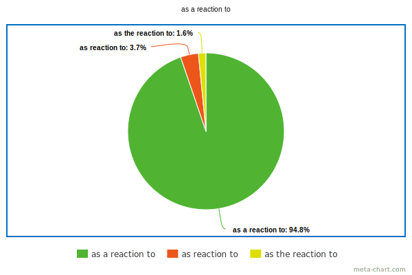
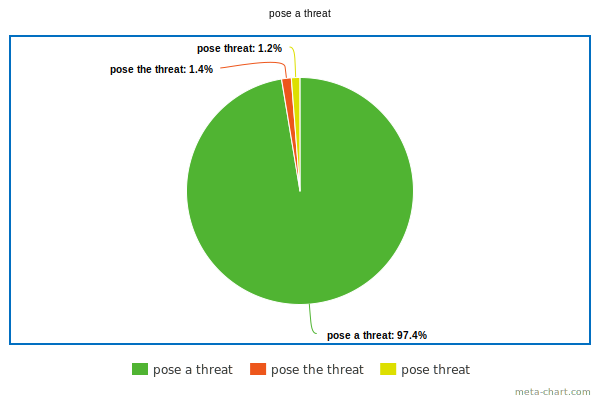
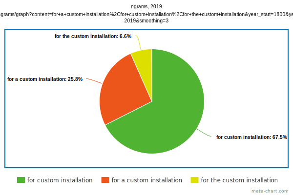
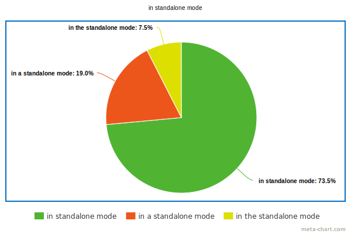

# Index

[Articles](#articles)
- [Abbreviations](#abbreviations-articles)
- [Words and phrases](#words-and-phrases)
  - [as a reaction to](#as-a-reaction-to-articles)
  - [installation](#installation-articles)
  - [mode](#mode-articles)
  - [pose a threat](#pose-a-threat)

[Capitalization](#capitalization)
- [table of contents](#table-of-contents-capitalization)
- [tables](#tables-capitalization)
- [to](#to-capitalization)

[Commas](#commas)
- [but](#but-commas)
- [otherwise](#otherwise-commas)
- [such as](#such-as-commas)

[Formatting Punctuation Marks](#formatting-punctuation-marks)

[Singular or plural](#singular-or-plural)
- [none](#none-singular-or-plural)

***

## Articles

### Abbreviations \[Articles\]

***Acronyms*** (which are read as words) tend not to require preceding articles at all except when they are used adjectivally[^adjectivally]:

> *The patient was diagnosed with AIDS.*

> ***The** AIDS <ins>patient</ins>*

***Initialisms*** (which are pronounced as individual letters) tend to use a preceding article (whether definite or indefinite):

> ***a** CD*

> ***an** NGO*

> ***the** EU*

Articles are often omitted in front of abbreviations:

> *CDC (~~the CDC~~)*

| Sound type | Article | Example |
|------------|--------------|---------|
| Consonant  | **A**  | ***a** PhD* |
|            |          | ***a** NASA launch* |
|            |          | ***a** UNICEF greeting card* |
| Vowel or consonant pronounced with an initial vowel sound | **An** | ***an** APA style of referencing* |
|                                                           |        | ***an** IQ test* |
|                                                           |        | ***an** MP’s riding* |

[^adjectivally]: Adjectivally \= как часть прилагательного.

*Sources: [1](https://www.proof-reading-service.com/en/blog/appropriate-use-articles-abbreviations),
[2](https://wwwnc.cdc.gov/eid/page/abbreviations-acronyms-initialisms)*

***

### Words and Phrases

#### As a reaction to \[Articles\]

[*Source*](https://books.google.com/ngrams/graph?content=as+a+reaction+to%2Cas+reaction+to%2Cas+the+reaction+to&year_start=1800&year_end=2019&corpus=en-2019&smoothing=3)

***

#### Pose a threat \[Articles\]

[*Source*](https://books.google.com/ngrams/graph?content=pose+a+threat%2Cpose+the+threat%2Cpose+threat&year_start=1800&year_end=2019&corpus=en-2019&smoothing=3)

***

### Installation \[Articles\]

- *(countable \& uncountable)* Installation is the act of installing.
- *(countable)* An installation is something that is installed.

*Sources: [1](https://simple.wiktionary.org/wiki/installation),
[2](https://books.google.com/ngrams/graph?content=for+a+custom+installation%2Cfor+custom+installation%2Cfor+the+custom+installation&year_start=1800&year_end=2019&corpus=en-2019&smoothing=3)*

***

### Mode \[Articles\]

We don’t need the definite article before one item/user/table/mode that can be uniquely identified from others in a certain set of items/users/tables/modes:

> *My cell-phone is <ins>on silent</ins> **mode**.*

*Sources: [1](https://ell.stackexchange.com/questions/61397/a-definite-article-before-silent-mode),
[2](https://books.google.com/ngrams/graph?content=in+the+standalone+mode%2Cin+a+standalone+mode%2Cin+standalone+mode&year_start=1800&year_end=2019&corpus=en-2019&smoothing=3)*

***

## Commas

### But \[Commas\]

| Comma position | Put in a comma | Case explanation | Example |
|----------------|----------------|-------------|---------|
| Before | \+ | *But* connects two independent clauses[^independent_clause]. | *The rules aren’t written down anywhere, **but** the important rules rarely are.* |
|        |    |                                                              | *I have a gym membership, **but** I rarely use it.* |
|        |    |                                                              | *I want to go to Italy this year, **but** my kinds want to go to Greece.* |
|        | \- | *But* connects an independent clause with a dependent clause. | *You had a birthday party **but** didn’t tell me about it?* |
|        |    |                                                               | *You left me with nothing **but** a broken promise.* |
| After  | \+ | You’re interrupting the sentence flow with another word or clause immediately after *but*, to create emphasis. | *I enjoyed the book, **but**, to be honest, I didn’t completely understand it.* |
|        |    |                                                                                                                | ***But**, as you know, the dodo bird went extinct long ago.* |
|        |    |                                                                                                                | *I tried to go to the grocery store, **but**, as it turns out, it closed early.* |
|        |    |                                                                                                                | ***But**, my dear, you didn’t tell me the whole story.* |

[^independent_clause]: An independent clause is a string of words that can stand on its own as a complete sentence, with a subject and an object.

[*Source*](https://prowritingaid.com/comma-before-or-after-but)

***

### Otherwise \[Commas\]

#### Conjunction (connector of clauses)

> *He couldn’t see her; **otherwise**, he would have to tell her the truth.* (~~, otherwise,~~: two independent clauses are connected. Always place a comma after *otherwise* here.[^otherwise])

[^otherwise]: Some sources allow *, otherwise, * or *Otherwise∅*

> He couldn’t see her. Otherwise, he would have to tell her the truth.

We can use <ins>;</ins> or <ins>.</ins> interchangeably. Many people use <ins>;</ins> when they want the sentence to continue a little longer, while <ins>.</ins> are useful for breaking up sentences or long bodies of text.

#### Part of a parenthetical element[^parenthetical]

[^parenthetical]: Parenthetical element = поясняющая конструкция

> *My job, **otherwise** known as hell on earth, is causing me to have a lot of issues.*

> *You shouldn’t have said that to Mr. Hampshire, **otherwise** known as Paul.*

#### Adjective

Many people avoid using this old-fashioned structure today because it’s not too particular with its meaning.

> *This **otherwise** delicious piece of fruit isn’t something I’ve ever thought of trying myself.*

> *An **otherwise** pleasure had become a grinding chore.*

> *I couldn’t have said it better **otherwise**.*

> *There will be no surprises – pleasant or **otherwise**.*

*Sources: [1](https://grammarhow.com/otherwise-comma/),
[2](https://www.dictionary.com/browse/otherwise),
[3](https://www.onestopenglish.com/your-english/your-english-word-grammar-otherwise/157482.article)*

***

### Such as \[Commas\]

| Type of a phrase | Comma before *such as* | Example | Explanation |
|------------------|------------------------|---------|-------------|
| Restrictive | \- | *Bands **such as** The Who and Deep Purple are known for playing loud.* | *such as* cannot be omitted |
| Non-restrictive | \+ | *I’m a big fan of frozen desserts, **such as** popsicles and ice cream.* | *such as* can be omitted: \= *I’m a big fan of frozen desserts.* |

[*Source*](https://prowritingaid.com/such-as-comma)

***

## Formatting Punctuation Marks

### Italicizing Comma After an Italic Word

If the commas are not logically part of the italicized material, they should not be italicized.

> We rented the movie *Planes, Trains and Automobiles*. \[The comma is part of the title\]

### Punctuation Mark and a Word Before

The formatting of the punctuation mark should match the formatting of the word before, but there can be exceptions:

> The difference is statistically significant (*p* < .05).

### Colon at the End of a Heading

Do not underline the colon at the end of a heading.

[*Source*](https://iconlogic.blogs.com/weblog/2011/04/writing-grammar-do-i-italicize-the-comma-after-an-italic-word.html)

***

## Capitalization

### Tables \[Capitalization\]

\[Microsoft Style Guide\]

Use sentence-style capitalization for:
- the table title;
- each column header;
- the text in cells unless there’s a reason not to (for example, keywords that must be lowercase).

| Tables are sometimes useful for	| Example |
|---------------------------------|---------|
| Data or values | Text formats and their associated HTML codes |
| Simple instructions | User interface actions and their associated keyboard shortcuts |
| Categories of things with examples | SKUs[^SKU] and the products they include |
| Collections of things with two or more attributes | Event dates with times and locations |

[^SKU]: Stock Keeping Unit = артикул (код товара)

[*Source*](https://learn.microsoft.com/en-us/style-guide/scannable-content/tables)

***

### Table of Contents \[Capitalization\]

If you use a certain capitalization in the title of a chapter, then use the same capitalization whenever you mention that title elsewhere, including within the Table of Contents.

### To \[Capitalization\]

Capitalize ***to*** if:
- it is the first word of the title:
  > ***To** Infinity and Beyond*
- it is used as an adverb (*to and fro*, *come to*, *pull to*):
  > *Walking **To** <ins>and Fro</ins>*
  
  > *<ins>Pull</ins> the Door **To** and Lock It*

- it is the last word of the title \[depends on a style guide\]:
  > *Music That You Can Dance **To***

Do not capitalize ***to*** in all other cases:
- *Back *to* the 50s* \[preposition, all style guides\]
- *You Don’t Have **to** Tell Me* \[infinitive, depends on a style guide\]

*Sources: [1](https://writing.stackexchange.com/questions/61942/should-the-table-of-contents-be-title-case),
[2](https://titlecaseconverter.com/blog/is-to-capitalized)*

***

## Singular or plural

### None \[Singular or plural\]

| Role | Example | Explanation |
|------|---------|-------------|
| Plural noun | ***None** of the movies **are** worth watching.* | *movies* is plural |
| Singular noun | ***None** of your advice **is** helpful.* | *advice* is singular |
| Plural pronoun | ***None** of my friends **are** going to the fair.* | *none* could be substituted with *not any* |
| Singular pronoun | *She ate it all, and now **none is** left.* | *none* could be substituted with *nothing* |
| Adverb | *We’ll take it while he’s not looking, and he’ll **be none** the wiser.* | *none* is modifying the verb *be* and effectively means *not at all* |

[*Source*](https://www.masterclass.com/articles/is-none-singular-or-plural)

***
